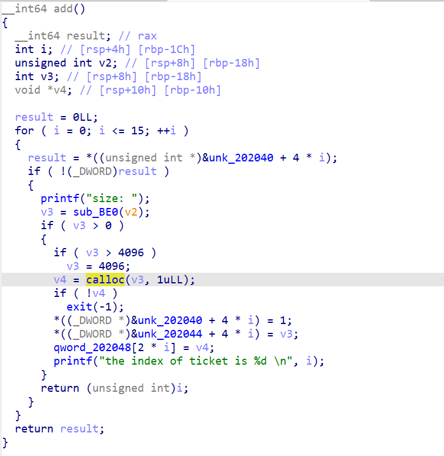
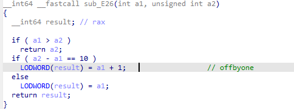
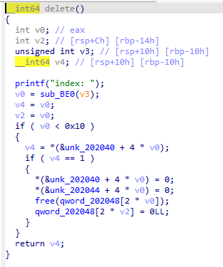

# roarctf_2019_easy_pwn

这里我们查看这个题目的一个保护发现这个保护是一个全开的状态因此我们发现是一个堆题



这里发现出现了一个新的堆块创建因此我们要了解一下这个堆块calloc与malloc的访问有什么区别

在这里我们发现malloc和calloc的区别还是有一些的

```tex
区别一：
malloc(size_t,size) ---- size为我们要申请空间的大小，该值是需要我们去计算的

calloc(size_t count,size_t size) ---- count为我们需要申请空间的块数，size为我们需要申请类型的占的字节大小，并不需要人为的计算空间大小

而且，使用malloc()函数申请后空间的值是随机的，并没有进行初始化，但是使用calloc()函数却在申请后，对空间逐一进行初始化，并设置值为0;

区别二：

效率问题。calloc函数由于给每一个空间都要初始化值，那必然效率较malloc要低，并且现实世界，很多情况的空间申请是不需要初始值的，所以对于初学者，一般都是接触malloc函数较多。
```

在这里我们已经大概明白了calloc和malloc的一些区别因此我们要继续看ida的反编译代码



在这个函数中发现了一个offbyone因此这里存在一个溢出的漏洞



观察delete函数发现在这个free后并不存在uaf漏洞因此我们优先想到一个通过堆重叠来构造一个uaf出来

所以我们要构造一个unsortbin来泄露libc的地址

刚开始要先创建4的堆块并且通过offbyone漏洞把chunk1块给改大，使得它可以覆盖下个chunk块

再把这个chunk块free后于chunk2
