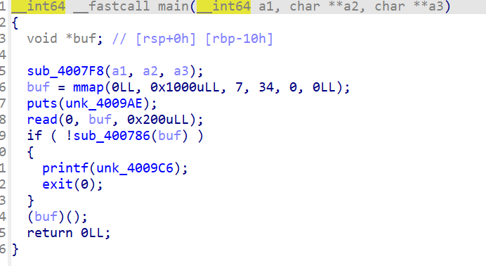
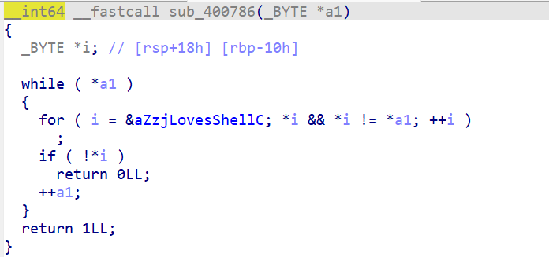

# starctf_2019_babyshell

这个题目还是比较有意思的

这里我们先查看ida的反编译的脚本



这里我们查看代码发现他是一个shellcode的题目打开时出现了一个if语句我们还是要查看if语句里面的数据



```c
__int64 __fastcall sub_400786(_BYTE *a1)
{
  _BYTE *i; // [rsp+18h] [rbp-10h]

  // 外部循环，逐字节检查输入的 shellcode
  while ( *a1 ) // 当前检查的 shellcode 字节不为零时，继续循环
  {
    // 内部循环，在白名单中查找当前 shellcode 字节
    for ( i = &aZzjLovesShellC; *i && *i != *a1; ++i ) // 从白名单首地址开始查找，直到找到与当前 shellcode 字节相等的字节或白名单结束
      ;
    if ( !*i ) // 如果白名单中没有找到匹配的字节（即 *i 为零，表示已遍历完白名单未找到）
      return 0LL; // 返回 0，表示验证失败，shellcode 不合法
    ++a1; // 检查下一个 shellcode 字节
  }
  return 1LL; // 所有 shellcode 字节都通过验证，返回 1，表示验证成功
}
```

也就是如果这个程序的头部为0 的话还是可以跳过的因此我们可以是的因此我们可以跳过着这个检查

这里我们使用的绕过语句是**\x00\xc0**这个方法来一个绕过是的我们的shellcode不会被检查到