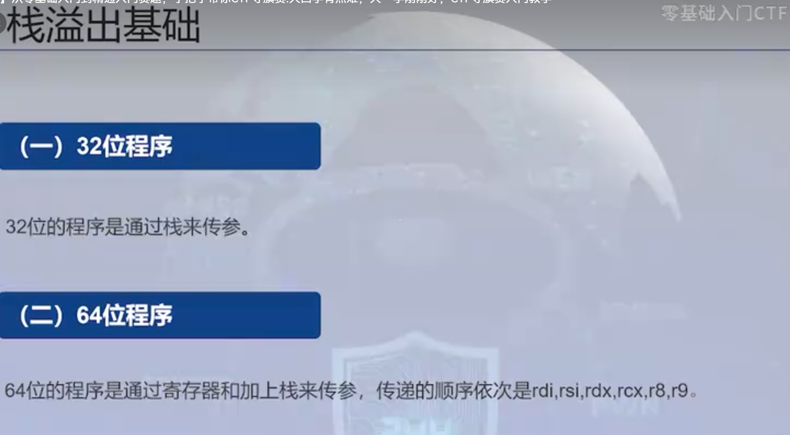

## pwn基础

### 汇编基础

push入栈指令

pop出栈指令

​	pop eax；就是栈顶指针区值放到eax中

---

### 程序保护机制

plt表是一个字符

got表是函数的真实地址

RELRO：主要是对got表的一个保护

stack：对栈溢出进行一个保护

nx：栈不可执行

pie：全局地址汇集化

---

### 栈溢出基础

在栈中esp指向栈顶ebp指向栈底

