# pwn的基础（引用星盟安全）

### 文件结构

elf文件结构

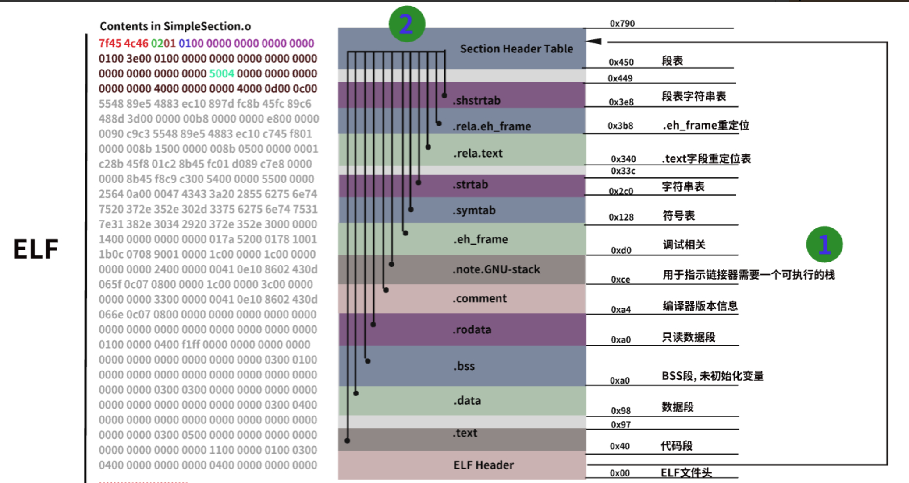

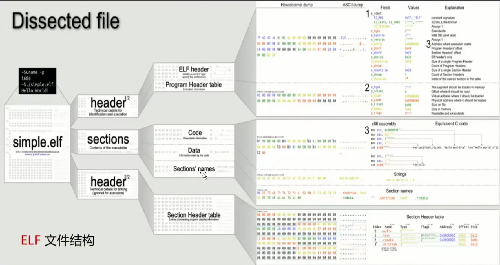

这elf文件结构中主要的文件是在code段和data段

### 程序装载和虚拟内存

这是一个elf文件在磁盘中的映射

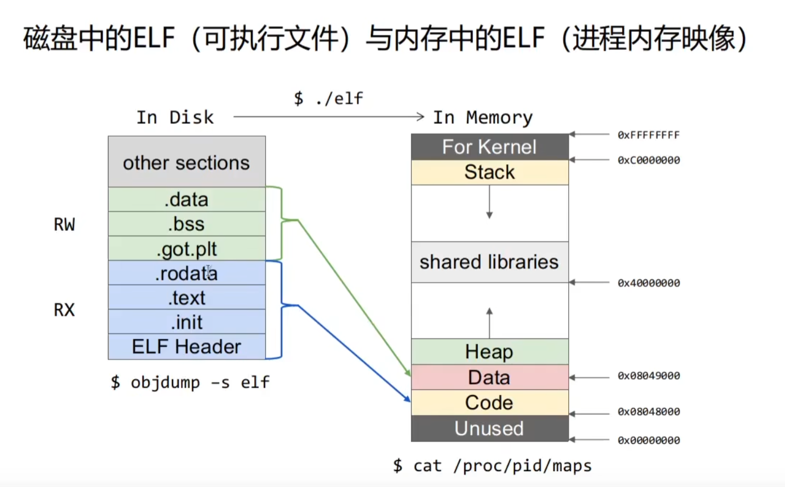

在程序中的映像只是占据了data和code文件

并且heap是从低地址向高地址写入而stack是从高地址向低地址写入

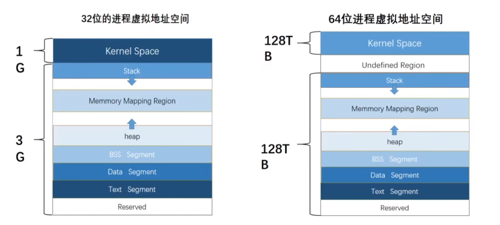

在这个图片中可以知道64位和32位没有什么区别只是大小有变大

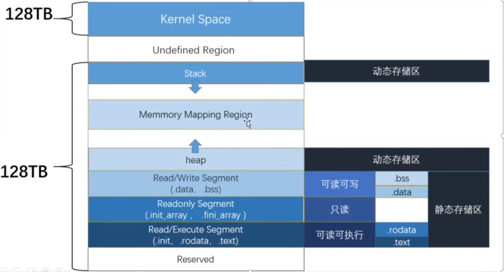

这是64位的具体文件

stack是用来协助程序来完成程序流转移和恢复的一个功能

heap一下的低地址都是静态存储区而动态的就是heap和stack

在内存中的书写习惯就是从低向高地址写 而为了书写习惯可以在自己的脑海中建立一个内存空间示意图

### cpu和进程的执行

#### 段和节

节是用于一个二进制文件在磁盘中的存放他不同区域的数据，而不同功能的单位就是节

节可以使用objdump进行查看

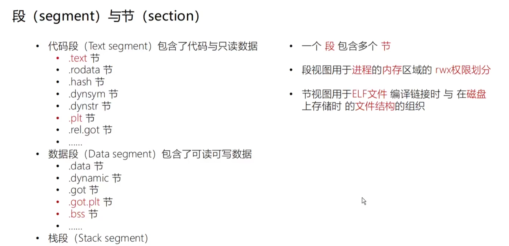

got节保存的是用来保存全局偏移量的一个表

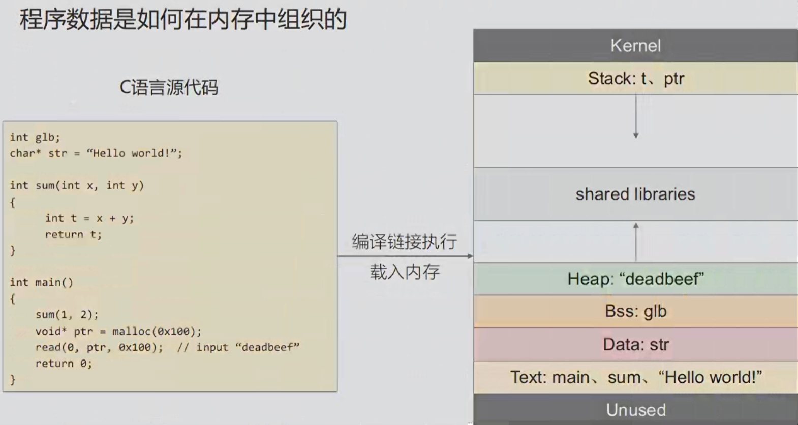

这里也是我们需要了解一个c语言源代码对应的数据段

就是源代码和内存的映射

1.没有初始化的全局变量是放到bss中的

同样bss段使用来存放未初始化的全局变量 主要是因为它没有占用磁盘但是占用了内存

2.只读不可写不可执行的数据就会放到text段中

因此text段中放的是不可写的数据

3.局部变量是会放到栈中的

4.其中函数调用的内存是包含在stack中的

5.因为使用了malloc函数并且读入的数据会放到堆中

6.如果是sum中的参数的话就要看他的指令集了，如果是x86就是用stack而amd64就是用寄存器中的地址

---

#### 大端序和小端序

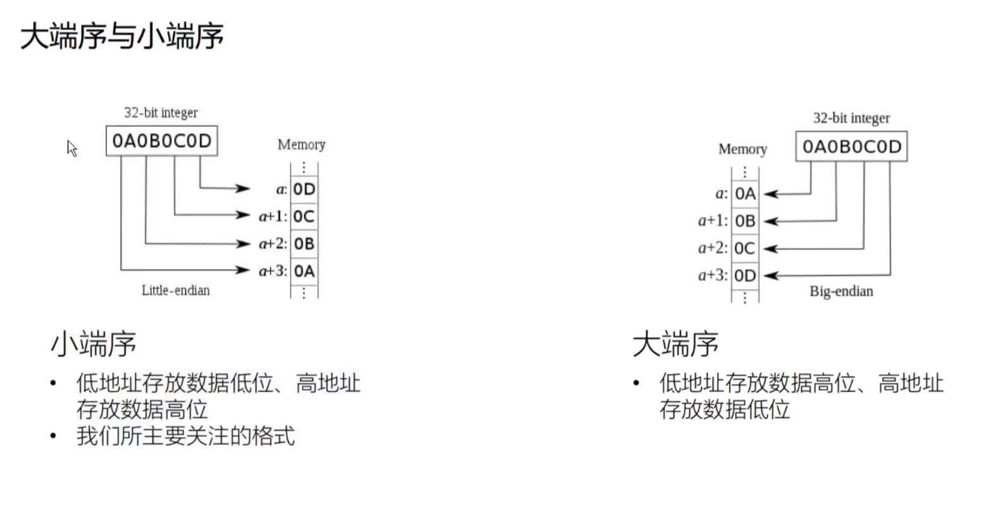

---

#### amd64

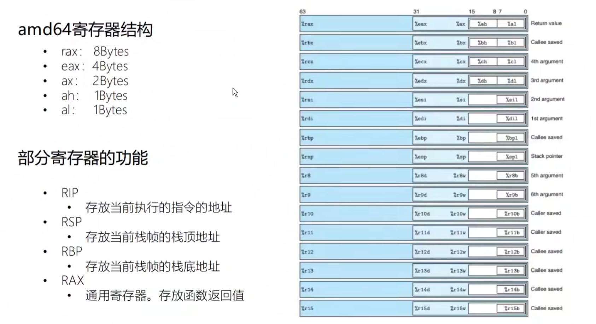

eax在amd64中就是取了它的低四字节同理ax就是低二字节

rcx会存放一个累加器的中间结果

rsi/rdi 会传入调用函数的前两个参数

rip它其实就是pc(program counter)他是存放下一条指令的偏移地址

---

### 转载和汇编

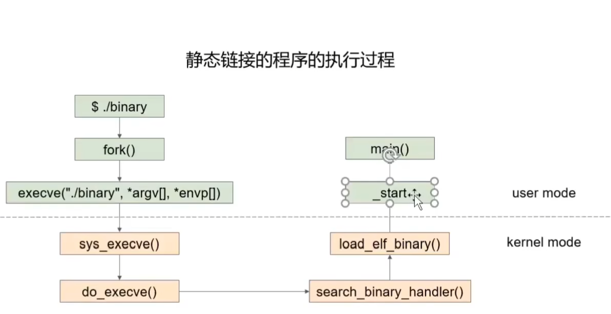

这就是一个程序执行的过程

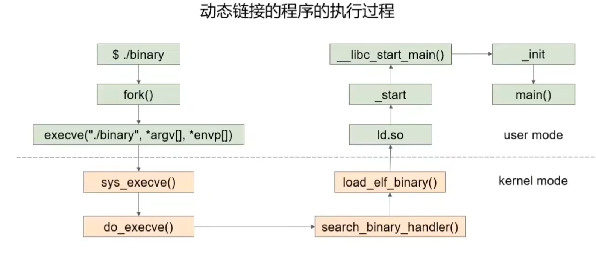

为什么会出现动态链接就是因为他的代码程序中公用的东西放入编译到了程序里面就是应为静态连接内存会冗余

ld.so文件是动态和静态的主要区别二这个文件就是一个公用地址文件的映射同时他就可能是一个偏移量

---

#### 常用的汇编

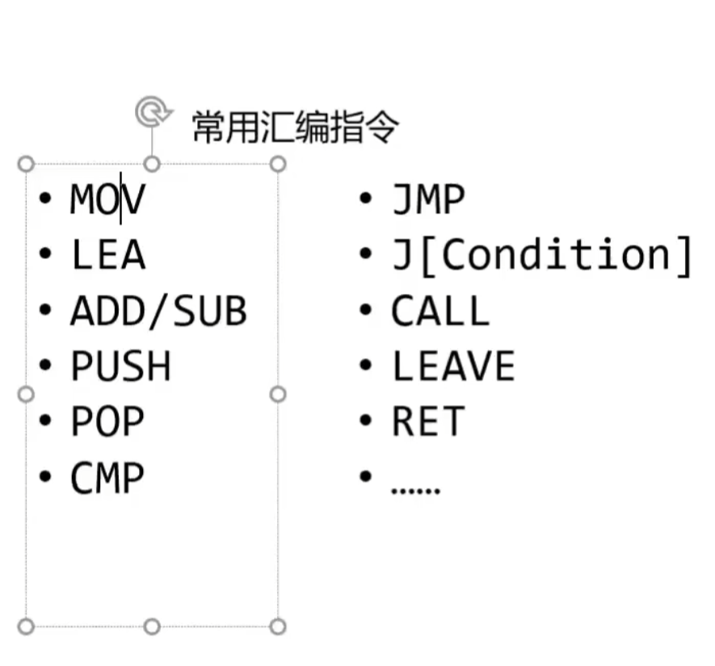

asc：标号就是代表的当前的地址

add/sub：就是对数据的加和减操作

call指令：push 调用函数后的下一条指令。然后，jmp过去

lea：把源操作数的有效地址送给指定的寄存器

mov：

---

### 栈帧

函数调用栈是指程序运行时内存一段连续的区域用来保存函数运行时的状态信息，包括函数参数与局部变量等称之为"栈"是因为发生函数调用时，调用函数（caller）的状态被保存在栈内，被调用函数（callee）的状态被压入调用栈的栈顶在函数调用结束时，栈顶的函数（callee)状态被弹出，栈顶恢复到调用函数（caller）的状态函数调用栈在内存中从高地址向低地址生长，所以栈顶对应的内存地址在压栈时变小，退栈时变大

---

### rop

随着NX保护的开启,以往直接向栈或者堆上直接注入代码的方式难以继续发挥效果。攻击者们也提出来相应的方法来绕过保护, 目前主要的是ROP(Return Oriented Programming),其主要思想是在栈缓冲区溢出的基础上，利用程序中已有的小片段（gadgets）来改变某些寄存器或者变量的值，从而控制程序的执行流程。所谓 gadgets 就是以 ret 结尾的指令序列,通过这些指令序列,我们可以修改某些地址的内容,方便控制程序的执行流程。

之所以称之为ROP,是因为核心在于利用了指令集中的ret指令,改变了指令流的执行顺序。ROP 攻击一般得满足如下条件：

1·程序存在溢出,并且可以控制返回地址。

2·可以找到满足条件的gadgets以及相应gadgets的地址。

如果gadgets每次的地址是不固定的,那我们就需要想办法动态获取对应的地址了。

#### ret2txt

他的意思是用程序已有的代码进行攻击

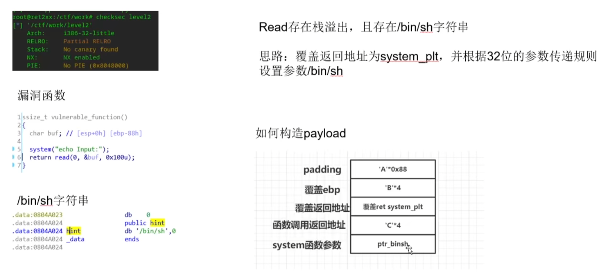