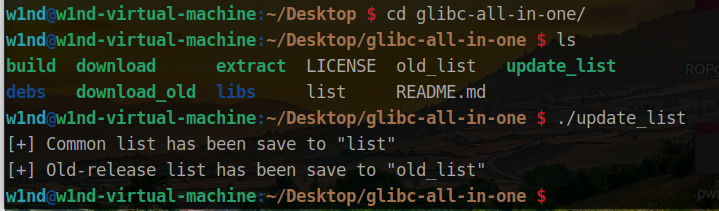
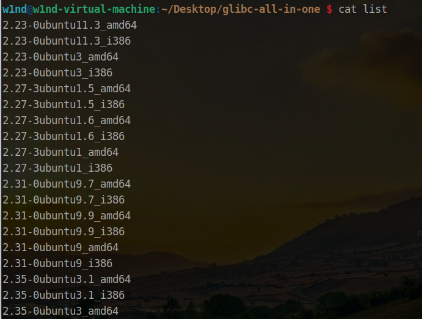
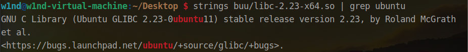
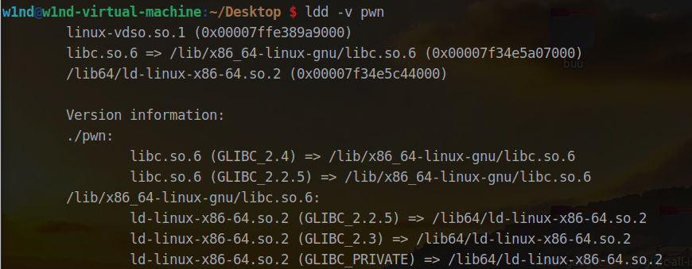
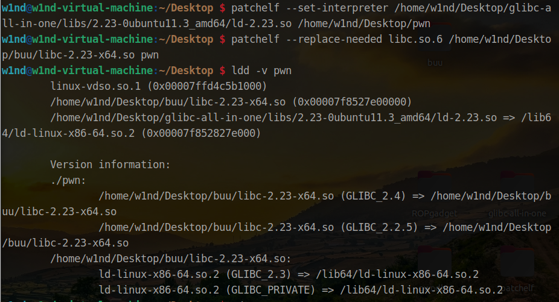
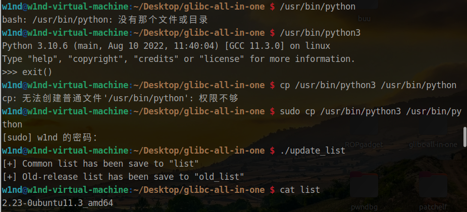

pwn有时候真的太玄学了（我太菜了），有时候因为环境问题导致一道题很难调试成功，跟 wp 上的差很多，有时候调试几天也不知道怎么回事，换个环境突然就好了。特别是到堆的时候，搞了好几台不同 ubuntu 版本的虚拟机，最后发现还是直接用 patchelf 修改 pwn 题目的libc 好， 希望能帮助大家。

 先下载 patchelf

```
sudo apt-get install patchelf
```

再下载支持库

```
git clone https://github.com/matrix1001/glibc-all-in-one
```

还需要更新支持库

```
cd glibc-all-in-one/
./update_list
```



 

 

 查看可以下载的库

```
cat list
```



 

 

 使用下面的命令下载

```
./download name
```

下载后的文件都放到了 libs 文件夹下

那么准备工作就做好了，这里以 buuctf 提供 libc 为例

我们首先要先确定与 libc 同版本的 链接器

```
strings buu/libc-2.23-x64.so | grep ubuntu
```



 

 

 这个我们 list 中是有的

再看下现在的 pwn 题目使用的 libc

```
ldd -v pwn
```



 

 明显还是系统提供的 libc 和 ld

接下来修改 pwn 题目的 libc 和 ld

```
patchelf --set-interpreter /home/w1nd/Desktop/glibc-all-in-one/libs/2.23-0ubuntu11.3_amd64/ld-2.23.so /home/w1nd/Desktop/pwn
patchelf --replace-needed libc.so.6 /home/w1nd/Desktop/buu/libc-2.23-x64.so pwn
```



 

 很好，pwn 题目的 libc 和 ld 都被修改了，不过不建议直接使用 buuctf 提供的 libc，因为无法用 gdb 调试

可以使用支持库中的

```
patchelf --set-interpreter /home/w1nd/Desktop/glibc-all-in-one/libs/2.23-0ubuntu11.3_amd64/ld-2.23.so /home/w1nd/Desktop/pwn
patchelf --replace-needed libc.so.6 /home/w1nd/Desktop/glibc-all-in-one/libs/2.23-0ubuntu11.3_amd64/libc-2.23.so pwn
```

 

顺便提下，我更新支持库的时候出现了未找到 /usr/bin/pytho 的情况，但是我的 python3 是能正常用的，所以直接复制下即可解决



 