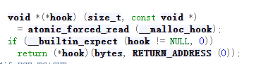
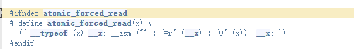
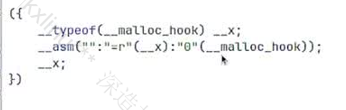
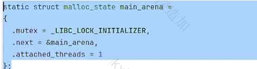
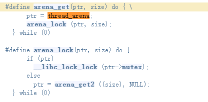

## glibc源码总结

### __libc_malloc函数

这个函数就是一个程序被编译后所调用的函数 也就是说他是malloc的got表就是要填libc_malloc

#### hook

这里我们先看出现了一个hook指针

这个代码的意思是读出malloc_hook的值并且与hook进行比较如果不等于null的话就就会调用它并且会传入一个bytes

其中atomic_forced_read的实现是一个汇编代码

这同样是一个原始的操作让malloc_hook赋值给 '__x'

hook这样设计的原因是：有时候有些人会觉得glibc中heap的实现不是很好并且为了应对特殊的设备就会自己实现的堆同时又要连接glibc中heap的一些函数就实现了一个这个hook变量也就是后hook就是一个外部实现堆来调用glibc内部函数的一个接口

但是这个hook在2.34版本后就被删除了

同时这也是2.34版本一下的一个攻击路线但是2.34以上的版本就要用其他的路线了

#### arena_get

下面看到一个arena_get的函数查看应用可以发现thread_arena=&malloc_statc因此在这下面的源代码中可以发现main_arena是写死在malloc中的所以它可以直接泄露出libc的地址

在下面的代码中可以明白如果在特殊情况下thread_arena不可用就会找arena_get2

而arena_get2就是当thread_arena不可以用时如何获取一个