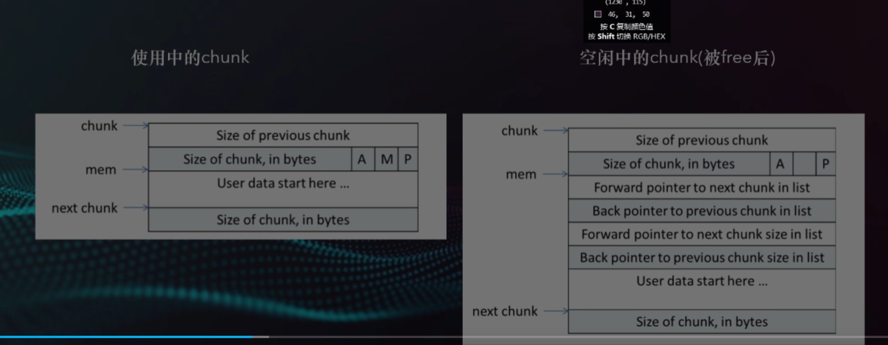
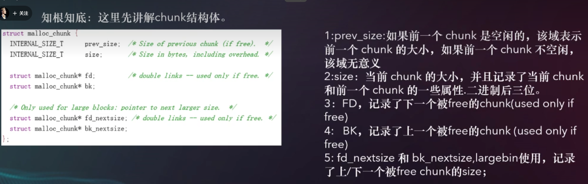
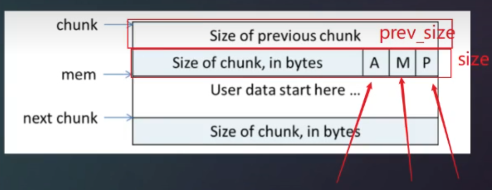
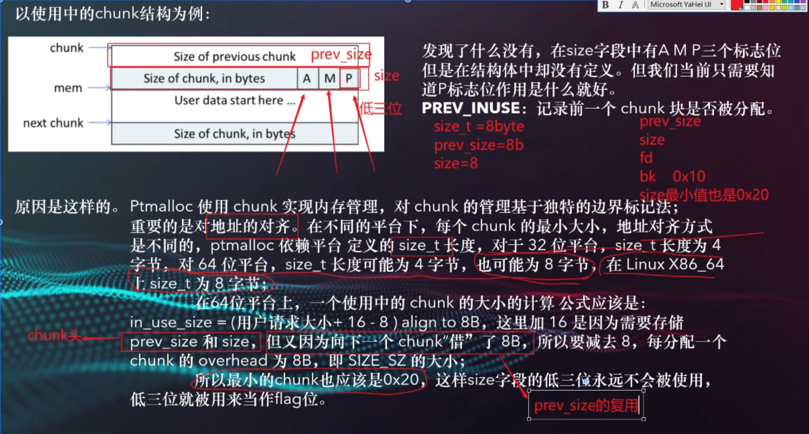
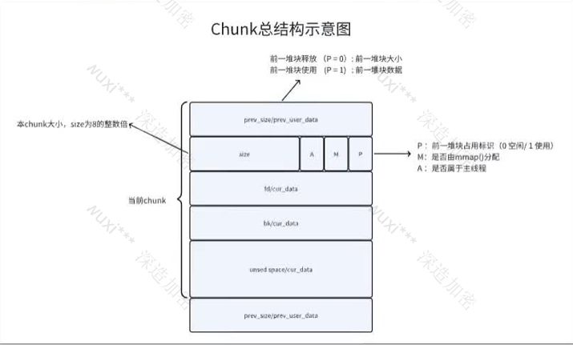

## chunk

malloc_chunk：

我们称运行过程中被malloc分配的内存为一个chunk，这块内存在ptmalloc中用

malloc_chunk 结构体表示，当程序申请的chunk被free时，会被加入相应的空闲管理列表中。

chunk在利用时和空闲时有着两种不同的状态

是malloc_chunk的原型：

1:prev_size:如果前一个 chunk 是空闲的，该域表示前一个 chunk 的大小，如果前一个 chunk 不空闲，该域无意义

2:size：当前 chunk 的大小，并且记录了当前 chunk和前一个 chunk 的一些属性.二进制后三位。

3:FD，记录了下一个被free的chunk(used only iffree)

4: BK，记录了上一个被free的chunk (used only iffree)

5: fd_nextsize 和 bk_nextsize,largebin使用，记录了上/下一个被free chunk的size;

原因是这样的:

Ptmalloc 使用 chunk 实现内存管理，对 chunk 的管理基于独特的边界标记法；重要的是对地址的对齐。在不同的平台下，每个 chunk 的最小大小，地址对齐方式是不同的，ptmalloc 依赖平台 定义的 size_t 长度，对于 32 位平台，size_t 长度为 4字节，对 64 位平台，size_t 长度可能为 4 字节，也可能为 8 字节，在 Linux X86_64size_t 为 8 字节；

在64位乎台上，一个使用中的 chunk 的大小的计算 公式应该是：in_use_size = （用户请求大小+ 16 - 8 ) align to 8B，这里加 16 是因为需要存储prev_size 和 size，但又因为向下一个 chunk“借”了 8B，所以要减去 8，每分配一个chunk 的 overhead 为 8B，即 SIZE_SZ 的大小；

所以最小的chunk也应该是0x20，这样size字段的低三位永远不会被使用，低三位就被用来当作flag位。

当前我们要记住的是p标致位 他表示了前一个的chunk是否被使用

chunk的复用技术：对于字段prev_size字段 prev_size 记录的什么信息呢？有两种情况：

1）如果前一个邻接 chunk 块空闲，那么当前 chunk 块结构体内的 prev_size 字段记录的是前一个邻接chunk块的大小。这就是由当前chunk指针获得前一个空闲chunk地址的依据。宏prev_chunk(p)就是依赖这个假设实现的。

2）如果前一个邻接 chunk 在使用中，则当前 chunk 的 prev_size 的空间被前一个 chunk借用中，其中的值是前一个 chunk 的内存内容，对当前 chunk 没有任何意义。

