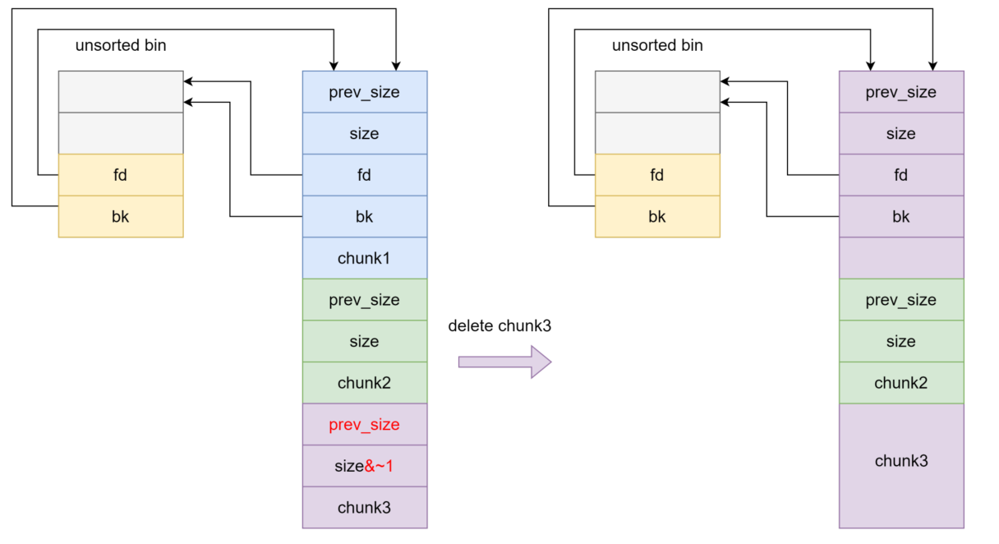
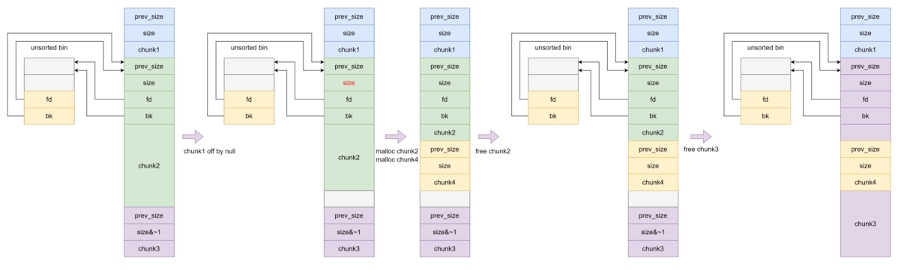

# heap overlapping——offbynull

offbynull和offbyone是相同的一种溢出漏洞，而不同点是offbyone是指程序向缓冲区中写入时，写入字节数超过申请的字节数并且只运行一个字节。而offbynull就是溢出数申请数的以为如‘\x00’也就是说我们只能控制下一个chunk的prev_size和size位的最低一个字节写成0的方式来进行溢出

所以我们这个一个主要方法就是释放chunk1然后修改chunk3的prev_size和PREV_INUSE位是的chunk3和chunk1合并并且把chunk2包括在这个chunk中实现堆重叠

但是还有一种特殊情况就是当我们不能设置prev_size位时（也就是说我当我们改动后prev_size位上会被填充一些数据）所以我们要用下图的方法

但是我们到2.29的时候设置了prev_size和size的要给