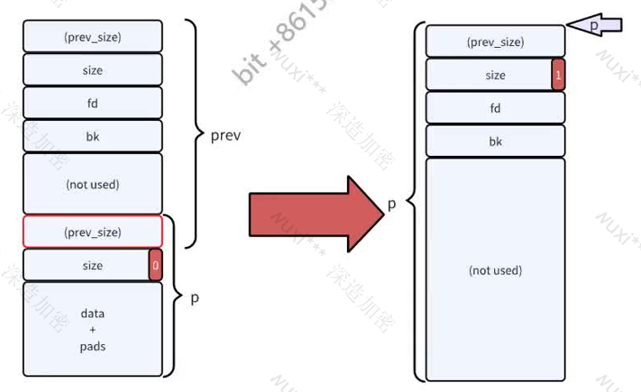

# house of xxx系列

### house of spirint

#### 原理：

House of Spirit算是一个组合型漏洞的利用,是变量覆盖和堆管理机制的组合利用,关键在于能够覆盖一个堆指针变量,使其指向可控的区域,只要构造好数据,释放后系统会错误的将该区域作为堆块放到相应的fast bin里面,最后再分配出来的时候,就有可能改写我们目标区域。

#### 经典利用场景的条件：

(1)想要控制的目标区域的前段空间与后段空间都是可控的内存区域一般来说想要控制的目标区域多为返回地址或是一个函数指针,正常情况下,该内存区域我们输入的数据是无法控制的,想要利用House of Spirit攻击技术来改写该区域,首先需要我们可以控制那片目标区域的前面空间和后面空间，示意图如下：


(2)存在可将堆变量指针覆盖指向为可区域，即上一步的区域

#### 利用思路：

1.伪造堆块：在可控1及可控2构造好数据，将它伪造成fastbin

2.覆盖堆指针指向上一步伪造的堆块：

3.释放堆块：将伪造的堆块释放入fastbin的单链表中

4.申请堆块：将刚刚释放的堆块申请出来，最终使得可以往目标区域写入数据，实现目的

需要说明的是第一步中的伪造堆块的过程, fastbin是一个单链表结构,遵循FIFO的规则, 32位系统中fastbin的大小是在16~64字节之间, 64位是在32~128字节之间。释放时会进行一些检查,所以需要对伪堆块中的数据进行构造，使其顺利的释放进到fastbin里面，看堆free过程中相关的源代码。

需要说明的是第一步中的伪造堆块的过程, fastbin是一个链表大小x首先mmap标志位不能被置上,否则会直接调用munmap_chunk函数去释放堆块。其次是伪造堆块的size字段不能超过fastbin的最大值，超过的话，就不会释放到fastbin里面了。最后是下一个堆块的大小，要大于2*SIZE_ZE小于system_mem，否则会报invalid next size的错误。对应到伪造推块那张示意图来说，需要在可控区域1中伪造好size字段绕过第一个和第二个检查，可控区域2则是伪造的是下一个堆块的size来绕过最后一个检查。

所以总的来说， House of Spirit的主要意思是我们想要控制的区域控制不了，但它前面和后面都可以控制，所以伪造好数据将它释放到fastbin里面,后面将该内存区域当做堆块申请出来,致使该区域被当做普通的内存使用,从而目标区域就变成了可控的了。

#### 保护检查

- fake chunk的ISMMAP位不能为1,因为free时,如果是mmap的chunk,会单独处理
- fake chunk地址需要对齐, MALLOC-ALIGN-MASKxi
- fake chunk的size大小需要满足对应的fastbin的需求,同时也得对齐
- fake chunk 的 next chunk 的大小不能小于 2 SIZE_sZ,同时也不能大于 av->system_mem
- fake chunk对应的fastbin链表头部不能是该
- fake chunk,即不能构成double free的情况

主要是:当前chunk的size (chunk->size) ,和下一个chunk的size (nextchunk->size)Wuxi

#### 利用条件：

- 可以控制free的参数,把它改为fake chunk data addr (House Of Spirit的核心)
- 可以控制fake chunk的size
- 可以控制next chunk的size (程序会根据fake chunk->size来获取next chunk的位置)

#### 利用姿势：

- 现成了两种风格：释放栈中的 fake chunk，劫持 ret 返回地址（利用栈溢出覆盖free的参数）
- 释放堆中的fake chunk,劫持控制模块实现WAA (需要注意chunk结构和off-by-one)NUXI

小技巧：

多关注堆中的数字


### house of Einherjar

House Of Einherjar是通过利用堆本身存在的溢出漏洞,通过修改、构造堆块的结构欺骗程序来实现让malloc分配几乎任意一个地址的chunk,从而实现任意地址控制的攻击方式。house of einherjar是一种堆利用技术,由Hiroki Matsukuma提出。该堆利用技术可以强制使得malloc返回一个几乎任意地址的chunk,其主要在于滥用free中的后向合并操作(合并低地址的chunk) ,从而使得尽可能避免碎片化。

此外,需要注意的是,在一些特殊大小的堆块中, off by one不仅可以修改下一个堆块的prev_size,还可以修改下一个堆块的PREV-INUSE比特位。

#### 原理：

##### 后向合并操作：

free函数中的后向合核心操!作

```c
if(!prev_inuse(p)){
    prevsize = prev_size(p);
    size += prevsize;
    p = chunk_at_offset(p, -((long) prevsize));
    unlink(av, p, bck, fwd);
}
```



#### 利用原理：

- 两个物理相邻的chunk会共享prev_size字段,尤其是当低地址的chunk处于使用状态时,高地址的chunk 的该字段便可以被低地址的 chunk 使用。因此，我们有希望可以通过写低地址 chunk 覆盖高地址chunk 的 prev_size 字段。
- 一个 chunk PREV_INUSE位标记了其物理相邻的低地址 chunk 的使用状态，而且该位是和 prev_size 物理相邻的。
- 后向合并时,新的chunk的位置取决于 chunk_at_offset(p, -((long) prevsize)) 。

那么如果我们可以同时控制一个chunk prev_size与PREV_INUSE字段，那么我们就可以将新的chunk 指向几乎任何位置

#### 利用条件：

- 用户能够篡改top chunk 的presize字段（篡改为负数或很大值）
- 有一个off-by-one，可以覆盖last chunk的p位“\x00”(使其在和top chunk合并后还可以进行后向合并，通过chunke—>presize 索引到fake chunk 合并到fake chun上)
- 可以控制fake chunk


利用姿势: 

已有两个 chunk（最后一个chunk， 和倒数第二个chunk）

在倒数第二个 chunk 最后一片内存空间（lastchunk->presize)中写入 offset (可以索引到fakechunk) ,同时溢出")x00"覆盖lastchunk 的P位(lastchunk->size)

提前t fake chunk a造好数据: presize (offset) , size, FD, BK, FDsize, BKsize

释放 lastchunk， 这样 top chunk 就会转移到该地址以下公式可以用来计算偏移presize: (有时offse有偏差也可以进行修正)