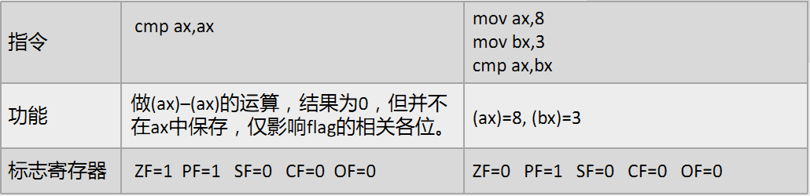
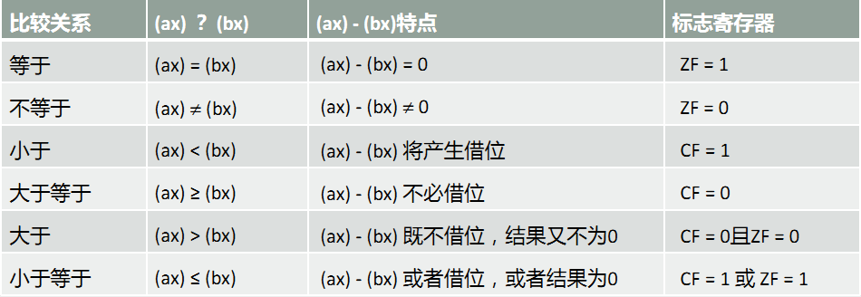
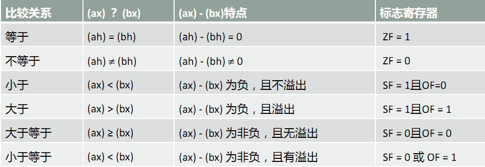
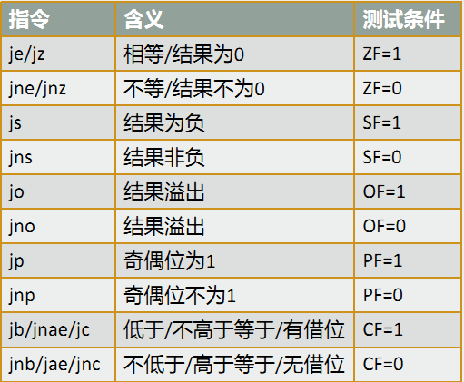
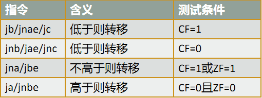
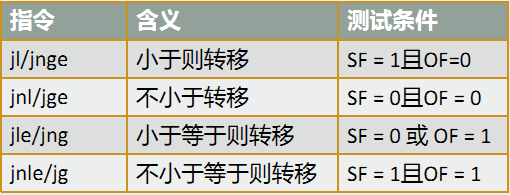
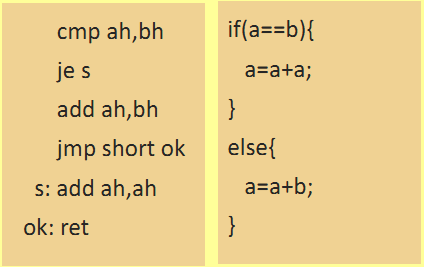
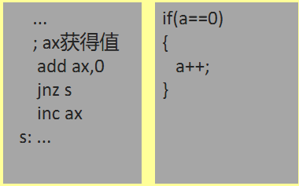

# ret2csu

这个手法只能使用到64位程序这里主要使用到的是csu_init函数，这个函数一般会放一个万能的gadget用来控制程序流

## libc_csu_init

函数代码

```assembly
[...]
.text:0000000000400740 loc_400740: ; CODE XREF:
__libc_csu_init+54↓j
.text:0000000000400740 mov rdx, r13
.text:0000000000400743 mov rsi, r14
.text:0000000000400746 mov edi, r15d
.text:0000000000400749 call ds:
(__frame_dummy_init_array_entry - 600E10h)[r12+rbx*8]
.text:000000000040074D add rbx, 1
.text:0000000000400751 cmp rbx, rbp
.text:0000000000400754 jnz short loc_400740
.text:0000000000400756
.text:0000000000400756 loc_400756: ; CODE XREF:
__libc_csu_init+34↑j
.text:0000000000400756 add rsp, 8
.text:000000000040075A pop rbx
.text:000000000040075B pop rbp
.text:000000000040075C pop r12
.text:000000000040075E pop r13
.text:0000000000400760 pop r14
.text:0000000000400762 pop r15
.text:0000000000400764 retn
.text:0000000000400764 ; } // starts at 400700
.text:0000000000400764 __libc_csu_init endp
```

这个很多时候是不能调用rax寄存器的gadget，如果程序不提供libc代码，并且条件用ret2libc的时候就可以使用ret2csu的方法来泄露

再这个个代码中40075a的地方是我们可以控制的寄存器，这些寄存器的值会mov到rdx，rsi，edi的寄存器中这样就可以使得我们可以控制整个程序的执行流

在这里主要知道的一点是r15d是一个逻辑寄存器

cmp 寄存器，寄存器->如果寄存器都一样时才把zf寄存器改为1

这里主要是要注意的一点在第二段gadget的时候要访问他的pop程序中因此对于pop控制的程序块中可以知道这个也要有一个填充段来填充程序帮助我们来访问

## 例题

源码：
```c
#include <stdio.h>
#include <unistd.h>
#include <string.h>
#include <stdlib.h>
char bss[200];
void init()
{
    setbuf(stdout,0);
    setbuf(stdin,0);
    setbuf(stderr,0);
    write(1,"ok",3);
} 
int main()
{
    init();
    __asm__ (
        "xor %eax,%eaxnt"
        "test %eax,%eaxnt"
        "jz lable2nt"
        "jnz lable1nt"
        "lable1:nt"
        " pop %rax;pop %rdi;retnt"
        " syscall;retnt"
        " call *%raxnt"
        "lable2:nt"
	);
    char buf[10];
    gets(buf);
    __asm__("mov $1,%rdxnt");
    return 0;
}
```

## 前置基础

# [8086汇编 cmp 指令](https://www.cnblogs.com/xiangsikai/p/12485150.html)

cmp 是比较指令，功能相当于减法指令，只是不保存结果。
cmp 指令执行后，将对标志寄存器产生影响。

格式：cmp 操作对象1,操作对象2
功能：计算操作对象1–操作对象2

原理：通过做减法运算影响标志寄存器，标志寄存器的相关位的取值，体现比较的结果。

## cmp 指令说明

### 一、应用使用

其他相关指令通过识别这些被影响的标志寄存器位来得知比较结果。

应用方法：用标志寄存器值，确定比较结果。



### 二、无符号数比较与标志位取值

思路：通过cmp 指令执行后相关标志位的值，可以看出比较的结果

指令：cmp ax,bx



### 三、有符号数比较与标志位取值

问题：用cmp来进行有符号数比较时，CPU用哪些标志位对比较结果进行记录

仅凭结果正负（SF）无法得出结论，需要配合是否溢出（OF）得到结论。

示例指令：cmp ah,bh



## 条件转移指令

;或者其他影响标志寄存器的指令

cmp oper1, oper2 

jxxx 标号

### 一、根据单个标志位转移的指令



### 二、根据无符号数比较结果进行转移的指令



###  三、根据有符号数比较结果进行转移的指令



###  四、转移指令全写

j-Jump　e-Equal　n-Not　b-Below　a-Above　L-less　g-Greater  s-Sign　C-carry　p-Parity o-Overflow 　z-Zero

## 条件准转移指令使用

jxxx系列指令和cmp指令配合，构造条 件转移指令

- 不必再考虑cmp指令对相关标志位的影响和jxxx指令对相关标志位的检测
- 可以直接考虑cmp和jxxx指令配合使用时表现出来的逻辑含义。
- jxxx系列指令和cmp指令配合实现高级语言中if语句的功能

例1：如果(ah)=(bh)，则(ah)=(ah)+(ah)，否则(ah)=(ah)+(bh)



例2：如果(ax)=0，则(ax)=(ax)+1


